# Salesforce Data Cloud × AdCP Integration Patterns

## Color Legend

| Color | Role |
|-------|------|
| 🟦 | Salesforce Data Cloud / Clean Room |
| 🟩 | Advertiser / Orchestrator (e.g., Nike, agency, AI planning agent) |
| 🟥 | Media Seller / Decisioning (e.g., Yahoo, Hulu, DSP, RMN) |
| 🟧 | MCP / AdCP Orchestration & Agents |

---

## Pattern 1: Salesforce as Signal Provider to AdCP

Salesforce supplies **privacy-safe audience signals** and clean-room overlaps into an external AdCP ecosystem.

### 1.1 High-Level Architecture

```mermaid
flowchart LR
    subgraph Buyer["🟩 Advertiser / Orchestrator"]
        PLAN[AI Planner / MCP Client]
    end

    subgraph SFDC["🟦 Salesforce Data Cloud Org"]
        DC[Data Cloud Segments]
        CR[Clean Room<br/>Federated Queries]
        SF_SIG["MCP Signals Agent<br/>(AdCP Tasks: discover_signals,<br/>compute_overlap, activate_segment)"]
    end

    subgraph AdCP["🟧 AdCP Orchestration Layer"]
        ORCH[AdCP MCP Orchestrator]
    end

    subgraph Media["🟥 Media / Decisioning"]
        SALES["Sales Agent(s)<br/>(Yahoo, RMN, DSP)"]
        DSP["Decisioning Platform / DSP"]
    end

    PLAN -->|1. NL brief & goals| ORCH
    ORCH -->|2. Signals tasks| SF_SIG
    SF_SIG -->|3. Segments & overlap<br/>aggregated only| ORCH
    ORCH -->|4. Media buy tasks| SALES
    SALES -->|5. Targeting handles<br/>cohort IDs, keys| DSP

    DC --> CR
    CR --> SF_SIG
```

### 1.2 Sequence Diagram

```mermaid
sequenceDiagram
    participant P as 🟩 1) Planner (Nike MCP Client)
    participant O as 🟧 2) AdCP Orchestrator
    participant SA as 🟦 3) Salesforce Signals Agent
    participant DC as 🟦 4) Data Cloud + Clean Room
    participant S as 🟥 5) Media Sales Agent / DSP

    Note over P: Campaign design
    P->>O: 1. "Find Nike runners in<br/>overlap with Hulu/Yahoo"
    O->>SA: 2. AdCP:discover_signals + compute_overlap
    SA->>DC: 3. Run clean-room overlap<br/>on hashed IDs (no raw PII)
    DC-->>SA: 4. Aggregated overlap, cohort IDs
    SA-->>O: 5. Return AdCP signal objects<br/>(segment handles, overlap stats)
    O-->>P: 6. Options & recommendations

    Note over P,S: Activation
    P->>O: 7. Choose segment + budget
    O->>S: 8. AdCP:media_buy with SFDC cohort IDs
    S-->>O: 9. Deal + campaign details
    O-->>P: 10. Confirmation + reporting links
```

### 1.3 Key Points

- **Data stays in Salesforce**: Data Cloud + Clean Room remain **inside Salesforce**, enforcing no raw data movement and k‑anonymity.
- **Standards-based signals source**: An **MCP Signals Agent** fronting Salesforce exposes AdCP "signals" tasks; external AdCP orchestrators just see a standards-based signals source.
- **Privacy-first architecture**: Only aggregated overlap statistics and cohort IDs leave the clean room—never raw PII or user-level data.

---

## Pattern 2: Salesforce as AdCP Implementation

Salesforce hosts **AdCP agents (signals + sales)** and can become the **native protocol surface** for buyer and seller workflows.

### 2.1 High-Level Architecture

```mermaid
flowchart LR
    subgraph Clients["🟩 External & Internal MCP Clients"]
        NIKE[Planner / Agentforce Client<br/>Nike, agency, internal teams]
    end

    subgraph SFDC["🟦 Salesforce Cloud Stack (AdCP-native)"]
        subgraph Data["Data Cloud + Clean Room"]
            SEG[Segments & DMO<br/>Customer, Engagement]
            CR[Clean Room<br/>Federated, k-anon]
        end

        subgraph Agents["🟧 MCP / AdCP Agents in SFDC"]
            SF_SIG["Signals Agent<br/>(AdCP Signals Protocol)"]
            SF_SALES["Sales Agent<br/>(AdCP Media Buy / Curation)"]
        end

        subgraph MediaCloud["🟦 Media Cloud / Ad Sales"]
            INV[Inventory & Products]
            DEAL[Deals, Orders, Campaigns]
        end
    end

    subgraph Dest["🟥 External Decisioning / Media"]
        DSP[Decisioning Platforms,<br/>Retail Media, SSP/DSP]
    end

    NIKE -->|1. MCP calls tools| SF_SIG
    NIKE -->|2. MCP calls tools| SF_SALES

    SF_SIG --> SEG
    SF_SIG --> CR

    SF_SALES --> INV
    SF_SALES --> DEAL
    DEAL --> DSP
```

### 2.2 Sequence Diagram

```mermaid
sequenceDiagram
    participant C as 🟩 1) Client (Nike / Planner)
    participant SSA as 🟧 2) SFDC Signals Agent (MCP)
    participant SSALES as 🟧 3) SFDC Sales Agent (MCP)
    participant DC as 🟦 4) Data Cloud + Clean Room
    participant MC as 🟦 5) Media Cloud / Ad Sales
    participant DSP as 🟥 6) External DSP / RMN

    Note over C,SSA: Signals & Overlap
    C->>SSA: 1. AdCP:discover_signals ("runners", "CTV viewers")
    SSA->>DC: 2. Query segments, run overlap in Clean Room
    DC-->>SSA: 3. Aggregated results + cohort IDs
    SSA-->>C: 4. AdCP signal list (SFDC-native)

    Note over C,SSALES: Plan & Create Buy
    C->>SSALES: 5. AdCP:media_buy (choose SF segments + SF inventory)
    SSALES->>MC: 6. Build proposal, deal, line items
    MC-->>SSALES: 7. Campaign IDs, pacing, flight dates
    SSALES-->>C: 8. Media buy confirmation + tracking keys

    Note over MC,DSP: Downstream Execution
    MC->>DSP: 9. Push cohort / segment IDs and line items
    DSP-->>MC: 10. Delivery & performance metrics
    MC-->>SSALES: 11. Aggregated reporting
    SSALES-->>C: 12. AdCP-standard analytics objects
```

### 2.3 Key Points

- **Salesforce hosts MCP servers**: Salesforce **hosts the MCP servers** that implement AdCP tasks, so external agents just "talk AdCP to Salesforce."
- **Unified backend**: Data Cloud + Clean Room back all signals/overlap logic, while Media Cloud / Ad Sales back inventory and deal execution; both are exposed via AdCP Signals and Media Buy protocols.
- **End-to-end workflow**: Planning, audience creation, inventory selection, and activation all happen within Salesforce's AdCP-compatible surface.

---

## When to Choose Each Pattern

| Pattern | Use Case | Best For |
|---------|----------|----------|
| **Pattern 1 – Signal Provider** | Salesforce is the **data/identity and clean-room spine**, but orchestration and media buying are owned by external AdCP platforms (Yahoo, RMNs, DSPs) | Organizations with existing media buying infrastructure who want to leverage Salesforce's identity and data capabilities |
| **Pattern 2 – Full AdCP** | Salesforce is the **agentic media hub**: planning, audience, inventory, and activation all exposed via AdCP-compatible MCP servers (Agentforce + Data Cloud + Media Cloud) | Organizations wanting a unified, Salesforce-native advertising workflow with full protocol compliance |

---

## Summary Comparison

---

## Glossary

| Term | Definition |
|------|------------|
| **AdCP** | Advertising Control Protocol – a standardized protocol for agentic advertising workflows |
| **MCP** | Model Context Protocol – enables AI agents to interact with external tools and data sources |
| **Clean Room** | Privacy-preserving environment for data collaboration without exposing raw user data |
| **k-Anonymity** | Privacy technique ensuring each record is indistinguishable from at least k-1 other records |
| **DMO** | Data Model Objects in Salesforce Data Cloud |
| **RMN** | Retail Media Network |
| **DSP** | Demand-Side Platform |
| **SSP** | Supply-Side Platform |
| **Cohort IDs** | Privacy-safe identifiers representing groups of users rather than individuals |