# Dentsu + Yahoo + Nike Architecture
## AdCP, MCP, A2A & Data Cloud Clean Room Integration

**Author**: Arup Sarkar  
**Date**: January 2026  
**Version**: 1.0

---

## 🏗️ High-Level Architecture Overview

This document describes how **Dentsu** (Agency), **Yahoo** (Publisher), and **Nike** (Advertiser) work together using:
- **AdCP v2.3.0** - Ad Context Protocol for campaign data structure
- **MCP** - Model Context Protocol for AI agent tool communication
- **A2A** - Agent-to-Agent Protocol for cross-organization orchestration
- **Data Cloud Clean Room** - Privacy-preserving audience matching

---

## 📊 Complete System Architecture

---

## 📈 Campaign Creation Sequence Diagram

```mermaid
sequenceDiagram
    autonumber
    participant DU as 👤 Dentsu User
    participant AF as ⚡ Agentforce
    participant DA as 🤖 Dentsu Agent
    participant CR as 🔐 Clean Room
    participant NA as 🤖 Nike Agent
    participant YA as 🤖 Yahoo Agent
    participant MCP as 🔌 Yahoo MCP
    participant SF as ❄️ Snowflake
    participant DC as ☁️ Data Cloud

    rect rgb(30, 136, 229)
        Note over DU,AF: 1️⃣ CAMPAIGN INITIATION
        DU->>AF: "Plan Nike running campaign<br/>for Q1 2026, $50K budget"
        AF->>DA: MCP: Natural language parsed
    end

    rect rgb(46, 125, 50)
        Note over CR: 2️⃣ CLEAN ROOM ACTIVATION
        DA->>CR: Request matched audiences<br/>(Nike customers × Yahoo users)
        CR->>CR: Apply k-anonymity (1000+)<br/>Differential privacy (ε=0.1)
        CR-->>DA: 850K matched users<br/>Demographics, engagement scores
    end

    rect rgb(255, 152, 0)
        Note over DA,YA: 3️⃣ A2A AGENT ORCHESTRATION
        DA->>NA: A2A: Confirm campaign goals
        NA-->>DA: A2A: Approved, budget $50K
        DA->>YA: A2A: discover_products<br/>{brief: "Nike running shoes"}
        YA->>MCP: MCP: get_products()
        MCP->>DC: SQL Query (Zero Copy)
        DC->>SF: Virtual read
        SF-->>DC: 5 Yahoo products
        DC-->>MCP: Product catalog
        MCP-->>YA: Products with pricing
        YA-->>DA: A2A: 5 products found<br/>Sports Video, Finance CTV...
    end

    rect rgb(123, 31, 162)
        Note over DA,SF: 4️⃣ CAMPAIGN CREATION (AdCP v2.3.0)
        DA->>YA: A2A: create_campaign<br/>{packages: [...], formats: [...]}
        YA->>MCP: MCP: create_media_buy()
        MCP->>MCP: AdCP Validation<br/>(packages, format_ids)
        MCP->>SF: INSERT media_buys, packages
        SF-->>DC: Zero Copy sync (instant)
        SF-->>MCP: campaign_id: nike_q1_2026
        MCP-->>YA: Campaign created ✅
        YA-->>DA: A2A: Success response
        DA-->>AF: Campaign ready
        AF-->>DU: "✅ Campaign created!<br/>ID: nike_q1_2026"
    end

    rect rgb(0, 172, 193)
        Note over DU,DC: 5️⃣ REAL-TIME MONITORING
        DU->>AF: "How is Nike campaign performing?"
        AF->>MCP: MCP: get_media_buy_delivery()
        MCP->>DC: Query delivery_metrics
        DC-->>MCP: Impressions, CTR, pacing
        MCP-->>AF: Performance report
        AF-->>DU: "8.5M impressions, 0.42% CTR"
    end
```

---

## 🔗 Protocol & Data Layer Architecture

---

## 🔐 Clean Room Data Flow

```mermaid
flowchart TD
    subgraph NIKE_DATA["🏃 Nike First-Party Data"]
        N1["Customer Emails (hashed)"]
        N2["Purchase History"]
        N3["Running Enthusiasts Segment"]
    end

    subgraph YAHOO_DATA["📺 Yahoo Publisher Data"]
        Y1["User IDs (hashed)"]
        Y2["Content Consumption"]
        Y3["Sports Audience Segment"]
    end

    subgraph CLEAN_ROOM["🔐 Data Cloud Clean Room"]
        CR1["🔀 Privacy-Preserving Match<br/>(Hashed ID Join)"]
        CR2["🛡️ k-Anonymity Filter<br/>(min 1000 users)"]
        CR3["📊 Differential Privacy<br/>(ε=0.1 noise)"]
        CR4["📈 Aggregated Output<br/>(No PII exposed)"]
        
        CR1 --> CR2 --> CR3 --> CR4
    end

    subgraph OUTPUT["📤 Clean Room Output"]
        O1["850K Matched Users"]
        O2["56.7% Match Rate"]
        O3["Demographics (aggregated)"]
        O4["Engagement Score: 0.85"]
    end

    NIKE_DATA --> CR1
    YAHOO_DATA --> CR1
    CR4 --> OUTPUT

    OUTPUT -->|"Available to<br/>Dentsu Agent"| DA["🤖 Dentsu Agent"]
    OUTPUT -->|"Stored in<br/>Snowflake"| SF["❄️ Snowflake"]
```

---

## 📋 Entity Roles & Responsibilities

| Entity | Role | Data Cloud | Agent | Protocols Used |
|--------|------|------------|-------|----------------|
| **Nike** | Advertiser | Customer 360, CRM data | Nike A2A Agent (Goals & Approval) | A2A (to Dentsu) |
| **Dentsu** | Agency | Campaign management, planning | Dentsu A2A Agent (Orchestrator) + Agentforce | A2A (both directions), MCP |
| **Yahoo** | Publisher | Audience data, inventory | Yahoo A2A Agent + MCP Server | MCP, A2A, AdCP v2.3.0 |
| **Clean Room** | Privacy Layer | Matched audiences | N/A | Data Cloud Native |
| **Snowflake** | Data Warehouse | Campaign metrics, packages | N/A | Zero Copy to Data Cloud |

---

## 🔌 Protocol Specifications

### MCP (Model Context Protocol)
- **Transport**: HTTP/SSE (Streamable HTTP)
- **Format**: JSON-RPC 2.0
- **Discovery**: `/.well-known/adagents.json`
- **Tools**: 9 MCP tools (get_products, create_media_buy, etc.)

### A2A (Agent-to-Agent Protocol)
- **Transport**: HTTPS
- **Format**: JSON-RPC 2.0
- **Skills**: discover_products, create_campaign, get_performance
- **Authentication**: JWT tokens

### AdCP v2.3.0 (Ad Context Protocol)
- **Structure**: Package-based campaigns
- **Formats**: 9 creative formats (display, video, native)
- **Validation**: Required fields, format_ids, pacing strategies

---

## 🎯 Key Architectural Principles

1. **Privacy-First**: Clean Room ensures no raw PII is shared between Nike and Yahoo
2. **Zero Copy**: Snowflake data appears instantly in Data Cloud without ETL
3. **Protocol Standardization**: MCP for AI tools, A2A for agent orchestration, AdCP for campaign structure
4. **Agent Orchestration**: Dentsu Agent acts as the central coordinator between advertiser (Nike) and publisher (Yahoo)
5. **Real-Time**: Campaign creation and monitoring happen in seconds, not days

---

## 📊 Business Impact

| Metric | Before (Manual) | After (AI Agents) |
|--------|-----------------|-------------------|
| Campaign Setup Time | 2-3 days | 30 seconds |
| Systems Touched | 5+ | 1 (Agentforce) |
| Manual Steps | 15+ | 1 (natural language) |
| Error Rate | High | Near zero |
| Annual Cost Savings | - | $200K-$300K |

---

## 🔮 Future Roadmap

### Phase 1 (Current) ✅
- Yahoo MCP Server with 9 tools
- Nike-Yahoo campaign automation
- Data Cloud Zero Copy integration

### Phase 2 (Q1 2026)
- Dentsu A2A Agent integration
- Multi-client campaign management
- Clean Room API automation

### Phase 3 (Q2 2026)
- Multi-publisher orchestration (Yahoo + Google + Meta)
- Predictive campaign planning
- Autonomous budget optimization

---

## 📚 References

- [Model Context Protocol](https://modelcontextprotocol.io/)
- [A2A Protocol](https://github.com/google/a2a-sdk)
- [AdCP Specification](https://github.com/adcontextprotocol/adcp)
- [Salesforce Data Cloud](https://www.salesforce.com/data-cloud/)
- [Snowflake Zero Copy](https://docs.snowflake.com/en/user-guide/data-share-partners)

---

**Document Version**: 1.0  
**Last Updated**: January 2026  
**Author**: Arup Sarkar
