# Dentsu + Yahoo + Nike Architecture
## AdCP, MCP, A2A & Data Cloud Clean Room Integration

**Author**: Arup Sarkar  
**Date**: January 2026  
**Version**: 1.0

---

## 🏗️ High-Level Architecture Overview

This document describes how **Dentsu** (Agency), **Yahoo** (Publisher), and **Nike** (Advertiser) work together using:
- **AdCP v2.3.0** - Ad Context Protocol for campaign data structure
- **MCP** - Model Context Protocol for AI agent tool communication
- **A2A** - Agent-to-Agent Protocol for cross-organization orchestration
- **Data Cloud Clean Room** - Privacy-preserving audience matching

---

## 📊 Complete System Architecture

```mermaid
flowchart TB
    subgraph NIKE["🏃 NIKE (Advertiser)"]
        direction TB
        NikeDC["☁️ Nike Data Cloud<br/>First-Party Customer Data"]
        NikeAgent["🤖 Nike A2A Agent<br/>(Campaign Orchestrator)"]
        NikeCRM["📊 Nike CRM<br/>Contacts, Accounts"]
        
        NikeCRM --> NikeDC
        NikeDC --> NikeAgent
    end

    subgraph DENTSU["🏢 DENTSU (Agency)"]
        direction TB
        DentsuDC["☁️ Dentsu Data Cloud<br/>Campaign Management"]
        DentsuAgent["🤖 Dentsu A2A Agent<br/>(Media Planning)"]
        DentsuUI["👤 Dentsu User<br/>Campaign Planner"]
        Agentforce["⚡ Agentforce<br/>(Natural Language UI)"]
        
        DentsuUI --> Agentforce
        Agentforce --> DentsuAgent
        DentsuDC --> DentsuAgent
    end

    subgraph YAHOO["📺 YAHOO (Publisher)"]
        direction TB
        YahooDC["☁️ Yahoo Data Cloud<br/>Audience Data"]
        YahooMCP["🔌 Yahoo MCP Server<br/>(AdCP v2.3.0)"]
        YahooAgent["🤖 Yahoo A2A Agent<br/>(Sales Agent)"]
        YahooBQ["📊 Google BigQuery<br/>Campaign & Metrics"]
        YahooInventory["📦 Yahoo Inventory<br/>Sports, Finance, Mail"]
        
        YahooInventory --> YahooBQ
        YahooBQ <-->|"Zero Copy"| YahooDC
        YahooDC --> YahooMCP
        YahooMCP --> YahooAgent
    end

    subgraph CLEANROOM["🔐 DATA CLOUD CLEAN ROOM"]
        direction TB
        CR_Match["🔀 Audience Matching<br/>Nike × Yahoo Overlap"]
        CR_Privacy["🛡️ Privacy Controls<br/>k-anonymity, DP"]
        CR_Insights["📈 Aggregated Insights<br/>Demographics, Scores"]
        
        CR_Match --> CR_Privacy
        CR_Privacy --> CR_Insights
    end

    %% Data Cloud Clean Room Connections
    NikeDC -.->|"First-Party<br/>Segments"| CLEANROOM
    YahooDC -.->|"Publisher<br/>Audiences"| CLEANROOM
    CLEANROOM -.->|"Matched Audiences<br/>850K Users"| DentsuDC
    CLEANROOM -.->|"Overlap Data"| YahooBQ

    %% A2A Protocol Connections
    NikeAgent <-->|"🔗 A2A Protocol<br/>Campaign Goals"| DentsuAgent
    DentsuAgent <-->|"🔗 A2A Protocol<br/>discover_products<br/>create_campaign"| YahooAgent

    %% MCP Protocol Connections
    Agentforce <-->|"📡 MCP Protocol<br/>JSON-RPC 2.0"| YahooMCP

    %% AdCP Data Flow
    YahooMCP -->|"📋 AdCP v2.3.0<br/>Packages, Formats"| YahooBQ
```

---

## 📈 Campaign Creation Sequence Diagram

---

## 🔗 Protocol & Data Layer Architecture

---

## 🔐 Clean Room Deployment Options

Both options use **Yahoo's D360 (Data Cloud) Clean Room** as the collaboration environment. The difference is in the **collaboration model** - who initiates and how data is contributed.

> **Note**: D360 is the new branding for Salesforce Data Cloud.

---

### 🏠 Option 1: Direct Advertiser Collaboration (Advertiser → Yahoo D360)

**Use Case**: Small/mid-size advertisers OR large advertisers with in-house media teams who want **self-service** access to Yahoo inventory without agency involvement.

In this model, the **advertiser directly collaborates** with Yahoo's D360 Clean Room. The advertiser contributes their first-party customer segments, and Yahoo provides audience data for matching. **Dentsu is optional** - they may provide campaign optimization services but are not required for the Clean Room collaboration.

**Is Dentsu Required?** ❌ **NO** - Dentsu is optional in this model.

**When Advertiser Goes Direct (No Dentsu):**
- Small/mid-size advertisers without agency relationships
- Large advertisers with in-house media buying teams
- Advertisers who prefer self-service campaign management
- Advertisers whose data is NOT in Dentsu's D360

**When Dentsu is Involved (Optional - Dotted Line):**
| Dentsu D360 Value-Add | Description |
|----------------------|-------------|
| **Campaign Optimization** | AI-powered budget allocation and pacing |
| **Cross-Campaign Insights** | Learnings from other advertiser campaigns |
| **Reporting & Analytics** | Unified dashboards across publishers |
| **A2A Orchestration** | Agent-to-agent automation with Yahoo |
| **Creative Strategy** | Format recommendations based on performance |

**Characteristics:**
| Aspect | Description |
|--------|-------------|
| **Collaboration** | Advertiser ↔ Yahoo (direct) |
| **Clean Room Location** | Yahoo D360 |
| **Data Contributor** | Advertiser contributes directly |
| **Use Case** | Self-service advertisers |
| **Agency Role** | ❌ Not required (optional optimization) |
| **Best For** | Small brands, in-house teams, self-service |

---

### 🏢 Option 2: Agency-Aggregated Collaboration (Dentsu → Yahoo D360)

**Use Case**: Agency managing multiple advertisers through Yahoo

In this model, **Dentsu aggregates advertiser data** from multiple clients (Nike, Pepsi, Ford) and collaborates with Yahoo's D360 Clean Room on their behalf. Dentsu's D360 connects to Yahoo's D360.

```mermaid
flowchart TB
    subgraph ADVERTISERS["🏃 ADVERTISERS (Dentsu Clients)"]
        Nike["Nike D360"]
        Pepsi["Pepsi D360"]
        Ford["Ford D360"]
    end

    subgraph DENTSU["🏢 DENTSU (Agency)"]
        DentsuDC["☁️ Dentsu D360<br/>Aggregated Advertiser Data"]
        DentsuAgent["🤖 Dentsu Agent"]
    end

    subgraph YAHOO["📺 YAHOO (Publisher) - CLEAN ROOM HOST"]
        YahooDC["☁️ Yahoo D360"]
        
        subgraph CLEANROOM["🔐 YAHOO D360 CLEAN ROOM"]
            CR1["Dentsu Aggregated Segments<br/>(Nike + Pepsi + Ford)"]
            CR2["Yahoo Audiences<br/>(Native to Yahoo)"]
            CR3["🔀 Match Engine"]
            CR4["📤 Matched Audiences<br/>Per Advertiser"]
        end
        
        YahooBQ["📊 Google BigQuery"]
    end

    Nike -->|"Segments"| DentsuDC
    Pepsi -->|"Segments"| DentsuDC
    Ford -->|"Segments"| DentsuDC
    
    DentsuDC -->|"Aggregated Hashed IDs<br/>(Agency Contribution)"| CR1
    YahooDC --> CR2
    CR1 --> CR3
    CR2 --> CR3
    CR3 --> CR4
    CR4 -->|"Matched Results<br/>Per Advertiser"| DentsuDC
    CR4 --> YahooBQ
    
    DentsuDC --> DentsuAgent
```

**Characteristics:**
| Aspect | Description |
|--------|-------------|
| **Collaboration** | Dentsu ↔ Yahoo (on behalf of advertisers) |
| **Clean Room Location** | Yahoo D360 (same as Option 1) |
| **Data Contributor** | Dentsu aggregates from multiple advertisers |
| **Use Case** | Agency manages campaigns for multiple clients |
| **Agency Role** | Central orchestrator with rich advertiser datasets |

**Why Dentsu Uses Yahoo's D360 Clean Room:**
1. **Publisher Data Stays Put**: Yahoo's audience data never leaves Yahoo's environment
2. **Compliance**: GDPR/CCPA compliance managed by publisher
3. **Trust**: Industry-standard model where publishers host Clean Rooms
4. **Performance**: No data movement = faster matching
5. **Security**: Yahoo controls access to their audience graph

---

### 📋 Option Comparison Matrix

| Criteria | Option 1: Direct (Self-Service) | Option 2: Agency-Aggregated |
|----------|--------------------------------|----------------------------|
| **Clean Room Location** | Yahoo D360 ✅ | Yahoo D360 ✅ |
| **Who Contributes Data** | Advertiser directly | Dentsu (on behalf of clients) |
| **Dentsu Required?** | ❌ No (optional) | ✅ Yes (required) |
| **Number of Advertisers** | Single | Multiple (Nike, Pepsi, Ford...) |
| **Dentsu D360 Role** | Optional optimization | Central data aggregator |
| **Data Flow** | Advertiser → Yahoo | Advertisers → Dentsu → Yahoo |
| **Campaign Management** | Self-service | Agency managed |
| **Best For** | Small/mid brands, in-house teams | Enterprise advertisers with agencies |
| **Advertiser Data Location** | Advertiser's own D360 | Dentsu's D360 (aggregated) |

### ❓ When to Use Which Option?

```mermaid
flowchart TD
    Q1{Does advertiser<br/>use an agency?}
    Q2{Is advertiser data<br/>in Dentsu D360?}
    Q3{Does advertiser want<br/>self-service?}
    
    O1["✅ OPTION 1<br/>Direct Collaboration"]
    O2["✅ OPTION 2<br/>Agency-Aggregated"]
    
    Q1 -->|No| O1
    Q1 -->|Yes| Q2
    Q2 -->|No| Q3
    Q2 -->|Yes| O2
    Q3 -->|Yes| O1
    Q3 -->|No| O2
```

**Decision Criteria:**
| Scenario | Recommended Option |
|----------|-------------------|
| Small brand, no agency | Option 1 (Direct) |
| Large brand with in-house team | Option 1 (Direct) |
| Enterprise using Dentsu | Option 2 (Agency) |
| Advertiser data already in Dentsu D360 | Option 2 (Agency) |
| Multi-brand campaigns (Nike + Pepsi) | Option 2 (Agency) |
| Self-service preference | Option 1 (Direct) |

---

### 🔄 Multi-Publisher Extension (Same Pattern)

When Dentsu works with **multiple publishers**, each publisher hosts their own D360 Clean Room. Dentsu contributes aggregated advertiser data to each:

```mermaid
flowchart TB
    subgraph DENTSU["🏢 DENTSU D360<br/>(Aggregated Advertiser Data)"]
        DentsuData["Nike + Pepsi + Ford<br/>Combined Segments"]
    end

    subgraph PUBLISHERS["📺 PUBLISHER D360 CLEAN ROOMS"]
        subgraph YAHOO_CR["Yahoo D360 Clean Room"]
            Y1["Dentsu Segments"]
            Y2["Yahoo Audiences"]
            Y3["🔀 Match"]
        end
        
        subgraph GOOGLE_CR["Google Ads Data Hub"]
            G1["Dentsu Segments"]
            G2["Google Audiences"]
            G3["🔀 Match"]
        end
        
        subgraph META_CR["Meta Advanced Analytics"]
            M1["Dentsu Segments"]
            M2["Meta Audiences"]
            M3["🔀 Match"]
        end
    end

    DentsuData -->|"Contribute"| Y1
    DentsuData -->|"Contribute"| G1
    DentsuData -->|"Contribute"| M1
    
    Y1 --> Y3
    Y2 --> Y3
    G1 --> G3
    G2 --> G3
    M1 --> M3
    M2 --> M3
    
    Y3 -->|"Yahoo Matched<br/>Audiences"| DentsuData
    G3 -->|"Google Matched<br/>Audiences"| DentsuData
    M3 -->|"Meta Matched<br/>Audiences"| DentsuData
```

**Key Principle**: Clean Rooms are **always hosted by the publisher** (Yahoo, Google, Meta). Dentsu's D360 is used to:
1. Aggregate advertiser first-party data
2. Contribute segments to multiple publisher Clean Rooms
3. Receive matched audience results back
4. Orchestrate campaigns via AI agents (MCP/A2A)

---

## 🔐 Clean Room Data Flow (Detailed)

```mermaid
flowchart TD
    subgraph NIKE_DATA["🏃 Nike First-Party Data"]
        N1["Customer Emails (hashed)"]
        N2["Purchase History"]
        N3["Running Enthusiasts Segment"]
    end

    subgraph YAHOO_DATA["📺 Yahoo Publisher Data"]
        Y1["User IDs (hashed)"]
        Y2["Content Consumption"]
        Y3["Sports Audience Segment"]
    end

    subgraph CLEAN_ROOM["🔐 Data Cloud Clean Room"]
        CR1["🔀 Privacy-Preserving Match<br/>(Hashed ID Join)"]
        CR2["🛡️ k-Anonymity Filter<br/>(min 1000 users)"]
        CR3["📊 Differential Privacy<br/>(ε=0.1 noise)"]
        CR4["📈 Aggregated Output<br/>(No PII exposed)"]
        
        CR1 --> CR2 --> CR3 --> CR4
    end

    subgraph OUTPUT["📤 Clean Room Output"]
        O1["850K Matched Users"]
        O2["56.7% Match Rate"]
        O3["Demographics (aggregated)"]
        O4["Engagement Score: 0.85"]
    end

    NIKE_DATA --> CR1
    YAHOO_DATA --> CR1
    CR4 --> OUTPUT

    OUTPUT -->|"Available to<br/>Dentsu Agent"| DA["🤖 Dentsu Agent"]
    OUTPUT -->|"Stored in<br/>Google BigQuery"| BQ["📊 Google BigQuery"]
```

---

## 📋 Entity Roles & Responsibilities

| Entity | Role | Data Cloud | Agent | Protocols Used |
|--------|------|------------|-------|----------------|
| **Nike** | Advertiser | Customer 360, CRM data | Nike A2A Agent (Goals & Approval) | A2A (to Dentsu) |
| **Dentsu** | Agency | Campaign management, planning | Dentsu A2A Agent (Orchestrator) + Agentforce | A2A (both directions), MCP |
| **Yahoo** | Publisher | Audience data, inventory | Yahoo A2A Agent + MCP Server | MCP, A2A, AdCP v2.3.0 |
| **Clean Room** | Privacy Layer | Matched audiences | N/A | Data Cloud Native |
| **Google BigQuery** | Data Warehouse | Campaign metrics, packages | N/A | Zero Copy to Data Cloud |

---

## 🔌 Protocol Specifications

### MCP (Model Context Protocol)
- **Transport**: HTTP/SSE (Streamable HTTP)
- **Format**: JSON-RPC 2.0
- **Discovery**: `/.well-known/adagents.json`
- **Tools**: 9 MCP tools (get_products, create_media_buy, etc.)

### A2A (Agent-to-Agent Protocol)
- **Transport**: HTTPS
- **Format**: JSON-RPC 2.0
- **Skills**: discover_products, create_campaign, get_performance
- **Authentication**: JWT tokens

### AdCP v2.3.0 (Ad Context Protocol)
- **Structure**: Package-based campaigns
- **Formats**: 9 creative formats (display, video, native)
- **Validation**: Required fields, format_ids, pacing strategies

---

## 🎯 Key Architectural Principles

1. **Privacy-First**: Clean Room ensures no raw PII is shared between Nike and Yahoo
2. **Zero Copy**: Google BigQuery data appears instantly in Data Cloud without ETL
3. **Protocol Standardization**: MCP for AI tools, A2A for agent orchestration, AdCP for campaign structure
4. **Agent Orchestration**: Dentsu Agent acts as the central coordinator between advertiser (Nike) and publisher (Yahoo)
5. **Real-Time**: Campaign creation and monitoring happen in seconds, not days

---

## 📊 Business Impact

| Metric | Before (Manual) | After (AI Agents) |
|--------|-----------------|-------------------|
| Campaign Setup Time | 2-3 days | 30 seconds |
| Systems Touched | 5+ | 1 (Agentforce) |
| Manual Steps | 15+ | 1 (natural language) |
| Error Rate | High | Near zero |
| Annual Cost Savings | - | $200K-$300K |

---

## 🔮 Future Roadmap

### Phase 1 (Current) ✅
- Yahoo MCP Server with 9 tools
- Nike-Yahoo campaign automation
- Data Cloud Zero Copy integration

### Phase 2 (Q1 2026)
- Dentsu A2A Agent integration
- Multi-client campaign management
- Clean Room API automation

### Phase 3 (Q2 2026)
- Multi-publisher orchestration (Yahoo + Google + Meta)
- Predictive campaign planning
- Autonomous budget optimization

---

## 📚 References

- [Model Context Protocol](https://modelcontextprotocol.io/)
- [A2A Protocol](https://github.com/google/a2a-sdk)
- [AdCP Specification](https://github.com/adcontextprotocol/adcp)
- [Salesforce Data Cloud](https://www.salesforce.com/data-cloud/)
- [Google BigQuery Data Sharing](https://cloud.google.com/bigquery/docs/analytics-hub-introduction)

---

**Document Version**: 1.0  
**Last Updated**: January 2026  
**Author**: Arup Sarkar
