```mermaid
flowchart TD
    subgraph NIKE_DATA["🏃 Nike First-Party Data"]
        N1["Customer Emails (hashed)"]
        N2["Purchase History"]
        N3["Running Enthusiasts Segment"]
    end

    subgraph YAHOO_DATA["📺 Yahoo Publisher Data"]
        Y1["User IDs (hashed)"]
        Y2["Content Consumption"]
        Y3["Sports Audience Segment"]
    end

    subgraph CLEAN_ROOM["🔐 Data Cloud Clean Room"]
        CR1["🔀 Privacy-Preserving Match<br/>(Hashed ID Join)"]
        CR2["🛡️ k-Anonymity Filter<br/>(min 1000 users)"]
        CR3["📊 Differential Privacy<br/>(ε=0.1 noise)"]
        CR4["📈 Aggregated Output<br/>(No PII exposed)"]
        
        CR1 --> CR2 --> CR3 --> CR4
    end

    subgraph OUTPUT["📤 Clean Room Output"]
        O1["850K Matched Users"]
        O2["56.7% Match Rate"]
        O3["Demographics (aggregated)"]
        O4["Engagement Score: 0.85"]
    end

    NIKE_DATA --> CR1
    YAHOO_DATA --> CR1
    CR4 --> OUTPUT

    OUTPUT -->|"Available to<br/>Dentsu Agent"| DA["🤖 Dentsu Agent"]
    OUTPUT -->|"Stored in<br/>Snowflake"| SF["❄️ Snowflake"]
```

# Dentsu + Yahoo + Nike Architecture
## AdCP, MCP, A2A & Data Cloud Clean Room Integration

**Author**: Arup Sarkar  
**Date**: January 2026  
**Version**: 1.0

---

## 🏗️ High-Level Architecture Overview

This document describes how **Dentsu** (Agency), **Yahoo** (Publisher), and **Nike** (Advertiser) work together using:
- **AdCP v2.3.0** - Ad Context Protocol for campaign data structure
- **MCP** - Model Context Protocol for AI agent tool communication
- **A2A** - Agent-to-Agent Protocol for cross-organization orchestration
- **Data Cloud Clean Room** - Privacy-preserving audience matching

---

## 📊 Complete System Architecture

---

## 📈 Campaign Creation Sequence Diagram

---

## 🔗 Protocol & Data Layer Architecture

---

## 🔐 Clean Room Deployment Options

There are **two architectural options** for where the Data Cloud Clean Room exists, depending on the partnership model:

---

### 🏠 Option 1: Publisher-Hosted Clean Room (Yahoo Data360)

**Recommended for**: Single publisher partnerships (Dentsu + Yahoo only)

In this model, the Clean Room exists **inside Yahoo's Data Cloud (Data360 platform)**. Yahoo controls the matching environment, and Dentsu/Nike contribute their segments.

```mermaid
flowchart TB
    subgraph NIKE["🏃 NIKE (Advertiser)"]
        NikeDC["☁️ Nike Data Cloud<br/>First-Party Data"]
    end

    subgraph DENTSU["🏢 DENTSU (Agency)"]
        DentsuDC["☁️ Dentsu Data Cloud<br/>Campaign Management"]
        DentsuAgent["🤖 Dentsu Agent"]
    end

    subgraph YAHOO["📺 YAHOO (Publisher) - CLEAN ROOM HOST"]
        YahooDC["☁️ Yahoo Data Cloud<br/>(Data360)"]
        
        subgraph CLEANROOM["🔐 CLEAN ROOM<br/>(Inside Yahoo Data Cloud)"]
            CR1["Nike Segments<br/>(Contributed)"]
            CR2["Yahoo Audiences<br/>(Native)"]
            CR3["🔀 Match Engine"]
            CR4["📤 Output: Matched Audiences"]
        end
        
        YahooSnowflake["❄️ Snowflake"]
    end

    NikeDC -->|"Hashed IDs<br/>Segments"| CR1
    YahooDC --> CR2
    CR1 --> CR3
    CR2 --> CR3
    CR3 --> CR4
    CR4 -->|"Matched Results<br/>(No PII)"| DentsuDC
    CR4 --> YahooSnowflake
```

**Advantages:**
| Benefit | Description |
|---------|-------------|
| **Data Sovereignty** | Yahoo retains full control of audience data |
| **Performance** | Yahoo data never leaves Yahoo environment |
| **Compliance** | Publisher-controlled for GDPR/CCPA |
| **Trust** | Industry-standard publisher Clean Room model |
| **Built-in** | Yahoo Data360 has native Clean Room support |

**Data Flow:**
1. Nike/Dentsu contributes hashed customer IDs and segments
2. Yahoo contributes audience data (never leaves Yahoo)
3. Match engine runs inside Yahoo's environment
4. Only aggregated, privacy-safe results are shared back

---

### 🏢 Option 2: Agency-Hosted Clean Room (Dentsu Multi-Publisher Hub)

**Recommended for**: Multi-publisher campaigns (Yahoo + Google + Meta + TikTok)

In this model, Dentsu hosts their own Clean Room to match across **multiple publishers simultaneously**. This enables cross-publisher audience planning and optimization.

```mermaid
flowchart TB
    subgraph ADVERTISERS["🏃 ADVERTISERS"]
        Nike["Nike Data Cloud"]
        Pepsi["Pepsi Data Cloud"]
        Ford["Ford Data Cloud"]
    end

    subgraph DENTSU["🏢 DENTSU - CENTRAL CLEAN ROOM HOST"]
        DentsuDC["☁️ Dentsu Data Cloud"]
        
        subgraph CLEANROOM["🔐 DENTSU CLEAN ROOM<br/>(Multi-Publisher Hub)"]
            CR1["Advertiser Segments"]
            CR2["Publisher Audiences<br/>(via API)"]
            CR3["🔀 Cross-Publisher<br/>Match Engine"]
            CR4["📊 Unified Insights"]
        end
        
        DentsuAgent["🤖 Dentsu Agent<br/>(Orchestrator)"]
    end

    subgraph PUBLISHERS["📺 PUBLISHERS (API Contributors)"]
        Yahoo["Yahoo Data360<br/>Audience API"]
        Google["Google Ads<br/>Data Hub"]
        Meta["Meta Advanced<br/>Analytics"]
        TikTok["TikTok for<br/>Business"]
    end

    Nike -->|"Segments"| CR1
    Pepsi -->|"Segments"| CR1
    Ford -->|"Segments"| CR1
    
    Yahoo -->|"Audience API"| CR2
    Google -->|"Audience API"| CR2
    Meta -->|"Audience API"| CR2
    TikTok -->|"Audience API"| CR2
    
    CR1 --> CR3
    CR2 --> CR3
    CR3 --> CR4
    CR4 --> DentsuAgent
```

**Advantages:**
| Benefit | Description |
|---------|-------------|
| **Cross-Publisher** | Match audiences across Yahoo, Google, Meta, TikTok |
| **Unified View** | Single dashboard for all publisher overlaps |
| **Budget Optimization** | Allocate spend based on cross-publisher insights |
| **Agency Control** | Dentsu manages Clean Room for all clients |
| **Scalability** | Add new publishers without new integrations |

**Data Flow:**
1. Multiple advertisers (Nike, Pepsi, Ford) contribute segments to Dentsu
2. Publishers provide audience data via secure APIs (not raw data)
3. Dentsu's Clean Room matches across all publishers
4. Unified insights power multi-publisher campaign orchestration

---

### 📋 Option Comparison Matrix

| Criteria | Option 1: Yahoo-Hosted | Option 2: Dentsu-Hosted |
|----------|------------------------|-------------------------|
| **Clean Room Location** | Yahoo Data Cloud | Dentsu Data Cloud |
| **Best For** | Single publisher | Multi-publisher |
| **Data Control** | Publisher controls | Agency controls |
| **Setup Complexity** | Low | Medium-High |
| **Cross-Publisher** | ❌ No | ✅ Yes |
| **Advertiser Segments** | Contributed | Contributed |
| **Publisher Data** | Native | Via API |
| **Compliance** | Publisher-managed | Agency-managed |
| **Use Case** | Nike-Yahoo only | Nike across Yahoo+Google+Meta |

---

### 🔄 Hybrid Approach (Recommended for Enterprise)

For large enterprises like Dentsu, a **hybrid approach** is optimal:

```mermaid
flowchart LR
    subgraph DENTSU["🏢 DENTSU"]
        DentsuCR["🔐 Dentsu Clean Room<br/>(Planning & Insights)"]
    end

    subgraph PUBLISHERS["📺 PUBLISHER CLEAN ROOMS"]
        YahooCR["🔐 Yahoo Clean Room<br/>(Activation)"]
        GoogleCR["🔐 Google Clean Room<br/>(Activation)"]
        MetaCR["🔐 Meta Clean Room<br/>(Activation)"]
    end

    DentsuCR -->|"Planning<br/>Insights"| YahooCR
    DentsuCR -->|"Planning<br/>Insights"| GoogleCR
    DentsuCR -->|"Planning<br/>Insights"| MetaCR
    
    YahooCR -->|"Activation<br/>Results"| DentsuCR
    GoogleCR -->|"Activation<br/>Results"| DentsuCR
    MetaCR -->|"Activation<br/>Results"| DentsuCR
```

**How it works:**
1. **Dentsu Clean Room** → Used for **planning** (cross-publisher insights)
2. **Publisher Clean Rooms** → Used for **activation** (actual campaign targeting)
3. Results flow back to Dentsu for unified reporting

---

## 🔐 Clean Room Data Flow (Detailed)

---

## 📋 Entity Roles & Responsibilities

| Entity | Role | Data Cloud | Agent | Protocols Used |
|--------|------|------------|-------|----------------|
| **Nike** | Advertiser | Customer 360, CRM data | Nike A2A Agent (Goals & Approval) | A2A (to Dentsu) |
| **Dentsu** | Agency | Campaign management, planning | Dentsu A2A Agent (Orchestrator) + Agentforce | A2A (both directions), MCP |
| **Yahoo** | Publisher | Audience data, inventory | Yahoo A2A Agent + MCP Server | MCP, A2A, AdCP v2.3.0 |
| **Clean Room** | Privacy Layer | Matched audiences | N/A | Data Cloud Native |
| **Snowflake** | Data Warehouse | Campaign metrics, packages | N/A | Zero Copy to Data Cloud |

---

## 🔌 Protocol Specifications

### MCP (Model Context Protocol)
- **Transport**: HTTP/SSE (Streamable HTTP)
- **Format**: JSON-RPC 2.0
- **Discovery**: `/.well-known/adagents.json`
- **Tools**: 9 MCP tools (get_products, create_media_buy, etc.)

### A2A (Agent-to-Agent Protocol)
- **Transport**: HTTPS
- **Format**: JSON-RPC 2.0
- **Skills**: discover_products, create_campaign, get_performance
- **Authentication**: JWT tokens

### AdCP v2.3.0 (Ad Context Protocol)
- **Structure**: Package-based campaigns
- **Formats**: 9 creative formats (display, video, native)
- **Validation**: Required fields, format_ids, pacing strategies

---

## 🎯 Key Architectural Principles

1. **Privacy-First**: Clean Room ensures no raw PII is shared between Nike and Yahoo
2. **Zero Copy**: Snowflake data appears instantly in Data Cloud without ETL
3. **Protocol Standardization**: MCP for AI tools, A2A for agent orchestration, AdCP for campaign structure
4. **Agent Orchestration**: Dentsu Agent acts as the central coordinator between advertiser (Nike) and publisher (Yahoo)
5. **Real-Time**: Campaign creation and monitoring happen in seconds, not days

---

## 📊 Business Impact

| Metric | Before (Manual) | After (AI Agents) |
|--------|-----------------|-------------------|
| Campaign Setup Time | 2-3 days | 30 seconds |
| Systems Touched | 5+ | 1 (Agentforce) |
| Manual Steps | 15+ | 1 (natural language) |
| Error Rate | High | Near zero |
| Annual Cost Savings | - | $200K-$300K |

---

## 🔮 Future Roadmap

### Phase 1 (Current) ✅
- Yahoo MCP Server with 9 tools
- Nike-Yahoo campaign automation
- Data Cloud Zero Copy integration

### Phase 2 (Q1 2026)
- Dentsu A2A Agent integration
- Multi-client campaign management
- Clean Room API automation

### Phase 3 (Q2 2026)
- Multi-publisher orchestration (Yahoo + Google + Meta)
- Predictive campaign planning
- Autonomous budget optimization

---

## 📚 References

- [Model Context Protocol](https://modelcontextprotocol.io/)
- [A2A Protocol](https://github.com/google/a2a-sdk)
- [AdCP Specification](https://github.com/adcontextprotocol/adcp)
- [Salesforce Data Cloud](https://www.salesforce.com/data-cloud/)
- [Snowflake Zero Copy](https://docs.snowflake.com/en/user-guide/data-share-partners)

---

**Document Version**: 1.0  
**Last Updated**: January 2026  
**Author**: Arup Sarkar
