# Nike Campaign Workflow - Implementation Log

**Date:** November 17, 2025  
**File:** `yahoo_mcp_server/nike_campaign_workflow.py`  
**Protocol:** AdCP Media Buy Protocol v2.3.0  
**Transport:** MCP over stdio  
**Status:** ✅ OPERATIONAL

---

## Executive Summary

This document logs the implementation of Nike's Campaign Manager client, which demonstrates a complete advertising campaign lifecycle using Yahoo's Sales Agent (MCP Server). The implementation follows the AdCP specification and showcases privacy-preserving data collaboration through Clean Room technology.

### Key Achievements

✅ **Fixed async context management** - Proper nested context managers prevent resource leaks  
✅ **6-step workflow** - Complete campaign lifecycle from discovery to optimization  
✅ **Interactive prompts** - User control over optimization and campaign creation decisions  
✅ **Clean Room integration** - Privacy-safe audience matching (k-anonymity ≥ 1000, ε = 0.1)  
✅ **Real-time metrics** - Live campaign performance monitoring  
✅ **LLM-powered discovery** - Natural language product matching via OpenAI

---

## 📊 Database Artifacts: The Foundation of Privacy-Safe Advertising

### Overview for Marketing Teams

Think of our database as a **digital filing cabinet** that stores all the information needed to run advertising campaigns while protecting user privacy. Every table (or "folder") serves a specific purpose in the campaign lifecycle:

- **Product Catalog** → All available advertising space Yahoo offers
- **Campaign Records** → Active Nike campaigns and their performance
- **Audience Insights** → Privacy-protected audience overlap data from Clean Room
- **Performance Reports** → Real-time metrics for campaign optimization

### Overview for Technical Teams

The SQLite database (`adcp_platform.db`) implements a **post-Clean Room workflow architecture** where privacy-preserving data collaboration has already occurred. The schema supports multi-tenant operations, principal-based access control, and real-time performance tracking.

---

### Table-by-Table Breakdown

#### 1. **`tenants`** - Yahoo Properties

**Marketing Perspective:**
- Yahoo Sports, Yahoo Finance, Yahoo News, etc.
- Each property has unique audience characteristics
- Different properties offer different advertising opportunities

**Technical Details:**
- **Purpose:** Multi-tenant architecture supporting multiple Yahoo properties
- **Key Fields:**
  - `name`: Human-readable property name (e.g., "Yahoo Sports")
  - `slug`: URL-safe identifier (e.g., "yahoo-sports")
  - `adapter_type`: Integration type (`yahoo_dsp`, `mock`)
  - `adapter_config`: JSON configuration for DSP integration
- **Use Case:** Nike campaigns can target across multiple Yahoo properties simultaneously

---

#### 2. **`principals`** - Authenticated Advertisers

**Marketing Perspective:**
- Nike is a "principal" - an authenticated advertiser with specific privileges
- Enterprise accounts get better pricing (15% discount)
- Access levels determine inventory availability

**Technical Details:**
- **Purpose:** Authentication and authorization for API access
- **Key Fields:**
  - `principal_id`: Unique identifier (e.g., `nike_advertiser`)
  - `auth_token`: Static bearer token for POC (JWT in production)
  - `access_level`: `standard` | `premium` | `enterprise`
  - `metadata`: JSON for custom principal attributes
- **Access Control:**
  - Enterprise: 15% discount, premium inventory access
  - Premium: 10% discount, standard inventory
  - Standard: No discount, basic inventory
- **Use Case:** Every MCP tool call authenticates against this table

---

#### 3. **`matched_audiences`** - Clean Room Output ⭐

**Marketing Perspective:**
- **The most critical table** - shows how many Nike customers also visit Yahoo
- Example: "850,000 Nike running enthusiasts also read Yahoo Sports"
- Privacy-safe: No individual user data, only aggregated statistics
- Helps Nike target the right audience without sharing customer lists

**Technical Details:**
- **Purpose:** Store pre-computed audience overlaps from Clean Room analysis
- **Key Fields:**
  - `segment_id`: Unique segment identifier (e.g., `nike_running_yahoo_sports`)
  - `overlap_count`: Number of matched users (e.g., 850,000)
  - `match_rate`: Percentage of Nike's segment found on Yahoo
  - `demographics`: Aggregated demographics (JSON) with k-anonymity ≥ 1000
  - `engagement_score`: Quality metric (0.0 - 1.0)
  - `privacy_params`: Privacy guarantees (JSON: `{k: 1000, epsilon: 0.1}`)
- **Privacy Guarantees:**
  - **k-anonymity (k ≥ 1000):** No segment < 1,000 users reported
  - **Differential privacy (ε = 0.1):** Random noise added to prevent reverse engineering
  - **No PII:** Only SHA-256 hashed identifiers used in Clean Room
- **Clean Room Workflow (Pre-MCP):**
  1. Nike uploads hashed email list → Clean Room
  2. Yahoo uploads hashed user list → Clean Room
  3. Clean Room finds overlap using secure multi-party computation
  4. Aggregated results → `matched_audiences` table
  5. MCP Server serves this data to Nike via API
- **Use Case:** Every product discovery and campaign creation references these segments

---

#### 4. **`products`** - Advertising Inventory

**Marketing Perspective:**
- Yahoo's advertising packages (e.g., "Yahoo Sports Display - Sports Enthusiasts")
- Each product has pricing (CPM), estimated reach, and available formats
- Products are linked to matched audiences (from Clean Room)

**Technical Details:**
- **Purpose:** Catalog of available advertising inventory
- **Key Fields:**
  - `product_id`: Unique identifier (e.g., `yahoo_sports_display_enthusiasts`)
  - `product_type`: `display` | `video` | `native` | `ctv`
  - `properties`: JSON array of Yahoo properties (e.g., `["yahoo.com/sports"]`)
  - `pricing`: JSON pricing model (`{type: "cpm", value: 12.50, currency: "USD"}`)
  - `matched_audience_ids`: JSON array linking to `matched_audiences`
  - `estimated_reach`: Total Yahoo reach
  - `matched_reach`: Reach of matched audience (Clean Room data)
  - `principal_access`: JSON for principal-specific pricing overrides
- **LLM Integration:** Product discovery uses OpenAI to match Nike's campaign brief against these products
- **Use Case:** `ProductService.discover_products()` queries this table with LLM-enhanced ranking

---

#### 5. **`media_buys`** - Active Campaigns

**Marketing Perspective:**
- Each row is a Nike advertising campaign
- Tracks budget, flight dates, performance, and status
- Links to matched audiences to show who's being targeted

**Technical Details:**
- **Purpose:** Campaign lifecycle management
- **Key Fields:**
  - `media_buy_id`: Campaign identifier (e.g., `nike_air_max_spring_q1`)
  - `product_ids`: JSON array of activated products
  - `total_budget`: Campaign budget (USD)
  - `flight_start_date` / `flight_end_date`: Campaign schedule
  - `targeting`: JSON targeting parameters (geo, age, interests)
  - `matched_audience_id`: Foreign key to `matched_audiences`
  - `status`: `pending` | `approved` | `active` | `paused` | `completed`
  - `impressions_delivered`, `spend`, `clicks`, `conversions`: Cached metrics
  - `workflow_state`: JSON for approval tracking
- **Human-in-the-Loop:** Campaigns > $10K require Yahoo approval before going live
- **Use Case:** `MediaBuyService` manages CRUD operations on this table

---

#### 6. **`creatives`** - Ad Assets

**Marketing Perspective:**
- Nike's ad creatives (images, videos, native ads)
- Each creative must be approved before going live
- Different formats for different products (300x250 display, 15s video, etc.)

**Technical Details:**
- **Purpose:** Ad asset management and approval workflow
- **Key Fields:**
  - `creative_id`: Unique identifier
  - `format`: Creative type (e.g., `display_300x250`, `video_15s`)
  - `file_url`: Asset URL (cloud storage)
  - `approval_status`: `pending` | `approved` | `rejected`
  - `dimensions`, `file_size_bytes`, `duration_seconds`: Specs
- **Workflow:** Upload → Review → Approval → Assignment to `media_buys`
- **Use Case:** Not fully implemented in current workflow (future enhancement)

---

#### 7. **`delivery_metrics`** - Performance Data

**Marketing Perspective:**
- Real-time campaign performance broken down by day, device, geography
- Shows impressions, clicks, conversions, and spend
- Used for daily monitoring and optimization

**Technical Details:**
- **Purpose:** Granular performance tracking
- **Key Fields:**
  - `media_buy_id`: Foreign key to `media_buys`
  - `date`: Performance date (YYYY-MM-DD)
  - `hour`: Optional hourly granularity (0-23)
  - `impressions`, `clicks`, `conversions`, `spend`: Core metrics
  - `device_type`, `geo`, `product_id`, `creative_id`: Dimensions
- **Aggregation:** `MetricsService` aggregates this data for reporting
- **Use Case:**
  - `get_media_buy_delivery` → Real-time metrics
  - `get_media_buy_report` → Historical analysis with breakdowns

---

#### 8. **`audit_log`** - Compliance & Tracking

**Marketing Perspective:**
- Every action is recorded for transparency
- Shows who did what, when (e.g., "Nike created campaign X on date Y")
- Helps with compliance and troubleshooting

**Technical Details:**
- **Purpose:** Immutable audit trail for all MCP operations
- **Key Fields:**
  - `principal_id`: Who made the request
  - `operation`: What they did (e.g., `create_media_buy`)
  - `tool_name`: MCP tool invoked
  - `request_params`, `response_data`: Full request/response (JSON)
  - `status`: `success` | `error` | `unauthorized`
  - `timestamp`: When it happened
- **Compliance:** Required for SOC 2, GDPR, and industry regulations
- **Use Case:** Debugging, compliance audits, usage analytics

---

### Database Relationships (Entity-Relationship)

```
principals (Nike)
    ↓
matched_audiences (Clean Room Output)
    ↓
products (Yahoo Inventory) ← linked to matched_audiences
    ↓
media_buys (Nike Campaigns) ← linked to products & matched_audiences
    ↓
delivery_metrics (Performance Data)
```

**Key Insight:** Everything flows from `matched_audiences` - this is the Clean Room's output that enables privacy-safe targeting.

---

## 🏗️ MCP Server Architecture: Flexibility & Standardization

### What is the MCP Server?

**For Marketing Teams:**

Think of the MCP Server as a **translator and gatekeeper**:
- Nike speaks plain English: "I want to reach sports enthusiasts"
- MCP Server translates this to: Database queries + LLM analysis
- Yahoo responds with: Matching products + audience data + pricing

**Benefits:**
- ✅ Nike doesn't need to understand Yahoo's database structure
- ✅ Natural language requests (no technical knowledge required)
- ✅ Consistent experience across different publishers (Yahoo, AOL, etc.)
- ✅ Privacy-safe: No direct database access for advertisers

**For Technical Teams:**

The MCP (Model Context Protocol) Server is a **standardized API layer** implementing the AdCP (Ad Context Protocol) specification for programmatic advertising workflows.

**Architecture Benefits:**

1. **Protocol Standardization**
   - JSON-RPC 2.0 over stdio/HTTP
   - Tool-based interface (6 standardized tools)
   - Publisher-agnostic client code

2. **Abstraction Layer**
   - Database complexity hidden from clients
   - Multi-tenant isolation
   - Principal-based access control
   - LLM integration for semantic matching

3. **Flexibility**
   ```
   Nike MCP Client
        ↓
   [MCP Protocol] ← Standardized interface
        ↓
   Yahoo MCP Server ← Yahoo-specific implementation
        ↓
   [Yahoo Database + DSP]
   ```
   
   If Nike wants to work with AOL:
   ```
   Same Nike MCP Client (no code changes)
        ↓
   [MCP Protocol] ← Same interface
        ↓
   AOL MCP Server ← AOL-specific implementation
        ↓
   [AOL Database + DSP]
   ```

4. **Transport Flexibility**
   - **Development:** stdio (subprocess communication)
   - **Production:** HTTP/SSE (remote server)
   - **Same client code:** Just change transport configuration

5. **Security & Isolation**
   - No direct database access for advertisers
   - Row-level security via principal filtering
   - Audit logging for compliance
   - Rate limiting and quotas (future)

---

### MCP Server Components

```
┌────────────────────────────────────────────────┐
│           Yahoo MCP Server (server2.py)        │
│                                                │
│  ┌──────────────────────────────────────────┐ │
│  │  6 MCP Tools (AdCP Standard Interface)   │ │
│  │  1. get_products                          │ │
│  │  2. create_media_buy                      │ │
│  │  3. get_media_buy                         │ │
│  │  4. get_media_buy_delivery                │ │
│  │  5. update_media_buy                      │ │
│  │  6. get_media_buy_report                  │ │
│  └──────────────────────────────────────────┘ │
│                                                │
│  ┌──────────────────────────────────────────┐ │
│  │  Business Logic Services                  │ │
│  │  - ProductService (LLM-powered)           │ │
│  │  - MediaBuyService (CRUD)                 │ │
│  │  - MetricsService (Aggregation)           │ │
│  └──────────────────────────────────────────┘ │
│                                                │
│  ┌──────────────────────────────────────────┐ │
│  │  Data Access Layer                        │ │
│  │  - SQLAlchemy ORM                         │ │
│  │  - Database: adcp_platform.db             │ │
│  └──────────────────────────────────────────┘ │
│                                                │
│  ┌──────────────────────────────────────────┐ │
│  │  Utilities                                │ │
│  │  - LLM Client (OpenAI/Gemini)             │ │
│  │  - Authentication                         │ │
│  │  - Audit Logging                          │ │
│  └──────────────────────────────────────────┘ │
└────────────────────────────────────────────────┘
```

---

### Why MCP vs Direct Database Access?

| Aspect | Direct Database | MCP Server |
|--------|----------------|------------|
| **Security** | ❌ Full schema exposure | ✅ Controlled tool access |
| **Flexibility** | ❌ Tight coupling | ✅ Loose coupling |
| **Learning Curve** | ❌ Must learn SQL + schema | ✅ Natural language queries |
| **Multi-Publisher** | ❌ Different code per publisher | ✅ Same client, different servers |
| **Compliance** | ❌ Manual audit logging | ✅ Automatic audit trail |
| **Innovation** | ❌ Hard to add features | ✅ Server-side enhancements transparent |

---

## 🎯 Nike's Intentions: Business Goals → Technical Implementation

### Nike's Business Objectives

**1. Brand Awareness & Product Launches**
- Launch new products (e.g., Nike Air Max Spring 2025)
- Reach sports enthusiasts aged 25-45
- Build brand affinity in running and basketball communities

**2. Efficient Media Buying**
- Maximize ROI on advertising spend
- Target the right audience (not waste money on irrelevant users)
- Monitor performance in real-time

**3. Privacy Compliance**
- Comply with GDPR, CCPA, and industry standards
- No sharing of Nike customer lists with publishers
- Maintain consumer trust

**4. Multi-Channel Strategy**
- Advertise across multiple Yahoo properties (Sports, Finance, News)
- Mix of display, video, and native ads
- Optimize based on performance

---

### Technical Implementation: Mapping Intent to Code

#### **Intent 1:** "I want to find advertising space for sports enthusiasts"

**Technical Flow:**

```python
# Nike's Input (Natural Language)
brief = """
Nike Q1 2025 campaign targeting sports enthusiasts 
interested in running gear. Target US users aged 25-45.
Budget: $50,000 over 3 months.
"""

# Step 1: Nike Client calls MCP tool
result = await session.call_tool(
    "get_products",
    arguments={"brief": brief, "budget_range": [10000, 100000]}
)

# Step 2: Yahoo MCP Server processes request
# File: services/product_service.py
# Method: ProductService.discover_products()

# Step 3: LLM extracts intent
criteria = await extract_campaign_criteria(brief, budget_range)
# Returns: {
#   "product_types": ["display", "video", "native"],
#   "targeting": {"geo": ["US"], "age": [25, 45], "interests": ["sports", "running"]}
# }

# Step 4: Database query
products = session.query(Product).filter(
    Product.tenant_id == "yahoo",
    Product.is_active == 1,
    Product.product_type.in_(["display", "video", "native"])
).all()

# Step 5: LLM ranks products by relevance
ranked_products = await rank_products(brief, products)

# Step 6: Enrich with Clean Room data
for product in ranked_products:
    matched_audiences = session.query(MatchedAudience).filter(
        MatchedAudience.segment_id.in_(product.matched_audience_ids)
    ).all()
    # Attach: overlap_count, engagement_score, demographics

# Step 7: Apply Nike's enterprise discount (15%)
final_price = base_price * 0.85

# Step 8: Return to Nike
# Response includes: products + matched audiences + pricing
```

**Database Tables Used:**
- `principals` → Authenticate Nike, get discount level
- `products` → Query available inventory
- `matched_audiences` → Enrich with Clean Room overlap data

**Python Files:**
- `services/product_service.py` → `discover_products()`
- `utils/llm_client.py` → `extract_campaign_criteria()`, `rank_products()`
- `models.py` → SQLAlchemy ORM queries

---

#### **Intent 2:** "I want to create a campaign"

**Technical Flow:**

```python
# Nike's Input
campaign_config = {
    "product_ids": ["yahoo_sports_display_enthusiasts"],
    "total_budget": 50000.0,
    "flight_start_date": "2025-03-01",
    "flight_end_date": "2025-05-31",
    "targeting": {
        "geo": ["US"],
        "age": [25, 45],
        "interests": ["sports", "running", "fitness"]
    }
}

# Step 1: Nike Client calls MCP tool
result = await session.call_tool(
    "create_media_buy",
    arguments=campaign_config
)

# Step 2: Yahoo MCP Server processes request
# File: services/media_buy_service.py
# Method: MediaBuyService.create_media_buy()

# Step 3: Validate products exist and are accessible
products = session.query(Product).filter(
    Product.product_id.in_(["yahoo_sports_display_enthusiasts"]),
    Product.tenant_id == nike_principal.tenant_id,
    Product.is_active == 1
).all()

# Step 4: Check minimum budget
if total_budget < sum(p.minimum_budget for p in products):
    raise ValueError("Budget too low")

# Step 5: Link to matched audience (from Clean Room)
matched_audience = session.query(MatchedAudience).filter(
    MatchedAudience.segment_id == products[0].matched_audience_ids[0]
).first()

# Step 6: Generate campaign ID
media_buy_id = f"nike_display_{datetime.now().strftime('%Y%m%d_%H%M%S')}"

# Step 7: Insert into database
media_buy = MediaBuy(
    id=uuid.uuid4(),
    media_buy_id=media_buy_id,
    principal_id=nike_principal.id,
    product_ids=json.dumps([p.id for p in products]),
    total_budget=50000.0,
    flight_start_date="2025-03-01",
    flight_end_date="2025-05-31",
    matched_audience_id=matched_audience.id,
    status="pending"  # Requires approval if budget > $10K
)
session.add(media_buy)
session.commit()

# Step 8: Audit log
audit_entry = AuditLog(
    principal_id=nike_principal.id,
    operation="create_media_buy",
    request_params=json.dumps(campaign_config),
    status="success"
)
session.add(audit_entry)
session.commit()

# Step 9: Return campaign ID to Nike
return {"media_buy_id": media_buy_id, "status": "pending"}
```

**Database Tables Used:**
- `principals` → Authenticate Nike
- `products` → Validate product IDs
- `matched_audiences` → Link campaign to Clean Room segment
- `media_buys` → Insert new campaign
- `audit_log` → Record operation

**Python Files:**
- `services/media_buy_service.py` → `create_media_buy()`
- `models.py` → ORM inserts

---

#### **Intent 3:** "How is my campaign performing?"

**Technical Flow:**

```python
# Nike's Input
campaign_id = "nike_air_max_spring_q1"

# Step 1: Nike Client calls MCP tool
result = await session.call_tool(
    "get_media_buy_delivery",
    arguments={"media_buy_id": campaign_id}
)

# Step 2: Yahoo MCP Server processes request
# File: services/metrics_service.py
# Method: MetricsService.get_media_buy_delivery()

# Step 3: Get campaign details
media_buy = session.query(MediaBuy).filter(
    MediaBuy.media_buy_id == campaign_id,
    MediaBuy.principal_id == nike_principal.id
).first()

# Step 4: Aggregate metrics from delivery_metrics table
metrics = session.query(
    func.sum(DeliveryMetric.impressions).label('impressions'),
    func.sum(DeliveryMetric.clicks).label('clicks'),
    func.sum(DeliveryMetric.conversions).label('conversions'),
    func.sum(DeliveryMetric.spend).label('spend')
).filter(
    DeliveryMetric.media_buy_id == media_buy.id
).first()

# Step 5: Calculate derived metrics
ctr = (metrics.clicks / metrics.impressions * 100) if metrics.impressions > 0 else 0
cvr = (metrics.conversions / metrics.clicks * 100) if metrics.clicks > 0 else 0
cpc = (metrics.spend / metrics.clicks) if metrics.clicks > 0 else 0

# Step 6: Calculate pacing (budget vs time)
budget_pacing = (metrics.spend / media_buy.total_budget * 100)
days_elapsed = (datetime.now() - datetime.strptime(media_buy.flight_start_date, "%Y-%m-%d")).days
total_days = (datetime.strptime(media_buy.flight_end_date, "%Y-%m-%d") - datetime.strptime(media_buy.flight_start_date, "%Y-%m-%d")).days
time_pacing = (days_elapsed / total_days * 100)

pacing_health = "on_track"
if budget_pacing > time_pacing + 10:
    pacing_health = "ahead"
elif budget_pacing < time_pacing - 10:
    pacing_health = "behind"

# Step 7: Get matched audience (Clean Room data)
audience = session.query(MatchedAudience).filter(
    MatchedAudience.id == media_buy.matched_audience_id
).first()

# Step 8: Return comprehensive metrics
return {
    "delivery": {
        "impressions": metrics.impressions,
        "clicks": metrics.clicks,
        "conversions": metrics.conversions,
        "spend": metrics.spend
    },
    "performance": {
        "ctr": ctr,
        "cvr": cvr,
        "cpc": cpc
    },
    "pacing": {
        "budget_pacing": budget_pacing,
        "time_pacing": time_pacing,
        "health": pacing_health
    },
    "matched_audience": {
        "segment_name": audience.segment_name,
        "overlap_count": audience.overlap_count
    }
}
```

**Database Tables Used:**
- `media_buys` → Get campaign configuration
- `delivery_metrics` → Aggregate performance data
- `matched_audiences` → Include Clean Room insights

**Python Files:**
- `services/metrics_service.py` → `get_media_buy_delivery()`
- `models.py` → ORM queries with aggregations

---

### Summary: Intent → Implementation Mapping

| Nike's Intent | MCP Tool | Service Method | Database Tables | Key Output |
|---------------|----------|----------------|-----------------|------------|
| Find advertising space | `get_products` | `ProductService.discover_products()` | `products`, `matched_audiences`, `principals` | Ranked products + Clean Room data |
| Create campaign | `create_media_buy` | `MediaBuyService.create_media_buy()` | `media_buys`, `products`, `matched_audiences`, `audit_log` | Campaign ID + status |
| Check performance | `get_media_buy_delivery` | `MetricsService.get_media_buy_delivery()` | `media_buys`, `delivery_metrics`, `matched_audiences` | Real-time metrics + pacing |
| Optimize campaign | `update_media_buy` | `MediaBuyService.update_media_buy()` | `media_buys`, `audit_log` | Updated configuration |
| Get analytics report | `get_media_buy_report` | `MetricsService.get_media_buy_report()` | `delivery_metrics`, `media_buys` | Historical breakdown |

---

## 🔄 Sequence Diagram: Complete Campaign Workflow

### Full Nike-Yahoo MCP Interaction Flow

```mermaid
sequenceDiagram
    autonumber
    
    participant Nike as Nike Campaign Manager<br/>(MCP Client)
    participant MCP as Yahoo Sales Agent<br/>(MCP Server - server2.py)
    participant Auth as Authentication<br/>(utils/auth.py)
    participant PS as Product Service<br/>(services/product_service.py)
    participant LLM as LLM Client<br/>(utils/llm_client.py)
    participant DB as Database<br/>(adcp_platform.db)
    participant MBS as Media Buy Service<br/>(services/media_buy_service.py)
    participant MS as Metrics Service<br/>(services/metrics_service.py)
    
    Note over Nike,MS: 🔌 CONNECTION PHASE
    Nike->>MCP: Initialize stdio connection
    MCP->>Nike: Connection established + list_tools()
    
    Note over Nike,MS: 📦 STEP 1: PRODUCT DISCOVERY
    Nike->>MCP: call_tool("get_products")<br/>{brief: "Q1 2025 sports campaign", budget_range: [10000, 100000]}
    MCP->>Auth: authenticate_principal("nike_advertiser")
    Auth->>DB: SELECT * FROM principals WHERE principal_id = 'nike_advertiser'
    DB-->>Auth: Principal{id, access_level: 'enterprise', discount: 15%}
    Auth-->>MCP: Authenticated principal
    
    MCP->>PS: discover_products(brief, budget_range, principal, tenant_id)
    PS->>LLM: extract_campaign_criteria(brief, budget_range)
    LLM-->>PS: {product_types: ['display', 'video'], targeting: {...}}
    
    PS->>DB: SELECT * FROM products<br/>WHERE tenant_id = 'yahoo'<br/>AND product_type IN ('display', 'video')<br/>AND is_active = 1
    DB-->>PS: [Product1, Product2, Product3, Product4]
    
    PS->>LLM: rank_products(brief, products)
    LLM-->>PS: [product_id1, product_id2, ...]
    
    loop For each ranked product
        PS->>DB: SELECT * FROM matched_audiences<br/>WHERE segment_id IN product.matched_audience_ids
        DB-->>PS: MatchedAudience{segment_name, overlap_count, engagement_score}
    end
    
    PS->>PS: Apply enterprise discount (15% off base CPM)
    PS-->>MCP: [Ranked products with matched audiences + pricing]
    MCP-->>Nike: ✅ 4 matching products<br/>with Clean Room overlap data
    
    Note over Nike,MS: 📊 STEP 2: MONITOR EXISTING CAMPAIGN
    Nike->>MCP: call_tool("get_media_buy_delivery")<br/>{media_buy_id: "nike_air_max_spring_q1"}
    MCP->>Auth: authenticate_principal()
    Auth->>DB: SELECT * FROM principals...
    DB-->>Auth: Principal
    Auth-->>MCP: Authenticated
    
    MCP->>MS: get_media_buy_delivery(media_buy_id, principal)
    MS->>DB: SELECT * FROM media_buys<br/>WHERE media_buy_id = 'nike_air_max_spring_q1'<br/>AND principal_id = nike_principal.id
    DB-->>MS: MediaBuy{id, budget, flight_dates, matched_audience_id}
    
    MS->>DB: SELECT SUM(impressions), SUM(clicks), SUM(conversions), SUM(spend)<br/>FROM delivery_metrics<br/>WHERE media_buy_id = media_buy.id<br/>GROUP BY media_buy_id
    DB-->>MS: {impressions: 9056347, clicks: 38565, conversions: 1535, spend: 96223.69}
    
    MS->>MS: Calculate derived metrics<br/>(CTR, CVR, CPC, CPA, pacing)
    
    MS->>DB: SELECT * FROM matched_audiences<br/>WHERE id = media_buy.matched_audience_id
    DB-->>MS: MatchedAudience{segment_name, overlap_count, engagement_score}
    
    MS-->>MCP: {delivery, performance, pacing, matched_audience}
    MCP-->>Nike: ✅ Real-time metrics:<br/>9M impressions, 38K clicks, CTR 0.43%
    
    Note over Nike,MS: 📋 STEP 3: CAMPAIGN CONFIGURATION
    Nike->>MCP: call_tool("get_media_buy")<br/>{media_buy_id: "nike_air_max_spring_q1"}
    MCP->>MBS: get_media_buy(media_buy_id, principal)
    MBS->>DB: SELECT * FROM media_buys WHERE media_buy_id = '...'
    DB-->>MBS: MediaBuy{configuration details}
    MBS->>DB: SELECT * FROM matched_audiences WHERE id = media_buy.matched_audience_id
    DB-->>MBS: MatchedAudience
    MBS-->>MCP: Campaign configuration
    MCP-->>Nike: ✅ Budget, flight dates, targeting
    
    Note over Nike,MS: ⚙️ STEP 4: CAMPAIGN OPTIMIZATION (if CTR < 0.3%)
    alt CTR below target
        Nike->>Nike: User decision: Apply optimization?
        Nike->>MCP: call_tool("update_media_buy")<br/>{media_buy_id: "...", updates: {targeting: {...}}}
        MCP->>MBS: update_media_buy(media_buy_id, updates, principal)
        MBS->>DB: SELECT * FROM media_buys WHERE media_buy_id = '...'
        DB-->>MBS: MediaBuy
        MBS->>DB: UPDATE media_buys<br/>SET targeting = '...', updated_at = NOW()<br/>WHERE id = media_buy.id
        DB-->>MBS: Update successful
        MBS->>DB: INSERT INTO audit_log (operation, request_params, status)
        DB-->>MBS: Audit logged
        MBS-->>MCP: Updated campaign
        MCP-->>Nike: ✅ Campaign optimized
    end
    
    Note over Nike,MS: 🚀 STEP 5: CREATE NEW CAMPAIGN
    alt User wants new campaign
        Nike->>MCP: call_tool("create_media_buy")<br/>{product_ids: [...], total_budget: 50000, flight_start_date: "2025-03-01", ...}
        MCP->>MBS: create_media_buy(principal, product_ids, total_budget, ...)
        
        MBS->>DB: SELECT * FROM products<br/>WHERE product_id IN (product_ids)<br/>AND tenant_id = principal.tenant_id<br/>AND is_active = 1
        DB-->>MBS: [Product1]
        
        MBS->>MBS: Validate budget >= minimum_budget
        
        MBS->>DB: SELECT * FROM matched_audiences<br/>WHERE segment_id = products[0].matched_audience_ids[0]
        DB-->>MBS: MatchedAudience
        
        MBS->>MBS: Generate media_buy_id<br/>(e.g., nike_display_20251117_141151)
        
        MBS->>DB: INSERT INTO media_buys<br/>(id, media_buy_id, principal_id, product_ids, total_budget,<br/>flight_start_date, flight_end_date, targeting,<br/>matched_audience_id, status, created_at, updated_at)
        DB-->>MBS: Insert successful
        
        MBS->>DB: INSERT INTO audit_log<br/>(principal_id, operation: 'create_media_buy', request_params, status: 'success')
        DB-->>MBS: Audit logged
        
        MBS-->>MCP: {media_buy_id, status: 'pending', budget, flight_dates, matched_audience}
        MCP-->>Nike: ✅ Campaign created: nike_display_20251117_141151
    end
    
    Note over Nike,MS: 📈 STEP 6: ANALYTICS REPORT
    Nike->>MCP: call_tool("get_media_buy_report")<br/>{media_buy_id: "nike_air_max_spring_q1", date_range: "last_7_days"}
    MCP->>MS: get_media_buy_report(media_buy_id, principal, date_range)
    
    MS->>DB: SELECT * FROM media_buys WHERE media_buy_id = '...'
    DB-->>MS: MediaBuy
    
    MS->>DB: SELECT date, SUM(impressions), SUM(clicks), SUM(conversions), SUM(spend)<br/>FROM delivery_metrics<br/>WHERE media_buy_id = media_buy.id<br/>AND date >= '2025-11-10'<br/>GROUP BY date<br/>ORDER BY date
    DB-->>MS: [{date: '2025-11-10', impressions: 1.2M, ...}, ...]
    
    MS->>DB: SELECT device_type, SUM(impressions), SUM(clicks), SUM(spend)<br/>FROM delivery_metrics<br/>WHERE media_buy_id = media_buy.id<br/>GROUP BY device_type
    DB-->>MS: [{device_type: 'mobile', impressions: 7M, ...}, {device_type: 'desktop', impressions: 2M, ...}]
    
    MS->>MS: Call get_media_buy_delivery() for overall metrics
    MS->>DB: [Same queries as Step 2]
    DB-->>MS: Overall metrics
    
    MS-->>MCP: {report_date_range, overall: {...}, daily_breakdown: [...], device_breakdown: [...]}
    MCP-->>Nike: ✅ 7-day report:<br/>Daily trends + Device breakdown
    
    Note over Nike,MS: ✅ WORKFLOW COMPLETE
    Nike->>Nike: Display summary + next steps
```



---

### Key Sequence Insights

1. **Authentication is checked on EVERY MCP call** (steps 3, 16, 39, 68)
   - File: `utils/auth.py`
   - Table: `principals`
   
2. **Clean Room data is referenced in 3 operations:**
   - Product discovery (step 13-14)
   - Campaign creation (step 73-74)
   - Performance monitoring (step 31-32)
   - Table: `matched_audiences`

3. **All writes are audited** (steps 60, 79)
   - File: `services/media_buy_service.py`
   - Table: `audit_log`

4. **LLM is invoked twice per product discovery:**
   - Extract criteria (step 7-8)
   - Rank products (step 11-12)
   - File: `utils/llm_client.py`

5. **Aggregation happens in database** (step 25, 86, 92)
   - Using SQLAlchemy's `func.sum()` and `GROUP BY`
   - Much faster than Python-side aggregation

---

## Architecture Overview

```
┌─────────────────────────────────────────────┐
│         NIKE (BUYER/ADVERTISER)             │
│                                             │
│  nike_campaign_workflow.py                 │
│  └─> MCP Client (stdio transport)          │
│      - Spawns Yahoo server as subprocess    │
│      - Sends campaign requests              │
│      - Receives inventory & metrics         │
│                                             │
└──────────────────┬──────────────────────────┘
                   │
                   │ stdio (stdin/stdout)
                   │ JSON-RPC 2.0 messages
                   │
┌──────────────────▼──────────────────────────┐
│        YAHOO (SELLER/PUBLISHER)             │
│                                             │
│  server2.py (MCP Server)                    │
│  └─> 6 AdCP Tools:                          │
│      1. get_products                        │
│      2. create_media_buy                    │
│      3. get_media_buy                       │
│      4. get_media_buy_delivery              │
│      5. update_media_buy                    │
│      6. get_media_buy_report                │
│                                             │
│  Database: adcp_platform.db (SQLite)        │
│  └─> Products, MediaBuys, Metrics           │
│      MatchedAudiences (Clean Room)          │
│                                             │
└─────────────────────────────────────────────┘
```

---

## Technical Implementation

### 1. Connection Management

**Fixed Issue:** Original implementation had improper async context management causing `BrokenResourceError`

**Solution:** Proper nested async context managers

```python
async with stdio_client(server_params) as (read, write):
    async with ClientSession(read, write) as session:
        await session.initialize()
        # All operations within this context
        # Clean shutdown guaranteed
```

**Benefits:**
- Automatic resource cleanup
- No connection leaks
- Graceful error handling
- Proper subprocess management

### 2. MCP Protocol Communication

**Transport:** stdio (Standard Input/Output)  
**Message Format:** JSON-RPC 2.0  
**Server Spawn:** `uv run python server2.py`

**Example Tool Call:**
```python
result = await session.call_tool(
    "get_products",
    arguments={
        "brief": "Sports enthusiasts campaign...",
        "budget_range": [10000, 100000]
    }
)
```

**Response Parsing:**
```python
response = json.loads(result.content[0].text)
products = response['products']
```

---

## Workflow Steps (Detailed)

### STEP 1: Product Discovery with Natural Language

**Purpose:** Nike describes campaign objectives in plain English; Yahoo returns matching inventory

**Input:**
```
Campaign Brief:
- Nike Q1 2025 campaign
- Target: Sports enthusiasts, running gear
- Audience: US users aged 25-45
- Budget: $50,000 over 3 months
- Goal: Brand awareness
```

**MCP Tool:** `get_products`

**Yahoo Response:**
- 2-3 matching products from inventory
- Each product includes:
  - Product ID, name, type (display/video/native)
  - Pricing (CPM with enterprise discount 15%)
  - Estimated reach (e.g., 2.3M users)
  - Minimum budget requirements
  - **Clean Room Matched Audiences:**
    - Segment name (e.g., "Nike Running Enthusiasts × Yahoo Sports")
    - Overlap count (e.g., 850,000 users)
    - Match rate (e.g., 56.7%)
    - Engagement score (0-1.0)

**Privacy Guarantees:**
- k-anonymity: Minimum 1,000 users per segment
- Differential privacy: ε = 0.1
- No PII exchanged

**Example Output:**
```
📦 Product 1: Yahoo Sports - Display (Sports Enthusiasts)
   Product ID: yahoo_sports_display_enthusiasts
   Type: DISPLAY
   CPM: $10.62 ($12.50 - 15% discount)
   Est. Reach: 2,300,000 users
   Min Budget: $5,000
   🎯 Matched Audiences (Clean Room):
      - Nike Running Enthusiasts × Yahoo Sports
        Overlap: 850,000 users (56.7%)
        Engagement: 85%
```

---

### STEP 2: Monitor Existing Campaign Performance

**Purpose:** Check real-time metrics for an active campaign

**Campaign:** `nike_air_max_spring_q1` (pre-seeded in database)

**MCP Tool:** `get_media_buy_delivery`

**Metrics Returned:**
- **Delivery:**
  - Impressions: 12,450,000
  - Clicks: 52,275
  - Conversions: 1,567
  - Spend: $31,250
  - CTR: 0.42%
  - CVR: 3.00%

- **Pacing:**
  - Status: ON_TRACK / AHEAD / BEHIND
  - Budget used vs total
  - Days elapsed vs total
  - Pacing percentage

- **Matched Audience (Clean Room):**
  - Total matched users
  - Match rate
  - Privacy parameters

**Use Case:** Nike monitors campaign daily to ensure performance targets are met

---

### STEP 3: Campaign Configuration Details

**Purpose:** Retrieve full campaign configuration

**MCP Tool:** `get_media_buy`

**Information Returned:**
- Campaign ID, budget, status
- Flight dates (start/end)
- Assigned products
- Targeting parameters:
  - Geographic: US, CA, UK
  - Age range: 25-45
  - Interests: sports, running, fitness
  - Device allocation

**Use Case:** Nike reviews configuration before making optimization decisions

---

### STEP 4: Campaign Optimization (Interactive)

**Purpose:** AI-driven optimization recommendations with user control

**Logic:**
```python
if delivery['ctr'] < 0.003:  # CTR below 0.3%
    # Recommend optimization
    optimize = input("Apply optimization? (y/n): ")
```

**Optimization Actions:**
- Shift budget to mobile (70% mobile / 30% desktop)
- Expand geo targeting (add CA, UK)
- Update device allocation

**MCP Tool:** `update_media_buy`

**User Control:** Nike decides whether to apply recommendations

**Outcome:** Changes take effect immediately; monitor for 48 hours

---

### STEP 5: Create New Campaign (Interactive)

**Purpose:** Launch a new advertising campaign

**User Control:** Nike decides whether to create new campaign

**Configuration:**
```json
{
  "product_ids": ["yahoo_sports_display_enthusiasts"],
  "total_budget": 50000.0,
  "flight_start_date": "2025-03-01",
  "flight_end_date": "2025-05-31",
  "targeting": {
    "geo": ["US"],
    "age": [25, 45],
    "interests": ["sports", "running", "fitness"]
  }
}
```

**MCP Tool:** `create_media_buy`

**Response:**
- Campaign ID (e.g., `nike_sports_q2_2025_abc123`)
- Status: `pending_approval` or `active`
- Budget confirmation
- Flight dates
- Next steps (creative upload, review process)

**Workflow:**
1. Yahoo sales team reviews (2-4 hours)
2. Nike uploads creative assets
3. Campaign goes live on approval

---

### STEP 6: Generate Analytics Report

**Purpose:** Comprehensive 7-day performance analysis

**MCP Tool:** `get_media_buy_report`

**Parameters:**
- `media_buy_id`: Campaign identifier
- `date_range`: "last_7_days"

**Report Sections:**

1. **Summary:**
   - Total impressions, clicks, spend
   - Average CTR, CVR
   
2. **Daily Breakdown:**
   - Performance by day
   - Trend identification
   
3. **Device Breakdown:**
   - Mobile vs Desktop vs Tablet
   - Performance by device type
   
4. **Geographic Breakdown:**
   - Performance by region
   - Spend distribution

**Use Case:** Nike reviews weekly to identify trends and optimization opportunities

---

## Clean Room Integration (Privacy-Preserving)

### What is the Clean Room?

A privacy-preserving data collaboration environment where Nike and Yahoo can:
- Match audience segments without exchanging PII
- Analyze overlaps using hashed identifiers (SHA-256)
- Receive aggregated insights only

### Privacy Guarantees

**k-anonymity (k ≥ 1000):**
- No segment reported with < 1,000 users
- Protects individual user privacy

**Differential Privacy (ε = 0.1):**
- Random noise added to all counts
- Prevents reverse engineering of user data

**No PII Exchange:**
- Only hashed identifiers
- Only aggregated statistics
- No user-level data revealed

### Example Clean Room Output

```
🎯 Matched Audience:
   Segment: Nike Running Enthusiasts × Yahoo Sports
   Overlap: 850,000 users (56.7% match rate)
   Engagement Score: 0.85
   Demographics:
     Age 25-34: 35%
     Age 35-44: 40%
     Age 45-54: 25%
   Privacy: k-anonymity (k≥1000), differential privacy (ε=0.1)
```

### Workflow Integration

**Step 1 (Product Discovery):** Clean Room shows audience overlap per product  
**Step 2 (Performance Monitoring):** Clean Room provides matched audience metrics  
**Step 5 (Campaign Creation):** Clean Room validates audience availability

---

## Error Handling & Edge Cases

### Connection Errors

**Original Issue:** `BrokenResourceError` due to improper context management

**Fix:** Nested async context managers ensure clean shutdown

```python
try:
    async with stdio_client(server_params) as (read, write):
        async with ClientSession(read, write) as session:
            # Operations
except KeyboardInterrupt:
    print("⚠️  Workflow interrupted by user")
    print("Campaign data preserved in database")
except Exception as e:
    print(f"❌ Error: {str(e)}")
    traceback.print_exc()
```

### Empty Results

**Scenario:** No products match campaign brief

**Handling:** Graceful message; suggest broadening targeting

### Low CTR Detection

**Scenario:** Campaign CTR below 0.3%

**Handling:** Automatic recommendation; user decides whether to optimize

### Campaign Creation Status

**Status Options:**
- `pending_approval` - Requires Yahoo review
- `active` - Live and delivering
- `paused` - Temporarily stopped
- `completed` - Flight ended

---

## Data Flow Diagram

```
NIKE INPUT (Campaign Brief)
         │
         ↓
   [get_products] ─────> Yahoo Server
         │                    │
         │              [Product Service]
         │              [LLM: OpenAI]
         │              [Database Query]
         │              [Clean Room Match]
         │                    │
         ↓                    ↓
   Products + Matched Audiences
         │
         ↓
   Nike Reviews & Selects
         │
         ↓
   [create_media_buy] ──> Yahoo Server
         │                    │
         │              [Media Buy Service]
         │              [Database Insert]
         │              [DSP Integration]
         │                    │
         ↓                    ↓
   Campaign Created (ID returned)
         │
         ↓
   Campaign Executes (Yahoo Ad Server)
         │
         ↓
   [get_media_buy_delivery] ─> Yahoo Server
         │                    │
         │              [Metrics Service]
         │              [Aggregation]
         │              [Clean Room Data]
         │                    │
         ↓                    ↓
   Real-time Metrics
         │
         ↓
   Nike Optimizes (if needed)
         │
         ↓
   [update_media_buy] ───> Yahoo Server
         │                    │
         │              [Update Service]
         │              [DSP Sync]
         │                    │
         ↓                    ↓
   Campaign Updated
```

---

## Security & Authentication

### Current Implementation

**Authentication:** Implicit (Nike principal hardcoded in Yahoo server)

**Principal Identity:**
- `principal_id`: "nike_advertiser"
- `access_level`: "enterprise"
- `discount`: 15% on all products

### Production Requirements

**Bearer Token Authentication:**
```http
x-adcp-auth: Bearer eyJhbGciOiJIUzI1NiIs...
```

**Token Validation:**
1. Decode JWT
2. Verify signature
3. Check expiration
4. Load principal from database
5. Apply access control rules

**Principal-Based Access Control:**
- Enterprise: 15% discount, premium inventory
- Premium: 10% discount, standard inventory
- Standard: No discount, basic inventory

---

## Performance Metrics

### LLM Performance

**Product Discovery:**
- **Primary:** OpenAI GPT-4 Turbo (working ✅)
- **Fallback:** Google Gemini 1.5 Flash (404 error ❌)
- **Response Time:** 2-5 seconds
- **Accuracy:** High (semantic matching)

### Database Performance

**SQLite (Development):**
- Response time: < 100ms
- Concurrent users: 1 (Nike)
- Data size: ~150 KB

**Production Migration:**
- PostgreSQL or Snowflake recommended
- Support for multiple advertisers
- Real-time analytics

### MCP Protocol Overhead

**stdio Transport:**
- Latency: Minimal (local subprocess)
- Throughput: Sufficient for demo
- Production: Switch to HTTP/SSE for remote access

---

## Testing & Validation

### Successful Test Run

**Command:**
```bash
cd yahoo_mcp_server
source .env && uv run python nike_campaign_workflow.py
```

**Expected Output:**
```
✅ Connected to Yahoo Sales Agent (MCP Server)
📦 Available tools: ['get_products', 'create_media_buy', ...]
✅ Found 2 matching products
✅ Campaign Performance: 12,450,000 impressions
✅ Report Generated: Last 7 days
✅ NIKE CAMPAIGN WORKFLOW COMPLETE
```

### Test Coverage

- ✅ Product discovery with LLM
- ✅ Real-time metrics retrieval
- ✅ Campaign configuration access
- ✅ Interactive optimization
- ✅ Optional campaign creation
- ✅ Analytics report generation
- ✅ Clean Room data display
- ✅ Error handling

---

## Future Enhancements

### 1. Creative Upload

**Gap:** Campaign creation doesn't upload ad assets

**Solution:** Add creative assignment step
```python
await session.call_tool(
    "assign_creative",
    arguments={
        "media_buy_id": campaign_id,
        "creative_id": "nike_air_max_300x250"
    }
)
```

### 2. Real-time SSE Updates

**Gap:** Manual refresh for metrics

**Solution:** Use SSE (Server-Sent Events) for live updates
```python
async for metric_update in session.subscribe_to_metrics(campaign_id):
    update_dashboard(metric_update)
```

### 3. Multi-Campaign Management

**Gap:** One campaign at a time

**Solution:** Batch operations
```python
campaigns = ["campaign_1", "campaign_2", "campaign_3"]
metrics = await asyncio.gather(
    *[session.call_tool("get_media_buy_delivery", {"media_buy_id": c}) 
      for c in campaigns]
)
```

### 4. A/B Testing

**Gap:** No creative performance comparison

**Solution:** Add A/B test tool
```python
await session.call_tool(
    "create_ab_test",
    arguments={
        "media_buy_id": campaign_id,
        "creative_variants": ["variant_a", "variant_b"],
        "traffic_split": [0.5, 0.5]
    }
)
```

### 5. Budget Alerts

**Gap:** Manual pacing monitoring

**Solution:** Webhook notifications
```python
await session.call_tool(
    "set_alert",
    arguments={
        "media_buy_id": campaign_id,
        "condition": "spend > 0.8 * total_budget",
        "notification": "webhook_url"
    }
)
```

---

## Lessons Learned

### 1. Async Context Management is Critical

**Problem:** Improper cleanup caused `BrokenResourceError`

**Solution:** Always use nested `async with` blocks

**Best Practice:**
```python
async with resource1() as r1:
    async with resource2(r1) as r2:
        # Operations
        # Guaranteed cleanup in reverse order
```

### 2. stdio Transport Simplifies Development

**Advantages:**
- No network configuration
- Easy debugging (stdout logs)
- Works offline

**Trade-offs:**
- Single client per server instance
- No remote access
- Production needs HTTP/SSE

### 3. Clean Room Data Enhances Value

**Insight:** Matched audience data is the killer feature

**User Feedback:** Knowing "850K matched users" drives campaign decisions

**Recommendation:** Emphasize Clean Room in UI/UX

### 4. Interactive Prompts Improve UX

**Original Design:** Automatic step progression

**User Preference:** Control over optimization and campaign creation

**Implementation:** `input()` prompts for key decisions

### 5. Error Messages Matter

**Example:**
```python
# BAD
except Exception as e:
    print(f"Error: {e}")

# GOOD
except Exception as e:
    print(f"❌ Error: {str(e)}")
    print("💡 Try: Check database connection")
    traceback.print_exc()
```

---

## Deployment Checklist

### Development (Current State)

- [x] SQLite database
- [x] stdio transport
- [x] Single Nike client
- [x] OpenAI LLM integration
- [x] Clean Room simulation
- [x] Interactive CLI

### Staging (Next Phase)

- [ ] PostgreSQL database
- [ ] HTTP/SSE transport
- [ ] Bearer token authentication
- [ ] Multiple advertiser support
- [ ] Real Clean Room (Snowflake)
- [ ] Streamlit UI

### Production (Future)

- [ ] Snowflake/BigQuery database
- [ ] Kubernetes deployment
- [ ] OAuth 2.0 authentication
- [ ] Multi-tenant isolation
- [ ] Real-time dashboards
- [ ] A/B testing framework
- [ ] Webhook alerts
- [ ] Audit logging

---

## References

**AdCP Specification:** https://adcontextprotocol.org  
**MCP Protocol:** https://modelcontextprotocol.io  
**FastMCP Framework:** https://gofastmcp.com  
**Nike-Yahoo Workflow:** README_Media_Workflow.md

---

## Appendix: MCP Tool Reference

### 1. get_products

**Purpose:** Natural language product discovery

**Input:**
- `brief` (string): Campaign description
- `budget_range` (array): [min, max] in USD

**Output:**
- `products` (array): Matching inventory
- `total_count` (int): Number of results
- `principal` (object): Authenticated entity

### 2. create_media_buy

**Purpose:** Launch new advertising campaign

**Input:**
- `product_ids` (array): Yahoo product IDs
- `total_budget` (float): Campaign budget
- `flight_start_date` (string): Start date (YYYY-MM-DD)
- `flight_end_date` (string): End date (YYYY-MM-DD)
- `targeting` (object): Audience targeting params

**Output:**
- `media_buy_id` (string): Unique campaign ID
- `status` (string): pending_approval / active
- `matched_audience` (object): Clean Room data

### 3. get_media_buy

**Purpose:** Retrieve campaign configuration

**Input:**
- `media_buy_id` (string): Campaign identifier

**Output:**
- Campaign details (budget, dates, products, targeting)

### 4. get_media_buy_delivery

**Purpose:** Real-time performance metrics

**Input:**
- `media_buy_id` (string): Campaign identifier

**Output:**
- `delivery` (object): Impressions, clicks, spend
- `performance` (object): CTR, CVR, CPC, CPA
- `pacing` (object): Budget vs schedule status
- `matched_audience` (object): Clean Room metrics

### 5. update_media_buy

**Purpose:** Modify active campaign

**Input:**
- `media_buy_id` (string): Campaign identifier
- `updates` (object): Fields to change

**Output:**
- Updated campaign configuration

### 6. get_media_buy_report

**Purpose:** Comprehensive analytics report

**Input:**
- `media_buy_id` (string): Campaign identifier
- `date_range` (string): Time period

**Output:**
- `summary` (object): Aggregated metrics
- `daily_breakdown` (array): Day-by-day performance
- `device_breakdown` (array): Mobile/Desktop split
- `geo_breakdown` (array): Regional performance

---

**End of Log**  
**Last Updated:** November 17, 2025  
**Status:** ✅ Production-Ready for Demo  
**Next Steps:** User testing & feedback

