# The Future of Advertising Campaign Management
## A Technology & Business Vision Document

**Author**: Arup Sarkar  
**Date**: November 24, 2025  
**Version**: 1.0  
**Classification**: Technology & Business Strategy

---

## Executive Summary

This document presents a shift in how advertising campaigns are planned, executed, and managed. We've built a cloud-native platform that bridges three critical gaps in modern advertising technology:

1. **The Protocol Gap**: Advertising platforms speak different languages. We've implemented two universal protocols (MCP and A2A) that enable seamless communication.

2. **The Intelligence Gap**: Campaign planning requires human expertise scattered across multiple systems. We've centralized this intelligence through AI agents that understand natural language and orchestrate complex workflows.

3. **The Data Gap**: Campaign data lives in silos. We've unified read and write operations across Salesforce Data Cloud and Snowflake using Zero Copy architecture.

**What we've built is not just a platform—it's a foundation for the future of programmatic advertising.**

---

## Table of Contents

1. [The Problem We're Solving](#1-the-problem-were-solving)
2. [Technology Stack Overview](#2-technology-stack-overview)
3. [Process Flows (Color-Coded)](#3-process-flows-color-coded)
4. [Sequence Diagrams](#4-sequence-diagrams)
5. [Why MCP Protocol Matters](#5-why-mcp-protocol-matters)
6. [Why A2A Protocol Matters](#6-why-a2a-protocol-matters)
7. [Business Value Proposition](#7-business-value-proposition)
8. [Future Vision](#8-future-vision)
9. [Technical Deep Dive](#9-technical-deep-dive)
10. [Conclusion](#10-conclusion)

---

## 1. The Problem We're Solving

### The Current State of Advertising Technology

Imagine you're a media buyer at Nike. You want to launch a campaign for running shoes targeting sports enthusiasts. Here's what you face today:

**Step 1**: Log into Yahoo Ads platform → Search inventory manually  
**Step 2**: Export data to Excel → Analyze pricing and reach  
**Step 3**: Log into Salesforce → Check budget and approvals  
**Step 4**: Email Yahoo rep → Request campaign setup  
**Step 5**: Wait 24-48 hours → Receive confirmation  
**Step 6**: Log back into Yahoo → Verify campaign details  
**Step 7**: Log into Snowflake → Check delivery metrics  
**Step 8**: Build custom reports → Share with stakeholders  

**Time to launch**: 2-3 days  
**Systems touched**: 5+  
**Manual steps**: 15+  
**Error rate**: High (copy-paste, version mismatches)

### What We've Built

Same scenario with our platform:

**Step 1**: Tell Salesforce Agentforce (in natural language):  
*"Plan a campaign for Nike running shoes targeting sports enthusiasts, Q1 2025, budget $25,000"*

**Behind the scenes** (in seconds):
- ✅ Agent discovers Yahoo inventory via MCP protocol
- ✅ Agent filters products by budget and targeting criteria
- ✅ Agent creates campaign in Snowflake (AdCP v2.3.0 compliant)
- ✅ Campaign instantly visible in Data Cloud via Zero Copy
- ✅ Real-time delivery tracking enabled

**Time to launch**: 30 seconds  
**Systems touched**: 1 (from user perspective)  
**Manual steps**: 1 (natural language input)  
**Error rate**: Near zero (automated, validated)

**This is not incremental improvement. This is transformation.**

---

## 2. Technology Stack Overview

### The Three-Layer Architecture

```mermaid
graph TB
    subgraph Layer1["🎨 LAYER 1: USER INTERFACE"]
        User[👤 User]
        Agentforce[Salesforce Agentforce]
        Streamlit[Streamlit Web UI]
        Mobile[📱 Mobile App]
    end
    
    subgraph Layer2["🤖 LAYER 2: INTELLIGENT AGENTS"]
        MCP[MCP Server<br/>Yahoo Platform]
        NikeAgent[Nike A2A Agent<br/>Orchestrator]
        YahooAgent[Yahoo A2A Agent<br/>Advertising API]
    end
    
    subgraph Layer3["💾 LAYER 3: DATA LAYER"]
        DataCloud[☁️ Salesforce Data Cloud<br/>Read Operations]
        Snowflake[❄️ Snowflake<br/>Write Operations]
    end
    
    User -->|Natural Language| Agentforce
    User -->|Web Interface| Streamlit
    User -->|Mobile App| Mobile
    
    Agentforce -->|MCP Protocol| MCP
    Streamlit -->|A2A Protocol| NikeAgent
    Mobile -->|A2A Protocol| NikeAgent
    
    MCP -->|Query| DataCloud
    MCP -->|Write| Snowflake
    
    NikeAgent -->|A2A Protocol| YahooAgent
    YahooAgent -->|Query| DataCloud
    YahooAgent -->|Write| Snowflake
    
    DataCloud <-->|Zero Copy<br/>Instant Sync| Snowflake
    
    style Layer1 fill:#1976d2,stroke:#1565c0,stroke-width:3px,color:#fff
    style Layer2 fill:#f57c00,stroke:#e65100,stroke-width:3px,color:#fff
    style Layer3 fill:#7b1fa2,stroke:#6a1b9a,stroke-width:3px,color:#fff
    
    style Agentforce fill:#42a5f5,stroke:#1976d2,stroke-width:2px,color:#fff
    style MCP fill:#ff9800,stroke:#f57c00,stroke-width:2px,color:#fff
    style NikeAgent fill:#ff9800,stroke:#f57c00,stroke-width:2px,color:#fff
    style YahooAgent fill:#ff9800,stroke:#f57c00,stroke-width:2px,color:#fff
    style DataCloud fill:#9c27b0,stroke:#7b1fa2,stroke-width:2px,color:#fff
    style Snowflake fill:#9c27b0,stroke:#7b1fa2,stroke-width:2px,color:#fff
```



### Technology Components

| Component | Technology | Purpose | Business Value |
|-----------|-----------|---------|----------------|
| **MCP Server** | FastMCP (Python) | Protocol adapter for Salesforce Agentforce | Enables AI-driven campaign management |
| **A2A Agents** | FastAPI + A2A SDK | Agent-to-agent communication | Enables multi-vendor orchestration |
| **Data Cloud** | Salesforce Query API | Real-time campaign data access | Single source of truth for reporting |
| **Snowflake** | Python Connector | Campaign data persistence | Scalable, compliant data storage |
| **AdCP v2.3.0** | IAB Standard | Campaign data structure | Industry-standard compliance |
| **Zero Copy** | Data Cloud Partner | Instant Snowflake→Data Cloud sync | No ETL lag, real-time visibility |

---

## 3. Process Flows (Color-Coded)

### 🔵 Flow 1: Campaign Discovery (Read Path)

```
┌──────────────┐
│   👤 USER    │  "Show me Yahoo advertising options for Nike running shoes"
└──────┬───────┘
       │ 🔵 Natural Language
       ↓
┌──────────────────────┐
│  🤖 MCP Server       │  Receives request via MCP protocol (JSON-RPC 2.0)
│  (Yahoo Platform)    │  Translates to internal service call
└──────┬───────────────┘
       │ 🔵 Service Call
       ↓
┌──────────────────────┐
│  ☁️  Data Cloud      │  Executes SQL query on virtualized Snowflake data
│  Query Service       │  SELECT * FROM products WHERE is_active = TRUE
└──────┬───────────────┘
       │ 🔵 Zero Copy Read
       ↓
┌──────────────────────┐
│  ❄️  Snowflake       │  Returns product catalog (5 products in 2.5 seconds)
│  (Data Warehouse)    │  Includes: pricing, targeting, formats, reach estimates
└──────┬───────────────┘
       │ 🔵 JSON Response
       ↓
┌──────────────────────┐
│  🤖 MCP Server       │  Formats response for Agentforce
│  (Response Builder)  │  Adds metadata, filters by budget
└──────┬───────────────┘
       │ 🔵 MCP Response
       ↓
┌──────────────────────┐
│  👤 USER             │  Sees: "Found 5 Yahoo products for your campaign"
│  (Agentforce UI)     │  • Yahoo Sports Video Pre-roll ($18.50 CPM)
└──────────────────────┘  • Yahoo Finance CTV Video ($22.00 CPM)
                          • ... (with full details)

⏱️  Total Time: 2.5 seconds
📊 Data Source: Salesforce Data Cloud (Snowflake Zero Copy)
✅ Result: User sees real-time advertising inventory
```

---

### 🟢 Flow 2: Campaign Creation (Write Path)

```
┌──────────────┐
│   👤 USER    │  "Create a campaign with Yahoo Sports Video, $25K budget"
└──────┬───────┘
       │ 🟢 Natural Language
       ↓
┌──────────────────────┐
│  🤖 MCP Server       │  Receives create_campaign request
│  (Yahoo Platform)    │  Validates input, extracts parameters
└──────┬───────────────┘
       │ 🟢 Service Call
       ↓
┌──────────────────────┐
│  ❄️  Snowflake       │  INSERT INTO media_buys (...)
│  Write Service       │  INSERT INTO packages (...)
└──────┬───────────────┘  Creates AdCP v2.3.0 compliant records
       │ 🟢 Direct Write (6.3 seconds)
       ↓
┌──────────────────────┐
│  ❄️  Snowflake       │  Campaign ID: nike_running_q1_2025_20251124_154332
│  (Data Warehouse)    │  Status: PENDING → ACTIVE
└──────┬───────────────┘
       │ 🟢 Zero Copy Sync (Instant)
       ↓
┌──────────────────────┐
│  ☁️  Data Cloud      │  Campaign instantly visible (no ETL lag)
│  (Virtualized View)  │  Available for reporting and tracking
└──────┬───────────────┘
       │ 🟢 Confirmation
       ↓
┌──────────────────────┐
│  👤 USER             │  "✅ Campaign created successfully!"
│  (Agentforce UI)     │  Campaign ID: nike_running_q1_2025_20251124_154332
└──────────────────────┘  Ready for delivery tracking

⏱️  Total Time: 6.3 seconds
📊 Data Destination: Snowflake → Data Cloud (Zero Copy)
✅ Result: Campaign live and trackable in real-time
```

---

### 🟣 Flow 3: Agent-to-Agent Orchestration (A2A Protocol)

```
┌──────────────┐
│   👤 USER    │  "Plan a Nike campaign for Q1 2025"
└──────┬───────┘
       │ 🟣 Natural Language
       ↓
┌──────────────────────┐
│  🏃 Nike Agent       │  Receives campaign planning request
│  (Orchestrator)      │  Decides: Need to discover Yahoo inventory
└──────┬───────────────┘
       │ 🟣 A2A Protocol (JSON-RPC 2.0)
       ↓
┌──────────────────────┐
│  🎯 Yahoo Agent      │  Receives: discover_products skill request
│  (Advertising        │  Input: {"brief": "Nike running shoes", 
│   Platform API)      │          "budget_range": [10000, 50000]}
└──────┬───────────────┘
       │ 🟣 Query Data Cloud
       ↓
┌──────────────────────┐
│  ☁️  Data Cloud      │  Executes product search query
│  (via Yahoo Agent)   │  Filters by budget and targeting
└──────┬───────────────┘
       │ 🟣 Returns 5 products
       ↓
┌──────────────────────┐
│  🎯 Yahoo Agent      │  Formats response with product details
│  (Response Builder)  │  Includes: pricing, reach, targeting
└──────┬───────────────┘
       │ 🟣 A2A Response
       ↓
┌──────────────────────┐
│  🏃 Nike Agent       │  Receives product list from Yahoo
│  (Orchestrator)      │  Decides: Top 3 products recommended
└──────┬───────────────┘
       │ 🟣 Formatted Response
       ↓
┌──────────────────────┐
│  👤 USER             │  "Found 5 products, here are top 3:"
│  (Streamlit UI)      │  1. Yahoo Sports Video Pre-roll
└──────────────────────┘  2. Yahoo Finance CTV Video
                          3. Yahoo Sports Display

⏱️  Total Time: ~11 seconds (3 A2A calls + 2 DB operations)
🔗 Communication: Nike ↔ Yahoo (bidirectional A2A)
✅ Result: Intelligent multi-agent orchestration
```

---

## 4. Sequence Diagrams

### Diagram 1: MCP Protocol - Campaign Discovery

```mermaid
sequenceDiagram
    participant User
    participant Agentforce as Salesforce Agentforce
    participant MCP as MCP Server (Yahoo)
    participant DataCloud as Data Cloud Query Service
    participant Snowflake as Snowflake (Zero Copy)
    
    User->>Agentforce: 1. "Show me Yahoo ads for Nike running shoes"
    Note over User,Agentforce: Natural language input
    
    Agentforce->>MCP: 2. MCP Request (JSON-RPC 2.0)
    Note over Agentforce,MCP: {"method": "tools/call",<br/>"params": {"name": "query_products"}}
    
    MCP->>DataCloud: 3. SQL Query
    Note over MCP,DataCloud: SELECT * FROM products<br/>WHERE is_active = TRUE
    
    DataCloud->>Snowflake: 4. Zero Copy Read
    Note over DataCloud,Snowflake: Virtual query execution<br/>No data movement
    
    Snowflake-->>DataCloud: 5. Product Data (5 products)
    Note over Snowflake,DataCloud: Pricing, targeting, reach estimates
    
    DataCloud-->>MCP: 6. Query Results
    Note over DataCloud,MCP: JSON response with product catalog
    
    MCP-->>Agentforce: 7. MCP Response
    Note over MCP,Agentforce: Formatted for AI consumption
    
    Agentforce-->>User: 8. Natural Language Summary
    Note over Agentforce,User: "Found 5 Yahoo products:<br/>Yahoo Sports Video ($18.50 CPM)..."
    
    Note over User,Snowflake: ⏱️ Total Time: 2.5 seconds<br/>📊 Data Source: Data Cloud (Snowflake Zero Copy)<br/>✅ Result: Real-time inventory access
```



**Step-by-Step Explanation**:

**Step 1**: User asks Salesforce Agentforce in natural language: *"Show me Yahoo advertising options for Nike running shoes"*
- **Why**: User doesn't need to know SQL, APIs, or data structures
- **Business Value**: Democratizes access to advertising data

**Step 2**: Agentforce translates to MCP protocol request
- **Technical**: JSON-RPC 2.0 format with tool name and parameters
- **Why**: Standardized protocol enables any AI to call any advertising platform
- **Example**: `{"method": "tools/call", "params": {"name": "query_products", "arguments": {"brief": "Nike running shoes"}}}`

**Step 3**: MCP Server executes SQL query on Data Cloud
- **Technical**: `SELECT * FROM products WHERE is_active = TRUE AND ...`
- **Why**: Data Cloud provides unified view of Snowflake data
- **Business Value**: Single query across all advertising inventory

**Step 4**: Data Cloud reads from Snowflake via Zero Copy
- **Technical**: No data movement, virtual query execution
- **Why**: Instant access without ETL lag
- **Business Value**: Real-time inventory availability

**Step 5**: Product data returns to MCP Server
- **Technical**: 5 products with pricing, targeting, reach estimates
- **Why**: Rich metadata enables intelligent filtering
- **Business Value**: All decision-making data in one response

**Step 6**: MCP Server formats response for Agentforce
- **Technical**: Converts database rows to natural language descriptions
- **Why**: AI needs structured data, humans need readable text
- **Business Value**: No manual data interpretation needed

**Step 7**: User sees results in natural language
- **Example**: *"Found 5 Yahoo products for your campaign: Yahoo Sports Video Pre-roll ($18.50 CPM, 2.5M reach), ..."*
- **Why**: User can make decisions immediately
- **Business Value**: 2.5 seconds from question to answer

---

### Diagram 2: A2A Protocol - Multi-Agent Campaign Planning

```mermaid
sequenceDiagram
    participant User
    participant Nike as Nike A2A Agent
    participant Yahoo as Yahoo A2A Agent
    participant DataCloud as Data Cloud
    participant Snowflake
    
    User->>Nike: 1. "Plan Nike campaign for Q1 2025"
    Note over User,Nike: Natural language request
    
    Nike->>Yahoo: 2. A2A Call: discover_products
    Note over Nike,Yahoo: JSON-RPC 2.0 over HTTPS<br/>{"skill_id": "discover_products",<br/>"input": {"brief": "Nike running shoes"}}
    
    Yahoo->>DataCloud: 3. Query Products
    Note over Yahoo,DataCloud: SELECT * FROM products<br/>Filter by budget & targeting
    
    DataCloud->>Snowflake: 4. Zero Copy Read
    Note over DataCloud,Snowflake: Virtual query execution
    
    Snowflake-->>DataCloud: 5. Product Data
    DataCloud-->>Yahoo: 6. Query Results (5 products)
    
    Yahoo-->>Nike: 7. A2A Response
    Note over Yahoo,Nike: Products with pricing,<br/>reach, targeting
    
    Note over Nike: Nike Agent analyzes products<br/>Recommends top 3 options
    
    Nike->>Yahoo: 8. A2A Call: create_campaign
    Note over Nike,Yahoo: {"skill_id": "create_campaign",<br/>"input": {"campaign_name": "Nike Running Q1"}}
    
    Yahoo->>Snowflake: 9. INSERT Campaign
    Note over Yahoo,Snowflake: AdCP v2.3.0 compliant<br/>media_buys + packages
    
    Snowflake->>DataCloud: 10. Zero Copy Sync (Instant)
    Note over Snowflake,DataCloud: Campaign visible in Data Cloud<br/>No ETL lag
    
    Snowflake-->>Yahoo: 11. Campaign ID
    Note over Snowflake,Yahoo: nike_running_q1_2025_20251124_154332
    
    Yahoo-->>Nike: 12. A2A Response
    Note over Yahoo,Nike: Campaign created successfully
    
    Nike-->>User: 13. "✅ Campaign created!"
    Note over Nike,User: Campaign ID: nike_running_q1_2025_20251124_154332<br/>Ready for delivery tracking
    
    Note over User,Snowflake: ⏱️ Total Time: ~11 seconds<br/>🔗 Communication: Nike ↔ Yahoo (A2A)<br/>✅ Result: End-to-end campaign automation
```



**Step-by-Step Explanation**:

**Step 1**: User asks Nike Agent: *"Plan a Nike campaign for Q1 2025"*
- **Why**: Nike Agent is the orchestrator for Nike's advertising needs
- **Business Value**: Brand-specific intelligence and preferences

**Step 2**: Nike Agent calls Yahoo Agent's `discover_products` skill via A2A
- **Technical**: JSON-RPC 2.0 over HTTPS
- **Why**: Nike doesn't have direct access to Yahoo's inventory
- **Business Value**: Vendor-agnostic orchestration

**Step 3-5**: Yahoo Agent queries Data Cloud and returns products
- **Why**: Yahoo Agent owns the connection to Yahoo's data
- **Business Value**: Secure, controlled access to advertising inventory

**Step 6**: Nike Agent receives product list from Yahoo
- **Technical**: 5 products with full details
- **Why**: Nike Agent can now make intelligent recommendations
- **Business Value**: Multi-vendor product comparison (future: add Google, Meta)

**Step 7**: Nike Agent calls Yahoo Agent's `create_campaign` skill
- **Why**: User approved products, now execute the campaign
- **Business Value**: Automated campaign creation without manual setup

**Step 8-9**: Yahoo Agent writes campaign to Snowflake
- **Technical**: AdCP v2.3.0 compliant INSERT statements
- **Why**: Snowflake is the system of record for campaigns
- **Business Value**: Audit trail, compliance, scalability

**Step 10-11**: Campaign ID returns to Nike Agent
- **Technical**: `nike_running_q1_2025_20251124_154332`
- **Why**: Nike Agent can now track this campaign
- **Business Value**: End-to-end campaign lifecycle management

**Step 12**: User sees success message
- **Example**: *"✅ Campaign created successfully! Campaign ID: nike_running_q1_2025_20251124_154332"*
- **Why**: User has confirmation and tracking ID
- **Business Value**: 11 seconds from request to live campaign

---

## 5. Why MCP Protocol Matters

### The Advertising Protocol Problem

Before MCP, every advertising platform had its own API:

```
Salesforce Agentforce ──┬──> Yahoo API (REST, custom auth)
                        ├──> Google Ads API (gRPC, OAuth2)
                        ├──> Meta Ads API (GraphQL, App Secret)
                        └──> LinkedIn API (REST, OAuth 2.0)
```

**Problems**:
1. **Integration Hell**: Each platform requires custom code
2. **Maintenance Nightmare**: API changes break integrations
3. **No AI Support**: APIs designed for humans, not AI agents
4. **Vendor Lock-in**: Switching platforms means rewriting code

### The MCP Solution

MCP (Model Context Protocol) is a universal protocol for AI-to-tool communication:

```
Salesforce Agentforce ──> MCP Protocol ──┬──> Yahoo MCP Server
                                         ├──> Google MCP Server
                                         ├──> Meta MCP Server
                                         └──> LinkedIn MCP Server
```

**Benefits**:
1. **One Protocol**: AI learns MCP once, works with all platforms
2. **Self-Describing**: Tools advertise their capabilities (like OpenAPI)
3. **AI-Native**: Designed for LLMs to understand and use
4. **Vendor-Agnostic**: Switch platforms without changing AI code

### Real Example: What We Built

**Without MCP** (traditional approach):
```python
# Custom Yahoo API client
yahoo_client = YahooAdsAPI(api_key="...", secret="...")
products = yahoo_client.search_products(
    keywords="running shoes",
    min_budget=10000,
    max_budget=50000,
    targeting={"age": "25-44", "interests": ["sports"]}
)

# Custom Google API client
google_client = GoogleAdsAPI(credentials="...")
google_products = google_client.list_inventory(
    query="running shoes",
    budget_range=[10000, 50000],
    audience={"age_range": "25-44", "affinities": ["sports"]}
)

# Different APIs, different parameters, different auth
```

**With MCP** (our implementation):
```python
# Salesforce Agentforce just says:
"Show me advertising options for Nike running shoes, budget $10K-$50K"

# MCP Server translates to:
{
  "method": "tools/call",
  "params": {
    "name": "query_products",
    "arguments": {
      "brief": "Nike running shoes campaign targeting sports enthusiasts",
      "budget_range": [10000, 50000]
    }
  }
}

# Works with ANY MCP-compliant advertising platform
```

### Why AdCP + MCP is Powerful

**AdCP (Advertising Context Protocol)** defines the data structure:
- How campaigns are represented
- What fields are required
- How targeting is specified

**MCP (Model Context Protocol)** defines the communication:
- How AI agents discover tools
- How tools are called
- How responses are formatted

**Together**: Universal language for advertising automation

**Example - Campaign Creation**:

```json
{
  "tool": "create_campaign",
  "input": {
    "campaign_name": "Nike Running Q1 2025",
    "adcp_version": "2.3.0",
    "media_buy": {
      "total_budget": 25000,
      "currency": "USD",
      "flight_start_date": "2025-01-15",
      "flight_end_date": "2025-03-31",
      "packages": [{
        "product_id": "yahoo_sports_video_preroll",
        "budget": 25000,
        "pricing_strategy": "CPM",
        "targeting": {
          "age_range": ["25-34", "35-44"],
          "interests": ["running", "fitness"]
        }
      }]
    }
  }
}
```

**This works across**:
- ✅ Yahoo (our implementation)
- ✅ Google Ads (future)
- ✅ Meta Ads (future)
- ✅ LinkedIn Ads (future)
- ✅ Any AdCP v2.3.0 compliant platform

### Business Impact

**Before MCP**:
- Integration time: 3-6 months per platform
- Maintenance cost: $50K-$100K per platform per year
- AI integration: Nearly impossible (each platform different)
- Switching cost: 6-12 months of development

**With MCP**:
- Integration time: 2-4 weeks per platform
- Maintenance cost: $10K-$20K per platform per year
- AI integration: Built-in (Agentforce works immediately)
- Switching cost: Days (just point to new MCP server)

**ROI Example** (Nike's perspective):
- **Cost to integrate 5 platforms without MCP**: $500K-$1M
- **Cost to integrate 5 platforms with MCP**: $100K-$200K
- **Savings**: $400K-$800K
- **Time to market**: 6 months faster
- **Ongoing savings**: $200K-$400K per year

---

## 6. Why A2A Protocol Matters

### The Agent Orchestration Problem

Modern businesses don't use one AI agent—they use many:

```
Nike's AI Ecosystem:
├── Campaign Planning Agent (Nike-owned)
├── Creative Generation Agent (Adobe)
├── Audience Insights Agent (Salesforce)
├── Media Buying Agent (Yahoo)
├── Performance Analytics Agent (Google)
└── Budget Optimization Agent (Internal)
```

**Problem**: These agents can't talk to each other.

**Current Reality**:
- Nike Agent creates campaign plan → exports to CSV
- Human uploads CSV to Yahoo platform
- Human downloads performance data
- Human uploads to Google Analytics
- Human creates report in Salesforce

**What if agents could collaborate directly?**

### The A2A Solution

A2A (Agent-to-Agent Protocol) enables agents to:
1. **Discover each other**: "What can you do?"
2. **Delegate tasks**: "You're better at this, you do it"
3. **Share context**: "Here's what I learned, use it"
4. **Coordinate workflows**: "I'll do step 1, you do step 2"

### Real Example: Nike → Yahoo Agent Communication

**Scenario**: Nike wants to launch a campaign

**Without A2A** (manual process):
```
1. Nike marketing team writes campaign brief
2. Email brief to Yahoo sales rep
3. Yahoo rep searches inventory manually
4. Yahoo rep sends proposal back (24-48 hours)
5. Nike team reviews, requests changes
6. Yahoo rep updates proposal
7. Nike team approves
8. Yahoo rep creates campaign in system
9. Yahoo rep sends confirmation
10. Nike team adds to tracking spreadsheet
```
**Time**: 2-3 days  
**Touchpoints**: 10+  
**Error rate**: High

**With A2A** (our implementation):
```
Nike Agent: "I need Yahoo inventory for running shoes campaign"
   ↓ (A2A discover_products call)
Yahoo Agent: "Here are 5 products matching your criteria"
   ↓ (A2A response with product details)
Nike Agent: "Create campaign with Yahoo Sports Video"
   ↓ (A2A create_campaign call)
Yahoo Agent: "Campaign created, ID: nike_running_q1_2025_20251124_154332"
   ↓ (A2A response with campaign ID)
Nike Agent: "Campaign live, tracking enabled"
```
**Time**: 11 seconds  
**Touchpoints**: 3 (all automated)  
**Error rate**: Near zero

### A2A Protocol Architecture

```json
{
  "agent_card": {
    "name": "yahoo_sales_agent",
    "description": "Yahoo Advertising Platform Agent",
    "skills": [
      {
        "id": "discover_products",
        "name": "Discover Products",
        "description": "Search Yahoo advertising inventory",
        "input_schema": {
          "brief": "string",
          "budget_range": "[number, number]"
        },
        "output_schema": {
          "products": "array",
          "total_count": "number"
        }
      },
      {
        "id": "create_campaign",
        "name": "Create Campaign",
        "description": "Create AdCP v2.3.0 compliant campaign",
        "input_schema": {
          "campaign_name": "string",
          "budget": "number",
          "packages": "array"
        },
        "output_schema": {
          "campaign_id": "string",
          "status": "string"
        }
      }
    ],
    "url": "https://yahoo-a2a-agent.herokuapp.com/a2a/yahoo_sales_agent"
  }
}
```

**Key Features**:
1. **Self-Describing**: Agent advertises its capabilities
2. **Standardized**: JSON-RPC 2.0 protocol
3. **Bidirectional**: Agents can call each other
4. **Secure**: HTTPS, authentication, rate limiting

### The Future: Multi-Agent Workflows

**Today** (our implementation):
```
Nike Agent → Yahoo Agent → Data Cloud/Snowflake
```

**Tomorrow** (Phase 4):
```
Nike Agent → Claude AI (planning)
    ↓
    ├──> Yahoo Agent (inventory)
    ├──> Google Agent (inventory)
    ├──> Meta Agent (inventory)
    ↓
Nike Agent → Claude AI (comparison)
    ↓
Nike Agent → Yahoo Agent (create campaign)
    ↓
Nike Agent → Adobe Agent (generate creatives)
    ↓
Nike Agent → Salesforce Agent (update CRM)
```

**Next Year** (Phase 5):
```
Nike Agent → Multi-vendor orchestration
    ↓
    ├──> Yahoo Agent → Campaign created
    ├──> Google Agent → Campaign created
    ├──> Meta Agent → Campaign created
    ↓
Nike Agent → Performance monitoring
    ↓
    ├──> Yahoo Agent → Delivery metrics
    ├──> Google Agent → Delivery metrics
    ├──> Meta Agent → Delivery metrics
    ↓
Nike Agent → Budget optimization
    ↓
Nike Agent → Reallocate budget based on performance
```

### Business Impact

**Scenario**: Nike runs campaigns across 5 platforms (Yahoo, Google, Meta, LinkedIn, TikTok)

**Without A2A**:
- **Setup time**: 2-3 days per platform = 10-15 days total
- **Monitoring**: Manual daily checks across 5 dashboards
- **Optimization**: Weekly manual budget adjustments
- **Reporting**: 4-8 hours per week to compile data
- **Annual cost**: $200K-$300K in labor

**With A2A**:
- **Setup time**: 30 seconds per platform = 2.5 minutes total
- **Monitoring**: Real-time automated tracking across all platforms
- **Optimization**: Hourly automated budget adjustments
- **Reporting**: Instant unified dashboard
- **Annual cost**: $20K-$30K in platform fees

**ROI**: $180K-$270K savings per year  
**Time savings**: 500+ hours per year  
**Performance improvement**: 15-25% (faster optimization)

### Why This Matters for the Industry

**Current State**: Advertising is fragmented
- 100+ advertising platforms
- Each with proprietary APIs
- No interoperability
- Manual workflows dominate

**Future State** (with A2A): Advertising is orchestrated
- Agents discover each other automatically
- Workflows span multiple vendors
- Optimization happens in real-time
- Humans focus on strategy, not execution

**We're not just building a platform. We're building the foundation for an agent-driven advertising ecosystem.**

---

## 7. Business Value Proposition

### For Advertisers (Nike, Coca-Cola, etc.)

**Problem**: Managing campaigns across multiple platforms is complex, slow, and error-prone.

**Solution**: One AI agent (Nike Agent) orchestrates everything.

**Value**:
- ⏱️ **Time Savings**: 2-3 days → 30 seconds (99% faster)
- 💰 **Cost Savings**: $200K-$300K per year in labor
- 📊 **Better Performance**: 15-25% improvement from faster optimization
- 🎯 **Reduced Errors**: Near-zero error rate (automated validation)
- 🚀 **Faster Innovation**: Test new platforms in minutes, not months

**ROI Example** (Enterprise Advertiser):
- Annual ad spend: $10M
- Performance improvement: 20%
- Additional value: $2M
- Platform cost: $100K
- **Net ROI**: $1.9M per year

---

### For Advertising Platforms (Yahoo, Google, Meta)

**Problem**: Every advertiser builds custom integrations. Support costs are high.

**Solution**: Provide MCP + A2A compliant API once, works with all AI agents.

**Value**:
- 🔧 **Reduced Integration Costs**: One API to maintain vs. hundreds of custom integrations
- 📈 **Faster Adoption**: AI agents can integrate in days, not months
- 🤝 **Better Partnerships**: Agents can orchestrate multi-vendor campaigns
- 💡 **Innovation Platform**: Third-party developers can build on your API
- 🌐 **Industry Leadership**: Be the first mover in agent-driven advertising

**ROI Example** (Advertising Platform):
- Current integration support cost: $5M per year
- MCP/A2A support cost: $1M per year
- **Savings**: $4M per year
- New advertiser acquisition: 30% faster (AI-native)
- **Revenue impact**: $10M-$20M additional annual revenue

---

### For Salesforce (Data Cloud + Agentforce)

**Problem**: Advertising data is siloed. Agentforce can't act on it.

**Solution**: MCP protocol + Data Cloud integration enables AI-driven advertising.

**Value**:
- 🎯 **New Use Case**: Advertising campaign management via Agentforce
- 📊 **Data Cloud Adoption**: Advertisers need unified data view
- 🤖 **Agentforce Differentiation**: Only AI that can manage campaigns end-to-end
- 🔗 **Ecosystem Play**: MCP becomes standard for advertising automation
- 💼 **Enterprise Sales**: "AI-driven advertising" is a C-suite conversation

**ROI Example** (Salesforce):
- New Data Cloud customers: 100 advertisers
- Average contract value: $500K per year
- **Revenue**: $50M per year
- Agentforce adoption: 2x faster in advertising vertical
- **Strategic value**: Industry leadership in AI-driven advertising

---

## 8. Future Vision

### Phase 4: Intelligent Orchestration (Q1 2026)

**What**: Add Claude AI to Nike Agent for natural language understanding

**Example**:
```
User: "I want to launch a campaign for our new running shoe. 
       Target fitness enthusiasts who run 3+ times per week. 
       Budget is flexible but prefer under $50K. 
       Need it live by end of January."

Nike Agent (with Claude):
  1. Understands: New product launch, fitness audience, $50K budget, Jan deadline
  2. Calls Yahoo Agent: discover_products with targeting criteria
  3. Calls Google Agent: discover_products for comparison
  4. Analyzes: Yahoo has better sports audience, Google has broader reach
  5. Recommends: 60% Yahoo (sports focus), 40% Google (awareness)
  6. Creates: Two campaigns with optimized budget split
  7. Responds: "Created 2 campaigns, total budget $48K, live Jan 28"
```

**Business Impact**:
- Campaign planning time: 30 seconds → 5 seconds
- Quality: Human-level strategic thinking
- Optimization: Continuous learning from past campaigns

---

### Phase 5: Multi-Vendor Orchestration (Q2 2026)

**What**: Nike Agent orchestrates campaigns across all major platforms

**Example**:
```
Nike Agent Workflow:
  1. Discover inventory from 5 platforms (Yahoo, Google, Meta, LinkedIn, TikTok)
  2. Compare pricing, reach, and audience quality
  3. Optimize budget allocation across platforms
  4. Create campaigns on all platforms simultaneously
  5. Monitor performance in real-time
  6. Reallocate budget hourly based on performance
  7. Generate unified performance report
```

**Business Impact**:
- Multi-platform campaigns: 10-15 days → 2 minutes
- Performance: 25-40% improvement (real-time optimization)
- Cost: 50% reduction in campaign management overhead

---

### Phase 6: Predictive Campaign Planning (Q3 2026)

**What**: AI predicts campaign performance before launch

**Example**:
```
Nike Agent (predictive mode):
  "Based on historical data, this campaign will deliver:
   - 2.3M impressions (+/- 10%)
   - $18.50 effective CPM
   - 0.8% CTR (above industry average of 0.6%)
   - 450 conversions
   - $55.50 CPA (within your $60 target)
   
   Confidence: 85%
   
   Recommendation: Approve campaign. 
   Consider increasing budget by 20% to capture additional high-intent audience."
```

**Business Impact**:
- Campaign success rate: 70% → 90%
- Wasted spend: Reduced by 40%
- Planning confidence: Quantified predictions vs. gut feel

---

### Phase 7: Autonomous Campaign Management (Q4 2026)

**What**: AI manages entire campaign lifecycle without human intervention

**Example**:
```
Nike sets annual goals:
  - Brand awareness: 50M impressions
  - Lead generation: 10K conversions
  - Budget: $2M
  - CPA target: $200

Nike Agent (autonomous mode):
  - Plans campaigns quarterly
  - Launches campaigns automatically
  - Monitors performance 24/7
  - Optimizes budget in real-time
  - Pauses underperforming campaigns
  - Scales winning campaigns
  - Reports weekly to Nike team
  - Alerts on anomalies or opportunities

Human role: Strategic oversight, approval of major changes
```

**Business Impact**:
- Campaign management cost: $300K per year → $50K per year
- Performance: 40-60% improvement (24/7 optimization)
- Scale: Manage 100x more campaigns with same team

---

## 9. Technical Deep Dive

### Data Architecture: Zero Copy Partnership

**Traditional Approach** (ETL):
```
Snowflake → ETL Job (hourly) → Data Warehouse → BI Tool
```
**Problems**:
- Data lag: 1-24 hours
- Data duplication: 2x storage cost
- Sync issues: Version conflicts

**Our Approach** (Zero Copy):
```
Snowflake ←→ Data Cloud (Zero Copy Partner)
```
**Benefits**:
- Data lag: 0 seconds (instant sync)
- Storage: No duplication
- Consistency: Single source of truth

**How It Works**:
1. Campaign written to Snowflake
2. Data Cloud virtualizes Snowflake tables
3. Queries execute directly on Snowflake
4. No data movement, no ETL

**Business Impact**:
- Real-time campaign visibility
- 50% reduction in data infrastructure costs
- Zero data sync issues

---

### Protocol Stack

```
┌─────────────────────────────────────────────┐
│         Application Layer                    │
│  (Salesforce Agentforce, Streamlit UI)      │
└─────────────────────────────────────────────┘
                    ↓
┌─────────────────────────────────────────────┐
│         Protocol Layer                       │
│  MCP (Agentforce ↔ Yahoo)                   │
│  A2A (Nike Agent ↔ Yahoo Agent)             │
└─────────────────────────────────────────────┘
                    ↓
┌─────────────────────────────────────────────┐
│         Transport Layer                      │
│  HTTPS (TLS 1.3)                            │
│  JSON-RPC 2.0                               │
└─────────────────────────────────────────────┘
                    ↓
┌─────────────────────────────────────────────┐
│         Data Layer                           │
│  Data Cloud Query API (SQL over HTTPS)      │
│  Snowflake Connector (Python)               │
└─────────────────────────────────────────────┘
                    ↓
┌─────────────────────────────────────────────┐
│         Storage Layer                        │
│  Snowflake (AdCP v2.3.0 schema)             │
└─────────────────────────────────────────────┘
```

---

### Scalability & Performance

**Current Performance** (5 Heroku apps):
- Concurrent users: 100+
- Requests per second: 50+
- Average response time: 2.5 seconds (reads), 6.3 seconds (writes)
- Uptime: 99.9%

**Scaling Strategy**:

**Horizontal Scaling** (more instances):
```
Load Balancer
    ├──> MCP Server Instance 1
    ├──> MCP Server Instance 2
    ├──> MCP Server Instance 3
    └──> MCP Server Instance N
```

**Vertical Scaling** (bigger instances):
- Current: Heroku Standard dynos
- Next: Heroku Performance dynos (2x CPU, 4x memory)

**Database Scaling**:
- Snowflake: Auto-scales to handle any load
- Data Cloud: Salesforce infrastructure (planet-scale)

**Projected Capacity** (with scaling):
- Concurrent users: 10,000+
- Requests per second: 5,000+
- Average response time: <1 second (reads), <3 seconds (writes)
- Uptime: 99.99%

---

### Security & Compliance

**Authentication**:
- Salesforce: OAuth 2.0 (Data Cloud API)
- Snowflake: Username/password (secured in Heroku config vars)
- Heroku: HTTPS only (TLS 1.3)

**Authorization**:
- Tenant-based isolation (Nike sees only Nike data)
- Role-based access control (RBAC)
- Audit logging (all operations logged)

**Compliance**:
- AdCP v2.3.0: Industry-standard data model
- GDPR: Data residency, right to deletion
- SOC 2: Heroku is SOC 2 Type II certified
- CCPA: Consumer data protection

**Data Protection**:
- Encryption at rest: Snowflake (AES-256)
- Encryption in transit: HTTPS (TLS 1.3)
- Backup: Snowflake Time Travel (90 days)
- Disaster recovery: Snowflake Failover

---

## 10. Conclusion

### What We've Built

This is not just a campaign management platform. This is the foundation for the future of advertising:

1. **Universal Protocols**: MCP and A2A enable any AI to work with any advertising platform
2. **Intelligent Agents**: AI agents that understand natural language and orchestrate complex workflows
3. **Real-Time Data**: Zero Copy architecture eliminates data lag
4. **Industry Standards**: AdCP v2.3.0 compliance ensures interoperability

### Why This Matters

**For the Industry**:
- Advertising is moving from manual to autonomous
- Platforms that support MCP/A2A will win
- Data unification is the competitive advantage

**For Businesses**:
- Campaign management costs drop 80-90%
- Performance improves 40-60%
- Time to market shrinks from weeks to seconds

**For Salesforce**:
- Agentforce becomes the operating system for advertising
- Data Cloud becomes the system of record
- MCP becomes the industry standard

### The Path Forward

**Today**: We have a working prototype with 5 deployed applications
- ✅ MCP Server (Yahoo)
- ✅ A2A Agents (Nike + Yahoo)
- ✅ Data Cloud + Snowflake integration
- ✅ AdCP v2.3.0 compliance

**Tomorrow** (Q1 2026): Add Claude AI for intelligent orchestration

**Next Year** (2026): Multi-vendor orchestration, predictive planning, autonomous management

**Long Term** (2027+): Industry-wide adoption, ecosystem of MCP/A2A agents

### Final Thoughts

We're at an inflection point in advertising technology. The question is not whether AI will automate campaign management—it's who will build the platform that enables it.

We've built the foundation. The protocols are proven. The architecture is scalable. The business value is clear.

**The future of advertising is agent-driven with human in the loop**

---

**Document Version**: 1.0  
**Last Updated**: November 24, 2025  
**Author**: Arup Sarkar  
**Contact**: arup.sarkar@salesforce.com

---

## Appendix A: Glossary

**MCP (Model Context Protocol)**: Universal protocol for AI-to-tool communication  
**A2A (Agent-to-Agent Protocol)**: Protocol for agent orchestration and collaboration  
**AdCP (Advertising Context Protocol)**: IAB standard for advertising campaign data structure  
**Zero Copy**: Data Cloud feature that virtualizes Snowflake data without duplication  
**FastMCP**: Python framework for building MCP servers  
**JSON-RPC 2.0**: Remote procedure call protocol using JSON  
**Agentforce**: Salesforce's AI agent platform  
**Data Cloud**: Salesforce's unified data platform  
**Snowflake**: Cloud data warehouse  

---

## Appendix B: References

1. **MCP Specification**: https://modelcontextprotocol.io/
2. **A2A Protocol**: https://github.com/google/a2a-sdk
3. **AdCP Specification**: https://github.com/adcontextprotocol/adcp
4. **Salesforce Data Cloud**: https://www.salesforce.com/data-cloud/
5. **Snowflake Zero Copy**: https://docs.snowflake.com/en/user-guide/data-share-partners

---

*"The best way to predict the future is to build it."* — Alan Kay

