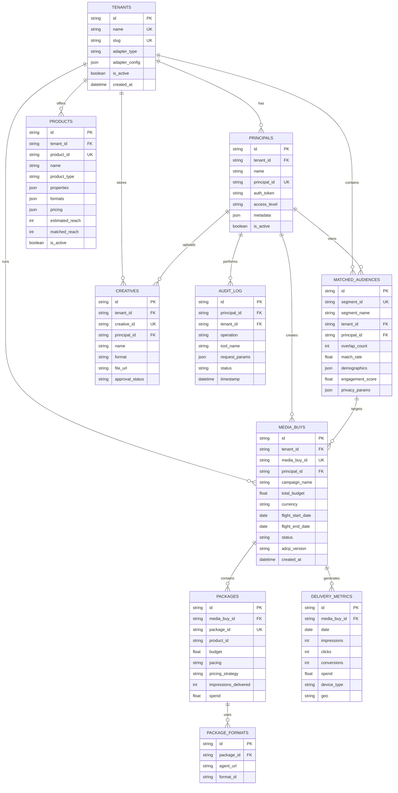

# Yahoo MCP Server - AdCP Sales Agent

FastMCP server exposing Yahoo advertising inventory via AdCP Media Buy Protocol.

## Architecture

```
┌─────────────────────────────────────────────────────────────────────────────┐
│                           YAHOO MCP SERVER                                   │
│                    (FastMCP + AdCP v2.3.0 Compliant)                        │
├─────────────────────────────────────────────────────────────────────────────┤
│                                                                              │
│    ┌────────────────┐     ┌────────────────┐     ┌────────────────┐        │
│    │  get_products  │     │create_media_buy│     │ update/delete  │        │
│    │  get_media_buy │     │                │     │                │        │
│    │  get_delivery  │     │                │     │                │        │
│    └───────┬────────┘     └───────┬────────┘     └───────┬────────┘        │
│            │ READ                 │ WRITE                │ WRITE           │
│            ▼                      ▼                      ▼                 │
│    ┌───────────────────────────────────────────────────────────────┐       │
│    │                    SERVICE LAYER                               │       │
│    │  datacloud_query_service.py  │  snowflake_write_service.py    │       │
│    └───────────────────────────────────────────────────────────────┘       │
│                                                                              │
└─────────────────────────────────────────────────────────────────────────────┘
                 │                              │
                 │ READ                         │ WRITE
                 ▼                              ▼
┌────────────────────────────┐    ┌────────────────────────────┐
│  SALESFORCE DATA CLOUD     │    │        SNOWFLAKE           │
│  ─────────────────────     │    │  ─────────────────────     │
│  • Query API               │◀──▶│  • Single Source of Truth  │
│  • Virtualized Tables      │    │  • AdCP v2.3.0 Schema      │
│  • Zero Copy Partner       │    │  • Instant Data Cloud Sync │
│                            │    │                            │
│  Tables (DLM suffix):      │    │  Tables:                   │
│  • products_dlm            │    │  • products                │
│  • media_buys_dlm          │    │  • media_buys              │
│  • packages_dlm            │    │  • packages                │
│  • delivery_metrics_dlm    │    │  • delivery_metrics        │
│  • matched_audiences_dlm   │    │  • matched_audiences       │
└────────────────────────────┘    └────────────────────────────┘
              ▲                              │
              │         ZERO COPY            │
              └──────────────────────────────┘
                    (No ETL, Instant Sync)
```

## Features

- **LLM-Powered Product Discovery**: Natural language campaign brief → matched products
- **Matched Audience Integration**: Products linked to Clean Room audience overlaps
- **Real-time Performance Metrics**: Campaign delivery, CTR, CVR, pacing
- **Principal Authentication**: Bearer token auth with access level discounts
- **Campaign Management**: Create, update, monitor media buys
- **Snowflake-First**: All writes go to Snowflake, Data Cloud reads via Zero Copy

## AdCP Tools (9 Total)

| Tool | Type | Description |
|------|------|-------------|
| `get_products` | READ | Discover inventory using natural language brief |
| `list_creative_formats` | READ | Get available ad formats |
| `create_media_buy` | WRITE | Create new campaign in Snowflake |
| `get_media_buy` | READ | Get campaign configuration |
| `get_media_buy_delivery` | READ | Real-time performance metrics |
| `update_media_buy` | WRITE | Modify active campaign |
| `delete_media_buy` | WRITE | Remove campaign |
| `get_media_buy_report` | READ | Generate analytics report |
| `get_matched_audiences` | READ | Clean Room audience overlaps |

## Quick Start

### 1. Install Dependencies

```bash
cd yahoo_mcp_server
uv sync
```

### 2. Configure Environment

```bash
cp env.template .env
# Edit .env with your credentials
```

**Required for Cloud-Native Mode:**
```bash
# Snowflake (WRITE path)
SNOWFLAKE_ACCOUNT=xxx.us-east-1
SNOWFLAKE_USER=your_user
SNOWFLAKE_PASSWORD=your_password
SNOWFLAKE_DATABASE=ADCP_PLATFORM
SNOWFLAKE_SCHEMA=PUBLIC
SNOWFLAKE_WAREHOUSE=COMPUTE_WH
SNOWFLAKE_ROLE=SYSADMIN

# Salesforce Data Cloud (READ path)
SFDC_CLIENT_ID=your_connected_app_client_id
SFDC_CLIENT_SECRET=your_connected_app_secret
SFDC_USERNAME=your_username
SFDC_PASSWORD=your_password
SFDC_LOGIN_URL=https://login.salesforce.com

# LLM for product matching
ANTHROPIC_API_KEY=sk-ant-...
```

### 3. Run Server

```bash
# Local development
uv run python server_http.py

# Or for production
python server_http.py
```

Server starts on: `http://localhost:8080/`

## Data Flow

### READ Path (Query)

```
User Request → MCP Server → Data Cloud Query Service → Salesforce Data Cloud
                                                              ↓
                                              (Zero Copy virtualized Snowflake)
                                                              ↓
                                                    Query Results → Response
```

### WRITE Path (Create/Update)

```
User Request → MCP Server → Snowflake Write Service → Snowflake
                                                          ↓
                                               (Instant Zero Copy Sync)
                                                          ↓
                                               Data Cloud sees changes
```

## Entity Relationship Diagram



## Table Relationships Summary

| Parent | Child | Relationship | Description |
|--------|-------|--------------|-------------|
| `tenants` | `principals` | 1:N | Tenant (Yahoo) has many principals (Nike, etc.) |
| `tenants` | `products` | 1:N | Tenant offers advertising inventory |
| `tenants` | `media_buys` | 1:N | Campaigns run on tenant's platform |
| `principals` | `media_buys` | 1:N | Advertiser creates campaigns |
| `principals` | `matched_audiences` | 1:N | Advertiser owns matched segments |
| `principals` | `creatives` | 1:N | Advertiser uploads ad assets |
| `media_buys` | `packages` | 1:N | Campaign contains AdCP v2.3.0 packages |
| `packages` | `package_formats` | 1:N | Package references creative formats |
| `media_buys` | `delivery_metrics` | 1:N | Campaign generates performance data |
| `matched_audiences` | `media_buys` | 1:N | Clean Room segment targets campaigns |

### Snowflake Tables (10 Total)

| Table | Description | Primary Key |
|-------|-------------|-------------|
| `tenants` | Yahoo Publishers (Sports, Finance, News) | `id` |
| `principals` | Authenticated advertisers (Nike) | `id` |
| `matched_audiences` | Clean Room output (audience overlaps) | `id` |
| `products` | Advertising inventory packages | `id` |
| `media_buys` | Active campaigns | `id` |
| `packages` | AdCP v2.3.0 package allocations | `id` |
| `package_formats` | Creative format assignments | `id` |
| `creatives` | Ad assets (images, video) | `id` |
| `delivery_metrics` | Performance data (impressions, clicks) | `id` |
| `audit_log` | Immutable operation history | `id` |

## Authentication

Include bearer token in requests:

```bash
x-adcp-auth: Bearer nike_token_12345
```

**Test Credentials**:
- Principal: `nike_advertiser`
- Token: `nike_token_12345`
- Access Level: `enterprise` (15% discount)

## Example Requests

### List Available Tools

```bash
curl http://localhost:8080/tools/list
```

### Discover Products

```bash
curl -X POST http://localhost:8080/tools/call \
  -H "x-adcp-auth: Bearer nike_token_12345" \
  -H "Content-Type: application/json" \
  -d '{
    "name": "get_products",
    "arguments": {
      "brief": "Display ads for sports enthusiasts interested in running",
      "budget_range": [10000, 100000]
    }
  }'
```

### Create Campaign

```bash
curl -X POST http://localhost:8080/tools/call \
  -H "x-adcp-auth: Bearer nike_token_12345" \
  -H "Content-Type: application/json" \
  -d '{
    "name": "create_media_buy",
    "arguments": {
      "campaign_name": "Nike Q1 Running",
      "packages": [{
        "product_id": "yahoo_sports_video_preroll",
        "budget": 25000,
        "pricing_strategy": "cpm"
      }],
      "flight_start_date": "2025-01-15",
      "flight_end_date": "2025-03-31"
    }
  }'
```

## Project Structure

```
yahoo_mcp_server/
├── server_http.py                 # FastMCP entry point (production)
├── server.py                      # Alternative entry point
├── services/
│   ├── datacloud_query_service.py # READ: Query Data Cloud
│   ├── datacloud_auth_service.py  # OAuth for Data Cloud
│   ├── snowflake_write_service.py # WRITE: Insert/Update Snowflake
│   ├── media_buy_service.py       # Campaign lifecycle
│   ├── product_service.py         # LLM-powered discovery
│   └── metrics_service.py         # Performance aggregation
├── utils/
│   ├── auth.py                    # Token authentication
│   └── llm_client.py              # Claude/Gemini wrapper
├── slack/                         # Slack MCP Client
│   ├── agent.py                   # Claude + MCP integration
│   ├── bot.py                     # Slack Bolt handlers
│   ├── formatters.py              # Block Kit formatting
│   └── README.md                  # Slack architecture docs
├── slack_app.py                   # Slack bot entry point
├── pyproject.toml                 # Dependencies (uv)
├── .python-version                # Python version for Heroku
└── Procfile                       # Heroku deployment command
```

## Deployment

### Heroku Deployment

```bash
# Add Heroku remote
git remote add yahoo-mcp https://git.heroku.com/yahoo-mcp-server.git

# Deploy yahoo_mcp_server subdirectory
git subtree push --prefix yahoo_mcp_server yahoo-mcp main
```

### Environment Variables on Heroku

```bash
heroku config:set SNOWFLAKE_ACCOUNT=xxx -a yahoo-mcp-server
heroku config:set SFDC_CLIENT_ID=xxx -a yahoo-mcp-server
# ... etc
```

## Related Documentation

| Document | Description |
|----------|-------------|
| [TECHNOLOGY_BUSINESS_VISION.md](../TECHNOLOGY_BUSINESS_VISION.md) | Full architecture and business value |
| [ADCP_DATACLOUD_INTEGRATION_PATTERNS.md](../ADCP_DATACLOUD_INTEGRATION_PATTERNS.md) | Data Cloud integration patterns |
| [SNOWFLAKE_FIRST_ARCHITECTURE.md](../SNOWFLAKE_FIRST_ARCHITECTURE.md) | Snowflake-First design decisions |
| [slack/README.md](slack/README.md) | Slack MCP Client architecture |

## Troubleshooting

**Issue**: "Data Cloud authentication failed"
- **Fix**: Verify `SFDC_*` environment variables are correct
- **Check**: Connected App has proper OAuth scopes

**Issue**: "Snowflake connection failed"
- **Fix**: Verify `SNOWFLAKE_*` environment variables
- **Check**: Warehouse is running, user has proper role

**Issue**: "LLM client initialization failed"
- **Fix**: Add `ANTHROPIC_API_KEY` to `.env`

**Issue**: "Authentication required"
- **Fix**: Include `x-adcp-auth: Bearer nike_token_12345` header

---

## Legacy Note

Earlier versions (Phase 1) used SQLite. The current production deployment is **100% cloud-native**:
- No SQLite dependency
- Snowflake as single source of truth
- Data Cloud for query interface

Files like `models.py` exist for backward compatibility but are not used in production (`server_http.py`).
