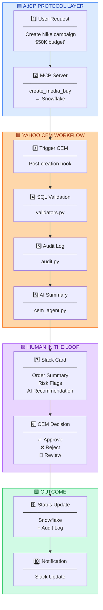
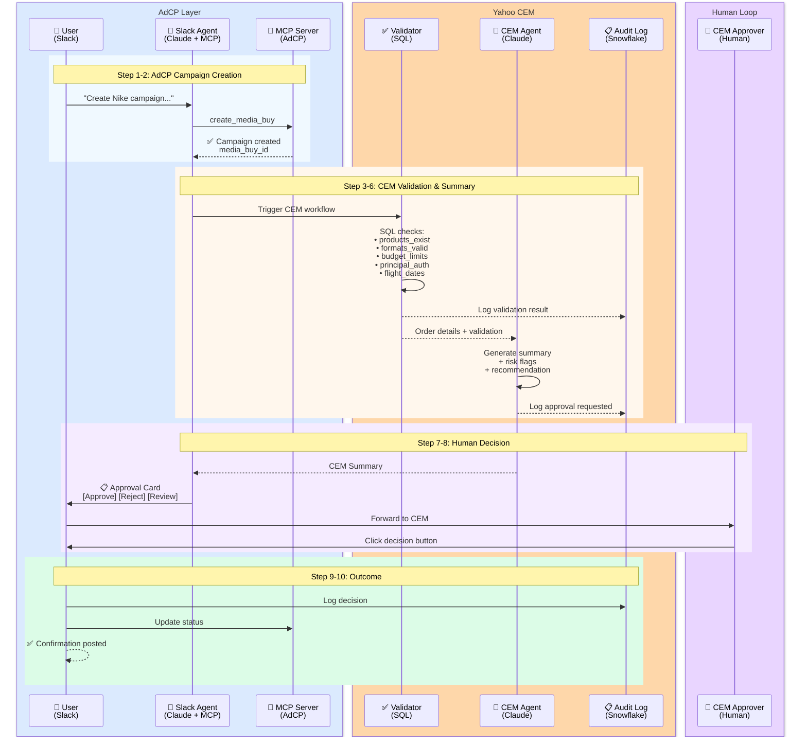
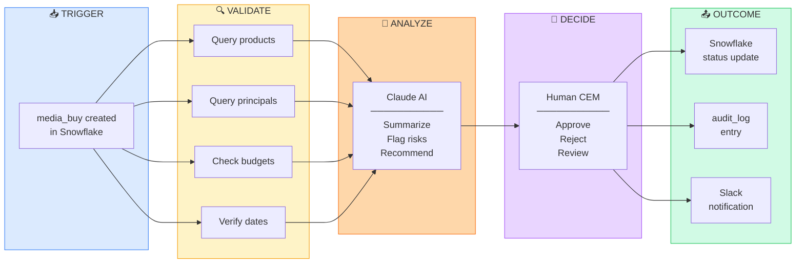

# Yahoo CEM Automation Workflow

## Overview

This module handles Yahoo's **internal Campaign Escalation Manager (CEM)** workflow for order validation and approval. It is **separate from the AdCP protocol** — this is Yahoo's internal business process that happens after AdCP creates a media buy.

### Key Principle: Separation of Concerns

```
┌─────────────────────────────────────────────────────────────────┐
│  AdCP PROTOCOL (External Standard)                              │
│  ───────────────────────────────────────────────────────────── │
│  • get_products, create_media_buy, get_delivery                │
│  • Industry-standard, interoperable                            │
│  • Writes to Snowflake via MCP Server                          │
└─────────────────────────────────────────────────────────────────┘
                              ↓
                    [ HANDOFF POINT ]
                              ↓
┌─────────────────────────────────────────────────────────────────┐
│  YAHOO INTERNAL (This Module)                                   │
│  ───────────────────────────────────────────────────────────── │
│  • SQL Validation against master tables                        │
│  • AI-powered summarization for human review                   │
│  • Human-in-the-loop approval in Slack                         │
│  • Audit logging for compliance                                │
└─────────────────────────────────────────────────────────────────┘
```

---

## Color Legend

| Color | Role | Hex (Light) | Hex (Dark) |
|-------|------|-------------|------------|
| 🟦 Blue | Data Layer (Snowflake) | `#3B82F6` | `#60A5FA` |
| 🟩 Green | Validation (Pass) | `#22C55E` | `#4ADE80` |
| 🟥 Red | Validation (Fail) / Reject | `#EF4444` | `#F87171` |
| 🟧 Orange | AI Processing | `#F97316` | `#FB923C` |
| 🟪 Purple | Human Action | `#A855F7` | `#C084FC` |
| ⬜ Gray | Audit / Logging | `#6B7280` | `#9CA3AF` |

---

## End-to-End Workflow



---

## Detailed Sequence Diagram



---

## Module Components

### 1. `validators.py` - SQL Validation

Validates orders against master tables using **pure SQL** — no business logic in code.

```
┌─────────────────────────────────────────────────────────────┐
│  VALIDATION CHECKS                                          │
├─────────────────────────────────────────────────────────────┤
│  ✅ media_buy_exists    │ Record exists in media_buys      │
│  ✅ products_exist      │ Products in master table         │
│  ✅ formats_exist       │ Format IDs are valid             │
│  ✅ principal_authorized│ Principal is active              │
│  ✅ budget_limits       │ Within access level limits       │
│  ✅ flight_dates        │ Start < end, valid range         │
└─────────────────────────────────────────────────────────────┘
```

**Budget Limits by Access Level:**
| Access Level | Max Budget |
|--------------|------------|
| Enterprise | $1,000,000 |
| Preferred | $500,000 |
| Standard | $100,000 |

### 2. `audit.py` - Compliance Logging

Logs all CEM operations to Snowflake `audit_log` table.

```
┌─────────────────────────────────────────────────────────────┐
│  AUDIT OPERATIONS                                           │
├─────────────────────────────────────────────────────────────┤
│  cem_validation        │ Order validated                   │
│  cem_approval_requested│ Sent to CEM for approval          │
│  cem_approved          │ CEM approved the order            │
│  cem_rejected          │ CEM rejected the order            │
│  cem_review_requested  │ CEM requested changes             │
└─────────────────────────────────────────────────────────────┘
```

### 3. `cem_agent.py` - AI Summarization

Uses Claude to generate **clear, explicit explanations** for human CEM review.

**Output Structure:**
```json
{
  "order_summary": "Human-readable 2-3 sentence summary",
  "validation_explanation": "What was checked and results",
  "risk_flags": ["flag1", "flag2"],
  "recommendation": {
    "action": "approve|review|reject",
    "confidence": "high|medium|low",
    "reason": "Clear explanation",
    "risk_level": "low|medium|high"
  }
}
```

**Recommendation Criteria:**
| Action | Criteria |
|--------|----------|
| ✅ APPROVE | All validations pass, no risk flags, normal budget |
| 🔍 REVIEW | Validations pass but has risk flags (high budget, new client) |
| ❌ REJECT | Any validation failed |

---

## Slack Integration

### Approval Card Components

```mermaid
flowchart TB
    subgraph CARD ["📋 CEM APPROVAL CARD"]
        direction TB
        H["🔔 New Order Pending CEM Approval"]
        ID["Order ID: nike_spring_2026_xxxxx"]
        DIV1["───────────────────────"]
        SUM["📋 Order Summary<br/>Nike (enterprise) requesting $50K..."]
        DIV2["───────────────────────"]
        VAL["✅ Validation Results<br/>5/6 checks passed..."]
        DIV3["───────────────────────"]
        RISK["⚠️ Risk Flags<br/>• High budget for flight duration"]
        DIV4["───────────────────────"]
        REC["🤖 AI Recommendation<br/>✅ APPROVE (high confidence)<br/>🟢 Risk Level: low"]
        DIV5["───────────────────────"]
        BTN["[✅ Approve] [❌ Reject] [📝 Request Changes]"]
    end

    style CARD fill:#F8FAFC,stroke:#64748B,color:#1E293B
```



### Button Actions

| Button | Action | Status Update |
|--------|--------|---------------|
| ✅ Approve | `cem_approve_{id}` | `active` |
| ❌ Reject | Opens modal for reason | `rejected` |
| 📝 Request Changes | Opens modal for comments | `pending_changes` |

---

## Data Flow Diagram



---

## Environment Variables

```bash
# Snowflake Connection (for validation & audit)
SNOWFLAKE_ACCOUNT=xxx.snowflakecomputing.com
SNOWFLAKE_USER=your_user
SNOWFLAKE_PASSWORD=your_password
SNOWFLAKE_DATABASE=DEMO_BYOL_QUERY_FEDERATION_FOR_SALESFORCE
SNOWFLAKE_SCHEMA=PUBLIC
SNOWFLAKE_WAREHOUSE=COMPUTE_WH
SNOWFLAKE_ROLE=SYSADMIN

# AI (for CEM summarization)
ANTHROPIC_API_KEY=sk-ant-xxx
```

---

## Usage Example

### Triggering CEM Workflow (from Slack Agent)

```python
from automation import OrderValidator, AuditLogger, CEMAgent

# After create_media_buy succeeds
media_buy_id = "nike_spring_2026_xxxxx"

# 1. Validate
validator = OrderValidator()
validation = validator.validate_order(media_buy_id)
order_details = validator.get_order_details(media_buy_id)

# 2. Log validation
audit = AuditLogger()
audit.log_validation(media_buy_id, validation.__dict__)

# 3. Generate AI summary
cem = CEMAgent()
summary = cem.generate_summary(order_details, validation.__dict__)

# 4. Post to Slack
blocks = summary.to_slack_blocks()  # Returns Slack Block Kit format
```

---

## Testing

### Happy Path (Should APPROVE)
```
Create a Nike campaign with:
- Product: yahoo_sports_display_enthusiasts
- Budget: $50,000
- Flight dates: January 15, 2026 to March 15, 2026
```

### Sad Path (Should REJECT)
```
Create a Nike campaign with:
- Product: yahoo_invalid_product
- Budget: $50,000
- Flight dates: January 15, 2026 to March 15, 2026
```

### Review Path (Should REVIEW)
```
Create a campaign with:
- Product: yahoo_sports_display_enthusiasts
- Budget: $750,000
- Flight dates: January 2, 2026 to January 5, 2026
```

---

## File Structure

```
automation/
├── __init__.py          # Package exports
├── README.md            # This file
├── validators.py        # SQL validation against master tables
├── audit.py             # Snowflake audit logging
└── cem_agent.py         # AI summarization for CEM review
```

---

## Architecture Alignment

This module implements the **"Yahoo Internal"** portion of the overall system:

```
┌────────────────────────────────────────────────────────────────┐
│                    OVERALL SYSTEM                              │
├────────────────────────────────────────────────────────────────┤
│                                                                │
│  ┌──────────────┐   ┌──────────────┐   ┌──────────────┐       │
│  │   Slack      │   │   Streamlit  │   │  Agentforce  │       │
│  │   Client     │   │   Client     │   │   Client     │       │
│  └──────┬───────┘   └──────┬───────┘   └──────┬───────┘       │
│         │                  │                  │               │
│         └──────────────────┼──────────────────┘               │
│                            │                                  │
│                            ▼                                  │
│              ┌─────────────────────────┐                      │
│              │     Yahoo MCP Server    │ ◄── AdCP Protocol    │
│              │      (server_http.py)   │                      │
│              └───────────┬─────────────┘                      │
│                          │                                    │
│         ┌────────────────┼────────────────┐                   │
│         ▼                ▼                ▼                   │
│  ┌─────────────┐  ┌─────────────┐  ┌─────────────┐           │
│  │  Snowflake  │  │ Data Cloud  │  │ automation/ │ ◄── HERE  │
│  │  (Writes)   │  │  (Reads)    │  │  (CEM Flow) │           │
│  └─────────────┘  └─────────────┘  └─────────────┘           │
│                                                                │
└────────────────────────────────────────────────────────────────┘
```

---

*This documentation is for Yahoo's internal CEM workflow. For AdCP protocol documentation, see the [main README](/yahoo_mcp_server/README.md).*

