# Slack MCP Client for Yahoo Advertising

## The Problem We're Solving

Media buyers spend too much time switching between tools.

Picture this: You're a campaign manager at Nike. You need to launch a Q1 campaign for running shoes. Today, that means logging into Yahoo's ad platform, searching inventory, exporting to a spreadsheet, cross-referencing with your CRM data, emailing your Yahoo rep, waiting for a proposal, going back and forth on targeting, and finally—maybe a week later—your campaign goes live.

That workflow is broken. Not because the people are slow, but because the tools don't talk to each other.

**What if you could just ask?**

> "Hey, show me Yahoo's sports video inventory for Nike runners. Budget is $50K for Q1."

And get an answer. Right there in Slack. Where your team already works.

That's what this does.

---

## What This Is

A Slack bot that connects your team directly to Yahoo's advertising platform using:

- **Claude AI** for natural language understanding
- **MCP (Model Context Protocol)** for standardized tool calling
- **Salesforce Data Cloud** for real-time campaign data
- **Snowflake** as the source of truth

No new logins. No context switching. Just ask questions in Slack and get answers.

---

## How It Works

When someone sends a message to the bot, here's what happens behind the scenes:

```mermaid
flowchart TB
    subgraph SLACK ["💬 SLACK"]
        USER["User sends message"]
        RESPONSE["User sees response"]
    end

    subgraph BOT ["🤖 SLACK BOT (Heroku)"]
        BOLT["Slack Bolt<br/>Event Handler"]
        AGENT["Claude AI Agent<br/>Natural Language → Tool Calls"]
        MCP_CLIENT["MCP Client<br/>Tool Execution"]
    end

    subgraph YAHOO ["🎯 YAHOO MCP SERVER (Heroku)"]
        MCP_SERVER["MCP Server<br/>9 AdCP Tools"]
    end

    subgraph DATA ["💾 DATA LAYER"]
        DC["Salesforce<br/>Data Cloud<br/>─────────<br/>READ Path<br/>Query API"]
        SF["Snowflake<br/>─────────<br/>WRITE Path<br/>Direct Insert"]
    end

    USER --> BOLT
    BOLT --> AGENT
    AGENT --> MCP_CLIENT
    MCP_CLIENT --> MCP_SERVER
    
    MCP_SERVER -->|"Query"| DC
    MCP_SERVER -->|"Insert/Update"| SF
    DC <-->|"Zero Copy"| SF
    
    SF --> MCP_SERVER
    DC --> MCP_SERVER
    MCP_SERVER --> MCP_CLIENT
    MCP_CLIENT --> AGENT
    AGENT --> BOLT
    BOLT --> RESPONSE

    style SLACK fill:#4A154B,stroke:#611f69,color:#fff
    style BOT fill:#1264A3,stroke:#0b4f8a,color:#fff
    style YAHOO fill:#7B68EE,stroke:#5a4fcf,color:#fff
    style DATA fill:#2E8B57,stroke:#1e6b47,color:#fff
```

---

## Request/Response Flow

Here's the complete journey of a single request:


---

## Write Path (Campaign Creation)

When a user creates a campaign, the flow is slightly different:


---

## Architecture Components

### Slack Bot Layer

| Component | Purpose |
|-----------|---------|
| **Slack Bolt** | Handles Slack events (mentions, DMs, commands) |
| **Claude Agent** | Converts natural language to tool calls |
| **MCP Client** | Executes tools against Yahoo MCP Server |

### Yahoo MCP Server

| Tool | Operation | Data Path |
|------|-----------|-----------|
| `get_products` | Discover inventory | READ → Data Cloud |
| `list_creative_formats` | Get format specs | Static response |
| `create_media_buy` | Create campaign | WRITE → Snowflake |
| `get_media_buy` | Get campaign details | READ → Data Cloud |
| `get_media_buy_delivery` | Performance metrics | READ → Data Cloud |
| `update_media_buy` | Modify campaign | WRITE → Snowflake |
| `get_media_buy_report` | Analytics report | READ → Data Cloud |

### Data Layer

```
┌─────────────────────────────────────────────────────────────┐
│                     SNOWFLAKE                                │
│              (Single Source of Truth)                        │
│  ┌─────────┐  ┌─────────┐  ┌──────────┐  ┌───────────────┐  │
│  │products │  │media_   │  │packages  │  │delivery_      │  │
│  │         │  │buys     │  │          │  │metrics        │  │
│  └─────────┘  └─────────┘  └──────────┘  └───────────────┘  │
└─────────────────────────────────────────────────────────────┘
                            ▲
                            │ Zero Copy
                            │ (No ETL, instant sync)
                            ▼
┌─────────────────────────────────────────────────────────────┐
│                 SALESFORCE DATA CLOUD                        │
│              (Query Interface + Semantics)                   │
│  ┌─────────┐  ┌─────────┐  ┌──────────┐  ┌───────────────┐  │
│  │products_│  │media_   │  │packages_ │  │delivery_      │  │
│  │_dlm     │  │buys_dlm │  │_dlm      │  │metrics_dlm    │  │
│  └─────────┘  └─────────┘  └──────────┘  └───────────────┘  │
└─────────────────────────────────────────────────────────────┘
```

---

## Why This Matters

| Before | After |
|--------|-------|
| 5+ systems to launch a campaign | 1 Slack message |
| 2-3 days from brief to live | 30 seconds |
| Manual data reconciliation | Automatic via Zero Copy |
| Copy-paste errors | Validated tool calls |
| Scattered conversations | Threaded, searchable history |

---

## Getting Started

### Prerequisites

1. Slack workspace with admin access
2. Slack App configured with:
   - Socket Mode enabled
   - Bot scopes: `app_mentions:read`, `chat:write`, `im:history`, `im:read`, `im:write`
   - Event subscriptions: `app_mention`, `message.im`
3. Anthropic API key (for Claude)

### Environment Variables

```bash
SLACK_BOT_TOKEN=xoxb-...      # OAuth & Permissions page
SLACK_APP_TOKEN=xapp-...      # Socket Mode token
SLACK_SIGNING_SECRET=...      # Basic Information page
ANTHROPIC_API_KEY=sk-ant-...  # Claude API
MCP_SERVER_URL=https://...    # Yahoo MCP Server (optional, has default)
```

### Run Locally

```bash
cd yahoo_mcp_server
uv sync
uv run python slack_app.py
```

### Test in Slack

DM the bot or @mention it:
- `help` — Show available commands
- `Show me advertising options for Nike` — Discover products
- `Create a campaign with Yahoo Sports Video, $25K` — Create campaign
- `How is campaign XYZ performing?` — Get metrics

---

## Files

```
slack/
├── __init__.py       # Package exports
├── agent.py          # Claude + MCP integration
├── bot.py            # Slack Bolt handlers
├── formatters.py     # Block Kit formatting
└── README.md         # This file

slack_app.py          # Entry point (HTTP + Socket Mode)
```

---

## Enterprise Scale: 100 Account Directors

Real scenario: Yahoo has 100 account directors (ADs) who live in Slack but need to create opportunities and campaigns in their CRM (Salesforce). How does this work?

### The Reality

Account directors don't want to learn new systems. They already:
- Chat with clients in Slack
- Coordinate with creative teams in Slack
- Get notifications in Slack

But the business requires:
- Opportunities tracked in CRM
- Campaigns with proper approval chains
- Audit trails for compliance

### Unified Architecture: Slack ↔ CRM + Campaign Integration

**Color Legend:**
| Color | Role |
|-------|------|
| 🟣 Purple | Slack Layer (100 Account Directors) |
| 🔵 Blue | Bot & AI Layer (Claude Agent) |
| 🟠 Orange | MCP Servers (Protocol Layer) |
| 🟢 Green | Data Systems (Snowflake, CRM, Data Cloud) |

```mermaid
flowchart TB
    subgraph SLACK ["🟣 SLACK WORKSPACE — 100 Account Directors"]
        direction LR
        AD_SPORTS["👤 AD: Sports<br/>─────────────<br/>Nike, Adidas"]
        AD_ENT["👤 AD: Entertainment<br/>─────────────<br/>Netflix, Disney"]
        AD_NEWS["👤 AD: News<br/>─────────────<br/>CNN, BBC"]
        AD_MORE["👤 AD: ... (x97)<br/>─────────────<br/>All Verticals"]
    end

    subgraph BOT ["🔵 SLACK BOT + CLAUDE AI"]
        BOLT["Slack Bolt<br/>Event Handler"]
        AGENT["Claude Agent<br/>───────────────<br/>Intent Detection<br/>Tool Orchestration"]
        MCP_CLIENT["MCP Client<br/>───────────────<br/>JSON-RPC 2.0"]
        
        BOLT --> AGENT
        AGENT --> MCP_CLIENT
    end

    subgraph MCP_SERVERS ["🟠 MCP SERVERS (AdCP Protocol)"]
        direction LR
        YAHOO_MCP["Yahoo MCP Server<br/>───────────────<br/>📦 get_products<br/>📝 create_media_buy<br/>📊 get_delivery"]
        CRM_MCP["Salesforce MCP Server<br/>───────────────<br/>💼 create_opportunity<br/>🔄 update_opportunity<br/>✅ submit_approval<br/>👍 approve_record"]
    end

    subgraph DATA ["🟢 DATA SYSTEMS"]
        subgraph SNOW_BOX ["❄️ SNOWFLAKE"]
            SNOW["Campaign Tables<br/>───────────────<br/>media_buys<br/>packages<br/>delivery_metrics"]
        end
        
        subgraph CRM_BOX ["☁️ SALESFORCE CRM"]
            OPP["Opportunities<br/>───────────────<br/>Amount, Stage<br/>Campaign Links"]
            APPR["Approval Process<br/>───────────────<br/>VP Approval<br/>Finance Review"]
        end
        
        subgraph DC_BOX ["🌐 DATA CLOUD"]
            DC["Unified View<br/>───────────────<br/>CRM + Campaigns<br/>Real-time Sync"]
        end
    end

    %% Connections from Slack to Bot
    AD_SPORTS -->|"1️⃣ Message"| BOLT
    AD_ENT -->|"1️⃣ Message"| BOLT
    AD_NEWS -->|"1️⃣ Message"| BOLT
    AD_MORE -->|"1️⃣ Message"| BOLT

    %% Bot to MCP Servers
    MCP_CLIENT -->|"2️⃣ Campaign DML"| YAHOO_MCP
    MCP_CLIENT -->|"2️⃣ CRM DML"| CRM_MCP

    %% MCP to Data Systems
    YAHOO_MCP -->|"3️⃣ INSERT/UPDATE"| SNOW
    CRM_MCP -->|"3️⃣ INSERT/UPDATE"| OPP
    CRM_MCP -->|"3️⃣ TRIGGER"| APPR

    %% Data Sync
    SNOW <-->|"4️⃣ Zero Copy"| DC
    OPP <-->|"4️⃣ Data Cloud Connect"| DC

    %% Styling with hex colors (GitHub compatible)
    style SLACK fill:#4A154B,stroke:#611f69,color:#fff
    style BOT fill:#1264A3,stroke:#0b4f8a,color:#fff
    style MCP_SERVERS fill:#FF9800,stroke:#E65100,color:#fff
    style DATA fill:#2E8B57,stroke:#1e6b47,color:#fff
    style SNOW_BOX fill:#2980B9,stroke:#3498DB,color:#fff
    style CRM_BOX fill:#9B59B6,stroke:#8E44AD,color:#fff
    style DC_BOX fill:#27AE60,stroke:#2ECC71,color:#fff
```

### Complete Request Flow with Step Numbers


### Approval Flow (VP in Slack)

```mermaid
sequenceDiagram
    box rgb(74, 21, 75) 🟣 Slack
        participant AD as 👤 Account Director
        participant VP as 👔 VP Sales
        participant SLACK as 💬 Slack
    end

    box rgb(18, 100, 163) 🔵 Bot
        participant BOT as 🔌 Bot
        participant AI as 🧠 Claude
    end

    box rgb(255, 152, 0) 🟠 MCP
        participant CRM as 💼 SF MCP
    end

    box rgb(46, 139, 87) 🟢 CRM
        participant SFDC as ☁️ Salesforce
        participant APPR as ⚡ Approval
    end

    Note over AD,APPR: 🔔 VP Receives Approval Request in Slack

    rect rgb(255, 250, 220)
        Note over BOT,VP: Approval Notification
        BOT->>SLACK: 1️⃣ Post to VP
        SLACK->>VP: 1️⃣ 🔔 Approval Request<br/>Nike $250K Campaign<br/>[✅ Approve] [❌ Reject]
    end

    rect rgb(220, 245, 220)
        Note over VP,APPR: VP Approves
        VP->>SLACK: 2️⃣ Click ✅ Approve
        SLACK->>BOT: 2️⃣ Button action
        BOT->>AI: 2️⃣ Process approval
        AI->>CRM: 3️⃣ approve_record(opp_id)
        CRM->>APPR: 3️⃣ Approve in SF
        APPR->>SFDC: 3️⃣ UPDATE status
        SFDC-->>CRM: 3️⃣ ✅ Approved
    end

    rect rgb(230, 210, 230)
        Note over AD,VP: Notifications
        CRM-->>AI: 4️⃣ Approval complete
        AI-->>BOT: 4️⃣ Notify parties
        BOT-->>SLACK: 4️⃣ Messages
        SLACK-->>AD: 4️⃣ "✅ APPROVED by VP!"
        SLACK-->>VP: 4️⃣ "✅ Approval recorded"
    end

    Note over AD,APPR: ⏱️ Total time: ~30 seconds<br/>vs 24-48 hours traditional
```

### DML Operations Summary

| Source | Target | Operation | MCP Tool |
|--------|--------|-----------|----------|
| Slack | Snowflake | INSERT media_buys | `create_media_buy` |
| Slack | Snowflake | INSERT packages | `create_media_buy` |
| Slack | Snowflake | UPDATE media_buys | `update_media_buy` |
| Slack | Salesforce CRM | INSERT Opportunity | `create_opportunity` |
| Slack | Salesforce CRM | UPDATE Opportunity | `update_opportunity` |
| Slack | Salesforce CRM | Trigger Approval | `submit_for_approval` |
| Slack | Salesforce CRM | Process Approval | `approve_record` |

### Data Unification in Data Cloud

```mermaid
flowchart LR
    subgraph SOURCES ["📥 DATA SOURCES"]
        SNOW["❄️ Snowflake<br/>───────────────<br/>media_buys<br/>packages<br/>delivery_metrics"]
        CRM["☁️ Salesforce CRM<br/>───────────────<br/>Opportunities<br/>Accounts<br/>Contacts"]
    end

    subgraph DC ["🌐 SALESFORCE DATA CLOUD"]
        direction TB
        UNIFIED["Unified Customer Profile<br/>───────────────<br/>Opportunity + Campaign<br/>Account + Delivery<br/>Contact + Engagement"]
        
        SEGMENT["Segments<br/>───────────────<br/>High-Value Advertisers<br/>Active Campaigns<br/>Pending Approvals"]
    end

    subgraph OUTPUTS ["📤 OUTPUTS"]
        SLACK_OUT["💬 Slack Reports<br/>───────────────<br/>Pipeline Dashboard<br/>Campaign Performance"]
        AGENT["🤖 AI Agent Queries<br/>───────────────<br/>Cross-system insights"]
    end

    SNOW -->|"Zero Copy<br/>(instant)"| UNIFIED
    CRM -->|"Data Cloud Connect<br/>(real-time)"| UNIFIED
    
    UNIFIED --> SEGMENT
    SEGMENT --> SLACK_OUT
    SEGMENT --> AGENT

    style SOURCES fill:#2E8B57,stroke:#1e6b47,color:#fff
    style DC fill:#9B59B6,stroke:#8E44AD,color:#fff
    style OUTPUTS fill:#4A154B,stroke:#611f69,color:#fff
```

### DML Operations via Slack

When an AD says: *"Create an opportunity for Nike, $500K Q1 campaign"*

```mermaid
sequenceDiagram
    box rgb(74, 21, 75) Slack
        participant AD as 👤 Account Director
    end

    box rgb(18, 100, 163) Bot
        participant BOT as 🧠 Claude Agent
    end

    box rgb(123, 104, 238) MCP Servers
        participant CRM as 📊 Salesforce MCP
        participant YAHOO as 🎯 Yahoo MCP
    end

    box rgb(46, 139, 87) Systems
        participant SF as ☁️ Salesforce CRM
        participant SNOW as ❄️ Snowflake
    end

    AD->>BOT: "Create Nike opportunity<br/>$500K Q1 sports campaign"

    rect rgb(210, 240, 235)
        Note over BOT,SF: CRM DML Operation
        BOT->>CRM: create_opportunity<br/>(account, amount, stage)
        CRM->>SF: INSERT Opportunity
        SF-->>CRM: Opportunity ID: 006xxx
        CRM-->>BOT: ✅ Created
    end

    BOT->>AD: Created Opportunity 006xxx<br/>🔗 [View in Salesforce]

    AD->>BOT: "Now create the campaign<br/>with Yahoo Sports Video"

    rect rgb(230, 225, 250)
        Note over BOT,SNOW: Campaign DML Operation
        BOT->>YAHOO: create_media_buy<br/>(products, budget, dates)
        YAHOO->>SNOW: INSERT media_buys
        SNOW-->>YAHOO: Campaign ID
        YAHOO-->>BOT: ✅ Created
    end

    rect rgb(210, 240, 235)
        Note over BOT,SF: Link Campaign to Opportunity
        BOT->>CRM: update_opportunity<br/>(add campaign_id)
        CRM->>SF: UPDATE Opportunity
    end

    BOT->>AD: ✅ Campaign created & linked!<br/>Opportunity: 006xxx<br/>Campaign: nike_q1_2025
```

### Approval Workflow

Campaigns over $100K require VP approval. Here's how it works entirely in Slack:

```mermaid
sequenceDiagram
    box rgb(74, 21, 75) Slack
        participant AD as 👤 Account Director
        participant VP as 👔 VP Sales
    end

    box rgb(18, 100, 163) Bot
        participant BOT as 🧠 Claude Agent
    end

    box rgb(123, 104, 238) MCP
        participant CRM as 📊 Salesforce MCP
    end

    box rgb(46, 139, 87) CRM
        participant SF as ☁️ Salesforce
        participant APPR as ⚡ Approval Process
    end

    AD->>BOT: "Create campaign for Nike<br/>$250K Yahoo Premium Video"

    BOT->>BOT: Detect: amount > $100K<br/>→ requires approval

    rect rgb(255, 250, 220)
        Note over BOT,APPR: Submit for Approval
        BOT->>CRM: create_media_buy<br/>(status: pending_approval)
        CRM->>SF: INSERT media_buy
        SF->>APPR: Trigger Approval Process
        APPR->>APPR: Route to VP
    end

    BOT->>AD: ⏳ Campaign submitted for approval<br/>Waiting on VP approval

    BOT->>VP: 🔔 Approval Request<br/>Nike $250K Campaign<br/>[✅ Approve] [❌ Reject]

    VP->>BOT: ✅ Approve

    rect rgb(220, 245, 220)
        Note over BOT,SF: Process Approval
        BOT->>CRM: approve_record<br/>(campaign_id)
        CRM->>SF: UPDATE status = approved
        SF->>APPR: Complete approval
    end

    BOT->>AD: ✅ Campaign APPROVED by VP!<br/>Campaign is now active
    BOT->>VP: ✅ Approval recorded
```

### Why Slack-Native Approvals Work

| Traditional | Slack-Native |
|------------|--------------|
| VP gets email → opens Salesforce → finds record → clicks approve | VP sees Slack notification → clicks ✅ |
| 24-48 hour turnaround | 5-minute turnaround |
| Context lost in email chain | Full context in thread |
| No audit trail in Slack | Everything logged to CRM |

### Technical Implementation

The approval flow requires:

1. **Salesforce MCP Server** with tools:
   - `create_opportunity` — INSERT into Opportunity object
   - `update_opportunity` — UPDATE with campaign links
   - `submit_for_approval` — Trigger approval process
   - `approve_record` / `reject_record` — Process approvals

2. **Slack Interactivity**:
   - Block Kit buttons for Approve/Reject
   - Action handlers in `bot.py`
   - Callback to Salesforce MCP

3. **Data Cloud Unification**:
   - CRM data + Campaign data in single view
   - Segment overlap (Nike customers × Yahoo audience)
   - Real-time reporting across both systems

### Sample Slack Commands

```
@adcp-slack-app create opportunity for Nike, $500K Q1 sports
@adcp-slack-app link campaign nike_q1_2025 to opportunity 006xxx
@adcp-slack-app show pending approvals
@adcp-slack-app approve campaign nike_q1_2025
@adcp-slack-app show Nike pipeline (pulls from CRM + campaigns)
```

---

## Developer Experience

### Gotchas We Hit (So You Don't Have To)

#### 1. Package Manager Conflict

Heroku's Python buildpack got strict in late 2024. If you have both `requirements.txt` AND `uv.lock`, it fails:

```
Error: Multiple Python package manager files were found.
```

**Fix:** Pick one. We use `uv` (faster, lockfile support). Delete `requirements.txt`.

#### 2. Python Version File

When using `uv`, Heroku doesn't support `runtime.txt`:

```
Error: The runtime.txt file isn't supported when using uv.
```

**Fix:** Delete `runtime.txt`, create `.python-version`:
```
3.12
```

Don't include patch version — let Heroku auto-update for security patches.

#### 3. Socket Mode on Heroku

Heroku requires web dynos to bind to `$PORT` within 60 seconds. Socket Mode only opens an outbound WebSocket — no port binding. Heroku kills it:

```
heroku[web.1]: Stopping process with SIGKILL
heroku[web.1]: State changed from starting to crashed
```

**Fix:** Run a minimal health check HTTP server alongside Socket Mode:

```python
# In slack_app.py
if port:  # Heroku sets PORT
    # Start health server AND Socket Mode concurrently
    await asyncio.gather(
        health_server.serve(),  # Binds to $PORT
        start_socket_mode(slack_app)  # WebSocket to Slack
    )
```

#### 4. Local vs Heroku: Only One at a Time

Both local and Heroku use the same `SLACK_APP_TOKEN` for Socket Mode. If both are running, Slack randomly distributes messages between them.

**Fix:** Scale down Heroku when testing locally:
```bash
heroku ps:scale web=0 -a adcp-slack-app   # Stop Heroku
uv run python slack_app.py                # Test local

# When done:
heroku ps:scale web=1 -a adcp-slack-app   # Resume Heroku
```

#### 5. Subtree Push for Monorepo

Deploying a subdirectory to Heroku:
```bash
git subtree push --prefix yahoo_mcp_server adcp-slack-app slack-mcp:main
```

If remote isn't set:
```bash
git remote add adcp-slack-app https://git.heroku.com/adcp-slack-app.git
```

### Deployment Checklist

- [ ] `.python-version` exists (not `runtime.txt`)
- [ ] Only `uv.lock` + `pyproject.toml` (no `requirements.txt`)
- [ ] `Procfile` set to `web: python slack_app.py`
- [ ] All env vars set in Heroku (`heroku config -a adcp-slack-app`)
- [ ] Local instance stopped before testing Heroku
- [ ] Health check server running alongside Socket Mode

---

## Enterprise Scaling: 100 CEMs with Visibility Rules

### The Challenge

Real-world scenario:
- **100 Yahoo Account Directors** (Campaign Escalation Managers)
- **500+ agencies** creating campaigns
- **Thousands of campaigns** per month
- Each CEM should only see campaigns for **their assigned accounts**

### Visibility Architecture

```mermaid
flowchart TB
    subgraph AGENCIES ["🟢 AGENCIES (External)"]
        A1["🏢 Nike Agency"]
        A2["🏢 Adidas Agency"]
        A3["🏢 Disney Agency"]
        A_MORE["🏢 ... 500+ Agencies"]
    end

    subgraph STREAMLIT ["📊 STREAMLIT APPS"]
        S1["Campaign Planner<br/>─────────────<br/>Webhook → Slack"]
    end

    subgraph ROUTING ["🔀 ROUTING LAYER"]
        LOOKUP["Account Lookup<br/>───────────────<br/>principal_id → CEM<br/>Query Snowflake/CRM"]
        ROUTER["CEM Router<br/>───────────────<br/>CEM → Slack User ID<br/>CEM → Channel"]
    end

    subgraph SLACK ["💬 SLACK (100 CEMs)"]
        direction LR
        CEM1["👤 CEM: Sports<br/>@john.smith<br/>─────────────<br/>Nike, Adidas,<br/>Under Armour"]
        CEM2["👤 CEM: Entertainment<br/>@jane.doe<br/>─────────────<br/>Disney, Netflix,<br/>Warner Bros"]
        CEM3["👤 CEM: Finance<br/>@bob.jones<br/>─────────────<br/>Fidelity, Chase,<br/>AmEx"]
        CEM_MORE["👤 ... (x97 CEMs)<br/>─────────────<br/>By Vertical"]
    end

    A1 --> S1
    A2 --> S1
    A3 --> S1
    A_MORE --> S1

    S1 -->|"Webhook<br/>+ principal_id"| LOOKUP
    LOOKUP -->|"Find CEM"| ROUTER
    
    ROUTER -->|"Nike → Sports"| CEM1
    ROUTER -->|"Disney → Ent"| CEM2
    ROUTER -->|"Fidelity → Fin"| CEM3

    style AGENCIES fill:#22C55E,stroke:#16A34A,color:#fff
    style STREAMLIT fill:#3B82F6,stroke:#2563EB,color:#fff
    style ROUTING fill:#F97316,stroke:#EA580C,color:#fff
    style SLACK fill:#4A154B,stroke:#611f69,color:#fff
```

### Visibility Rules Data Model

```
┌────────────────────────────────────────────────────────────────────┐
│  SNOWFLAKE: cem_assignments                                        │
├────────────────────────────────────────────────────────────────────┤
│  id            │ principal_id    │ cem_user_id    │ cem_slack_id   │
│  ──────────────┼─────────────────┼────────────────┼────────────────│
│  1             │ nike_global     │ john.smith     │ U0A1B2C3D4     │
│  2             │ adidas_na       │ john.smith     │ U0A1B2C3D4     │
│  3             │ disney_emea     │ jane.doe       │ U0E5F6G7H8     │
│  4             │ netflix_apac    │ jane.doe       │ U0E5F6G7H8     │
└────────────────────────────────────────────────────────────────────┘
```

### Routing Flow

```mermaid
sequenceDiagram
    box rgb(34, 197, 94) Agency
        participant A as 🏢 Nike Agency
    end
    
    box rgb(59, 130, 246) Streamlit
        participant S as 📊 Campaign Planner
    end
    
    box rgb(249, 115, 22) Routing
        participant W as 🔗 Webhook Handler
        participant R as 🔀 CEM Router
    end
    
    box rgb(74, 21, 75) Slack
        participant CEM as 👤 John Smith<br/>(Sports CEM)
    end

    A->>S: Create Nike campaign $250K
    S->>S: create_media_buy → Snowflake
    
    rect rgb(255, 237, 213)
        Note over S,R: Step 1: Webhook with Routing
        S->>W: POST /webhook/campaign-created<br/>{principal_id: "nike_global"}
        W->>R: Lookup CEM for "nike_global"
        R->>R: Query cem_assignments<br/>→ john.smith / U0A1B2C3D4
    end
    
    rect rgb(233, 213, 255)
        Note over R,CEM: Step 2: Targeted Notification
        R->>CEM: Post to DM: U0A1B2C3D4<br/>or Channel with @mention
    end
    
    Note over CEM: Only John sees Nike campaigns<br/>Jane never sees Nike campaigns
```

### Multi-Channel Strategy

Campaigns are routed to different Slack destinations based on business rules. The diagram below shows the four routing paths:

| Route | Trigger | Destination | Use Case |
|-------|---------|-------------|----------|
| **Standard** | Default path | CEM's DM | Normal campaigns under threshold |
| **High Value** | Budget > $250K | VP approval channel + CEM DM | Large deals requiring executive visibility |
| **Urgent** | `urgent=true` flag | #cem-urgent channel | Time-sensitive campaigns, SLA breaches |
| **Broadcast** | System alerts | #cem-all channel | Outages, policy changes, announcements |

```mermaid
flowchart LR
    subgraph CAMPAIGNS ["📋 INCOMING CAMPAIGNS"]
        C1["Nike $50K"]
        C2["Nike $500K"]
        C3["Disney $25K"]
        C4["Emergency Override"]
    end

    subgraph ROUTING ["🔀 ROUTING RULES"]
        NORMAL["Standard<br/>→ CEM DM"]
        HIGH["High Value (>$250K)<br/>→ CEM + VP Channel"]
        URGENT["Urgent Flag<br/>→ #cem-urgent"]
        BROADCAST["All Hands<br/>→ #cem-all"]
    end

    subgraph SLACK ["💬 DESTINATIONS"]
        DM["👤 CEM DM"]
        VP_CH["#sports-vp-approvals"]
        URGENT_CH["#cem-urgent"]
        ALL_CH["#cem-all"]
    end

    C1 --> NORMAL --> DM
    C2 --> HIGH --> VP_CH
    C3 --> NORMAL --> DM
    C4 --> URGENT --> URGENT_CH

    style CAMPAIGNS fill:#22C55E,stroke:#16A34A,color:#fff
    style ROUTING fill:#F97316,stroke:#EA580C,color:#fff
    style SLACK fill:#4A154B,stroke:#611f69,color:#fff
```

### Channel Creation: Pre-Configured, Not Runtime

**Why channels cannot be created at runtime:**

1. **Webhook requires channel ID** — The Slack API needs a channel ID (`C0123456789`) to post messages. You can't post to a channel that doesn't exist.

2. **Bot must be a member** — Even if you create a channel via API, the bot must be invited/added before it can post. This requires admin approval in most enterprise Slack workspaces.

3. **Channel creation requires admin scope** — Creating channels via API requires `channels:manage` scope, which most security teams won't grant to a bot.

4. **Audit and compliance** — Enterprise Slack requires all channels to be provisioned through IT/governance processes, not created ad-hoc by bots.

**The correct approach:**

```
┌─────────────────────────────────────────────────────────────────────┐
│  CHANNEL PROVISIONING (Done ONCE by Slack Admin)                    │
├─────────────────────────────────────────────────────────────────────┤
│                                                                     │
│  1. Admin creates channels in Slack:                                │
│     • #cem-sports-approvals     (VP visibility for Sports)         │
│     • #cem-entertainment-approvals (VP visibility for Ent)         │
│     • #cem-finance-approvals    (VP visibility for Finance)        │
│     • #cem-urgent               (Cross-vertical escalations)       │
│     • #cem-all                  (Broadcast announcements)          │
│                                                                     │
│  2. Admin invites bot to each channel:                              │
│     /invite @adcp-slack-app                                         │
│                                                                     │
│  3. Admin records channel IDs:                                      │
│     Copy from channel settings → "Copy link"                        │
│     https://workspace.slack.com/archives/C0ABC123DEF                │
│                                    └──────────┘                     │
│                                     Channel ID                      │
│                                                                     │
│  4. Configure in environment or database:                           │
│     CEM_SPORTS_VP_CHANNEL=C0ABC123DEF                               │
│     CEM_ENT_VP_CHANNEL=C0DEF456GHI                                  │
│     ...                                                             │
│                                                                     │
└─────────────────────────────────────────────────────────────────────┘
```

### Best Practices for Channel Management

#### 1. Channel Naming Convention

Use a consistent prefix for all CEM-related channels:

```
#cem-{vertical}-{purpose}

Examples:
#cem-sports-approvals      → Sports vertical VP approvals
#cem-sports-operations     → Sports team daily ops
#cem-entertainment-approvals
#cem-urgent                → Cross-vertical escalations
#cem-all                   → Broadcast to all CEMs
```

#### 2. Channel-to-Vertical Mapping Table

Store channel assignments in Snowflake for flexibility:

```sql
-- SNOWFLAKE: cem_channel_config
CREATE TABLE cem_channel_config (
    id              VARCHAR PRIMARY KEY,
    vertical        VARCHAR NOT NULL,      -- 'sports', 'entertainment', 'finance'
    channel_type    VARCHAR NOT NULL,      -- 'vp_approval', 'operations', 'urgent'
    slack_channel_id VARCHAR NOT NULL,     -- 'C0ABC123DEF'
    min_budget      NUMBER,                -- NULL = no minimum
    max_budget      NUMBER,                -- NULL = no maximum
    is_active       BOOLEAN DEFAULT TRUE,
    created_at      TIMESTAMP_NTZ DEFAULT CURRENT_TIMESTAMP()
);

-- Example data
INSERT INTO cem_channel_config VALUES
('ch_001', 'sports',       'vp_approval', 'C0SPORTS_VP',  250000, NULL,   TRUE, CURRENT_TIMESTAMP()),
('ch_002', 'sports',       'operations',  'C0SPORTS_OPS', NULL,   250000, TRUE, CURRENT_TIMESTAMP()),
('ch_003', 'entertainment','vp_approval', 'C0ENT_VP',     250000, NULL,   TRUE, CURRENT_TIMESTAMP()),
('ch_004', 'all',          'urgent',      'C0URGENT',     NULL,   NULL,   TRUE, CURRENT_TIMESTAMP()),
('ch_005', 'all',          'broadcast',   'C0ALL',        NULL,   NULL,   TRUE, CURRENT_TIMESTAMP());
```

#### 3. Routing Logic (Pseudocode)

```python
async def get_destination_channel(campaign: dict) -> str:
    """Determine where to post based on campaign attributes."""
    
    budget = campaign.get("total_budget", 0)
    vertical = campaign.get("vertical", "unknown")
    is_urgent = campaign.get("urgent", False)
    
    # Priority 1: Urgent always goes to urgent channel
    if is_urgent:
        return config["CEM_URGENT_CHANNEL"]
    
    # Priority 2: High-value goes to VP channel
    if budget >= config["CEM_HIGH_VALUE_THRESHOLD"]:
        # Lookup vertical-specific VP channel
        channel = await lookup_channel(
            vertical=vertical, 
            channel_type="vp_approval"
        )
        return channel or config["CEM_DEFAULT_CHANNEL"]
    
    # Priority 3: Standard goes to CEM's DM
    cem_slack_id = await lookup_cem_for_principal(campaign["principal_id"])
    if cem_slack_id:
        return cem_slack_id  # DM uses user ID, not channel ID
    
    # Fallback: Default channel
    return config["CEM_DEFAULT_CHANNEL"]
```

#### 4. Channel Lifecycle Management

| Phase | Action | Owner | Frequency |
|-------|--------|-------|-----------|
| **Provision** | Create channel, invite bot, record ID | Slack Admin | As needed |
| **Configure** | Add channel ID to config/database | DevOps | Same time as provision |
| **Audit** | Verify bot membership, check posting | Automated health check | Daily |
| **Archive** | Archive unused channels, remove from config | Slack Admin | Quarterly |

#### 5. Health Check for Channels

The bot should verify channel access on startup:

```python
async def verify_channel_access():
    """Run on startup to verify bot can post to all configured channels."""
    
    channels_to_check = [
        os.getenv("CEM_DEFAULT_CHANNEL"),
        os.getenv("CEM_HIGH_VALUE_CHANNEL"),
        os.getenv("CEM_URGENT_CHANNEL"),
    ]
    
    for channel_id in channels_to_check:
        if not channel_id:
            continue
        try:
            # Test with conversations.info (read-only, no spam)
            result = await slack_client.conversations_info(channel=channel_id)
            if not result["channel"]["is_member"]:
                logger.warning(f"⚠️  Bot not member of {channel_id}")
        except SlackApiError as e:
            logger.error(f"❌ Cannot access {channel_id}: {e}")
```

---

## Software Engineering: Design Principles Applied

This section documents the reasoning behind the channel routing architecture, applying established software engineering principles to validate the design.

### Domain-Driven Design (DDD)

The routing system is organized into **bounded contexts**, each with a single, well-defined responsibility:

```
┌─────────────────────────────────────────────────────────────────────────────┐
│                           ROUTING DOMAIN                                    │
├─────────────────────────────────────────────────────────────────────────────┤
│                                                                             │
│  ┌───────────────────┐   ┌───────────────────┐   ┌───────────────────┐     │
│  │   CHANNEL         │   │   CEM             │   │   CAMPAIGN        │     │
│  │   CONTEXT         │   │   CONTEXT         │   │   CONTEXT         │     │
│  │   ─────────────   │   │   ─────────────   │   │   ─────────────   │     │
│  │   • Channel IDs   │   │   • CEM Users     │   │   • Budget        │     │
│  │   • Channel Types │   │   • Assignments   │   │   • Principal     │     │
│  │   • Membership    │   │   • Verticals     │   │   • Urgency       │     │
│  └───────────────────┘   └───────────────────┘   └───────────────────┘     │
│           │                       │                       │                 │
│           └───────────────────────┼───────────────────────┘                 │
│                                   ▼                                         │
│                    ┌───────────────────────────┐                            │
│                    │   ROUTING POLICY          │                            │
│                    │   ───────────────────     │                            │
│                    │   • Evaluate campaign     │                            │
│                    │   • Apply rules           │                            │
│                    │   • Return destination    │                            │
│                    └───────────────────────────┘                            │
│                                                                             │
└─────────────────────────────────────────────────────────────────────────────┘
```

### Single Responsibility Principle (SRP)

Each class has **one reason to change**:

| Class | Responsibility | Changes When |
|-------|---------------|--------------|
| `ChannelRegistry` | Knows which channels exist and their IDs | Channels are added/removed |
| `CEMResolver` | Maps principal → CEM → Slack user ID | CEM assignments change |
| `RoutingPolicy` | Evaluates campaign and returns destination | Business rules change |
| `MessageDispatcher` | Posts messages to Slack | Slack API changes |

```python
# SRP: Each class does ONE thing

class ChannelRegistry:
    """Knows about channel configurations. Nothing else."""
    
    def get_channel(self, channel_type: str, vertical: str = None) -> str:
        """Returns channel ID for given type and optional vertical."""
        pass
    
    def verify_membership(self, channel_id: str) -> bool:
        """Checks if bot is member of channel."""
        pass


class CEMResolver:
    """Maps principals to CEMs. Nothing else."""
    
    def get_cem_for_principal(self, principal_id: str) -> CEMAssignment:
        """Returns CEM user details for a principal."""
        pass
    
    def get_slack_id(self, cem_user_id: str) -> str:
        """Returns Slack user ID for CEM."""
        pass


class RoutingPolicy:
    """Decides where messages go. Nothing else."""
    
    def __init__(self, registry: ChannelRegistry, resolver: CEMResolver):
        self.registry = registry
        self.resolver = resolver
    
    def evaluate(self, campaign: Campaign) -> RoutingDecision:
        """Applies rules to determine destination."""
        pass


class MessageDispatcher:
    """Sends messages to Slack. Nothing else."""
    
    def __init__(self, slack_client: WebClient):
        self.client = slack_client
    
    async def dispatch(self, destination: str, blocks: list) -> None:
        """Posts message to channel or DM."""
        pass
```

### Open/Closed Principle (OCP)

The routing system is **open for extension** (new rules) but **closed for modification** (core logic doesn't change):

```python
# OCP: Add new rules without modifying existing code

class RoutingRule(ABC):
    """Base class for routing rules."""
    
    @abstractmethod
    def matches(self, campaign: Campaign) -> bool:
        """Returns True if this rule applies."""
        pass
    
    @abstractmethod
    def get_destination(self, campaign: Campaign, context: RoutingContext) -> str:
        """Returns destination channel/user ID."""
        pass


class UrgentRule(RoutingRule):
    """Routes urgent campaigns to escalation channel."""
    
    def matches(self, campaign: Campaign) -> bool:
        return campaign.urgent is True
    
    def get_destination(self, campaign: Campaign, context: RoutingContext) -> str:
        return context.registry.get_channel("urgent")


class HighValueRule(RoutingRule):
    """Routes high-budget campaigns to VP channel."""
    
    def __init__(self, threshold: float):
        self.threshold = threshold
    
    def matches(self, campaign: Campaign) -> bool:
        return campaign.total_budget >= self.threshold
    
    def get_destination(self, campaign: Campaign, context: RoutingContext) -> str:
        return context.registry.get_channel("vp_approval", campaign.vertical)


class DefaultRule(RoutingRule):
    """Routes to CEM's DM. Always matches (fallback)."""
    
    def matches(self, campaign: Campaign) -> bool:
        return True  # Always matches
    
    def get_destination(self, campaign: Campaign, context: RoutingContext) -> str:
        cem = context.resolver.get_cem_for_principal(campaign.principal_id)
        return cem.slack_id if cem else context.registry.get_channel("default")


# Compose rules in priority order
routing_policy = RoutingPolicy(rules=[
    UrgentRule(),                    # Priority 1
    HighValueRule(threshold=250000), # Priority 2
    DefaultRule(),                   # Fallback
])
```

**To add a new rule** (e.g., "VIP clients go to CEO channel"):
1. Create `VIPClientRule(RoutingRule)`
2. Add to rules list
3. No existing code changes

### Dependency Inversion Principle (DIP)

High-level modules depend on **abstractions**, not concrete implementations:

```mermaid
flowchart TB
    subgraph HIGH ["🔷 HIGH-LEVEL POLICY"]
        RP["RoutingPolicy<br/>───────────────<br/>Business logic"]
    end

    subgraph ABSTRACTIONS ["⬜ ABSTRACTIONS (Interfaces)"]
        ICR["IChannelRegistry"]
        ICEM["ICEMResolver"]
        IDB["IDatabase"]
    end

    subgraph LOW ["🔶 LOW-LEVEL IMPLEMENTATIONS"]
        CR_SF["SnowflakeChannelRegistry"]
        CR_ENV["EnvChannelRegistry"]
        CEM_SF["SnowflakeCEMResolver"]
        CEM_CRM["SalesforceCEMResolver"]
    end

    RP --> ICR
    RP --> ICEM
    
    ICR -.-> CR_SF
    ICR -.-> CR_ENV
    ICEM -.-> CEM_SF
    ICEM -.-> CEM_CRM

    CR_SF --> IDB
    CEM_SF --> IDB

    style HIGH fill:#3B82F6,stroke:#2563EB,color:#fff
    style ABSTRACTIONS fill:#F3F4F6,stroke:#9CA3AF,color:#111
    style LOW fill:#F97316,stroke:#EA580C,color:#fff
```

**Why this matters:**
- Swap `SnowflakeCEMResolver` for `SalesforceCEMResolver` without changing `RoutingPolicy`
- Test with `MockChannelRegistry` without hitting real Slack
- Configuration-driven: environment variables select implementation

### Design Validation: Why This Is Correct

| Concern | Design Decision | Reasoning |
|---------|-----------------|-----------|
| **Channels must be pre-configured** | `ChannelRegistry` loads from config/DB at startup | Webhooks need channel IDs upfront; runtime creation requires admin scope |
| **CEM visibility isolation** | `CEMResolver` maps principal → CEM | Security: CEM only sees their accounts; query returns only assigned campaigns |
| **Rule extensibility** | `RoutingRule` abstraction with priority order | Business rules change frequently; OCP prevents regression |
| **Database flexibility** | `IDatabase` abstraction | Snowflake today, Salesforce tomorrow; DIP enables swap |
| **Testability** | All dependencies injected | Unit test `RoutingPolicy` with mocks; no Slack/DB calls |
| **Health checks** | `ChannelRegistry.verify_membership()` | Fail-fast on startup if bot not in channels |

### Component Diagram

```mermaid
flowchart TB
    subgraph ENTRY ["📥 ENTRY POINT"]
        WH["Webhook Handler<br/>/webhook/campaign-created"]
    end

    subgraph ROUTING ["🔀 ROUTING LAYER"]
        direction TB
        RP["RoutingPolicy"]
        
        subgraph RULES ["📋 Rules (Priority Order)"]
            R1["1. UrgentRule"]
            R2["2. HighValueRule"]
            R3["3. DefaultRule"]
        end
        
        RP --> R1
        RP --> R2
        RP --> R3
    end

    subgraph RESOLUTION ["🔍 RESOLUTION LAYER"]
        CR["ChannelRegistry"]
        CEM["CEMResolver"]
    end

    subgraph DATA ["💾 DATA LAYER"]
        SNOW["Snowflake<br/>cem_assignments<br/>cem_channel_config"]
        SFDC["Salesforce<br/>(future)"]
    end

    subgraph DISPATCH ["📤 DISPATCH LAYER"]
        MD["MessageDispatcher"]
        SLACK["Slack API"]
    end

    WH -->|"Campaign"| RP
    R1 --> CR
    R2 --> CR
    R3 --> CEM
    CEM --> CR
    
    CR --> SNOW
    CEM --> SNOW
    CR -.-> SFDC
    CEM -.-> SFDC
    
    RP -->|"Decision"| MD
    MD --> SLACK

    style ENTRY fill:#22C55E,stroke:#16A34A,color:#fff
    style ROUTING fill:#3B82F6,stroke:#2563EB,color:#fff
    style RESOLUTION fill:#F97316,stroke:#EA580C,color:#fff
    style DATA fill:#8B5CF6,stroke:#7C3AED,color:#fff
    style DISPATCH fill:#4A154B,stroke:#611f69,color:#fff
```

### Test Strategy

| Layer | Test Type | What to Verify |
|-------|-----------|----------------|
| `RoutingPolicy` | Unit | Rules evaluated in order; correct destination returned |
| `ChannelRegistry` | Unit | Channel lookup by type/vertical works; unknown returns default |
| `CEMResolver` | Unit | Principal → CEM mapping correct; missing returns None |
| `MessageDispatcher` | Integration | Messages post to Slack; errors handled gracefully |
| End-to-End | Contract | Webhook → Routing → Dispatch works with test campaign |

```python
# Example unit test for RoutingPolicy
def test_urgent_campaigns_go_to_urgent_channel():
    registry = MockChannelRegistry(urgent_channel="C0URGENT")
    resolver = MockCEMResolver()
    policy = RoutingPolicy(
        registry=registry,
        resolver=resolver,
        rules=[UrgentRule(), DefaultRule()]
    )
    
    campaign = Campaign(urgent=True, total_budget=10000)
    decision = policy.evaluate(campaign)
    
    assert decision.destination == "C0URGENT"
    assert decision.rule_applied == "UrgentRule"


def test_high_value_campaigns_go_to_vp_channel():
    registry = MockChannelRegistry(vp_channel="C0VP")
    resolver = MockCEMResolver()
    policy = RoutingPolicy(
        registry=registry,
        resolver=resolver,
        rules=[HighValueRule(threshold=250000), DefaultRule()]
    )
    
    campaign = Campaign(urgent=False, total_budget=500000)
    decision = policy.evaluate(campaign)
    
    assert decision.destination == "C0VP"
    assert decision.rule_applied == "HighValueRule"
```

---

### Scaling Configuration

```bash
# Environment Variables for Routing
CEM_ROUTING_ENABLED=true
CEM_DEFAULT_CHANNEL=C0123456789        # Fallback if no CEM assigned
CEM_HIGH_VALUE_THRESHOLD=250000        # Route to VP above this
CEM_HIGH_VALUE_CHANNEL=C0987654321     # VP approval channel
CEM_URGENT_CHANNEL=C0URGENT123         # Urgent/escalation channel

# Database connection for cem_assignments lookup
CEM_ROUTING_DATABASE=snowflake         # or "salesforce"
```

---

## Salesforce Agentforce Integration

### Current State vs Future State

| Aspect | Current (cem_agent.py) | Future (Agentforce) |
|--------|------------------------|---------------------|
| AI Runtime | Claude API (external) | Agentforce (Salesforce-native) |
| Data Access | Snowflake direct | Data Cloud (unified) |
| Hosting | Heroku Python | Salesforce Platform |
| Security | API keys in env | Salesforce Identity |
| Audit | Custom audit_log | Salesforce Shield |
| Scalability | Heroku dynos | Hyperforce |

### Agentforce Architecture

```mermaid
flowchart TB
    subgraph SLACK ["💬 SLACK"]
        USER["CEM receives<br/>approval request"]
        RESPONSE["CEM sees<br/>AI summary"]
    end

    subgraph WEBHOOK ["🔗 WEBHOOK HANDLER"]
        WH["Slack App<br/>Webhook Endpoint"]
    end

    subgraph AGENTFORCE ["🤖 SALESFORCE AGENTFORCE"]
        TOPIC["Agentforce Topic:<br/>CEM Order Review<br/>─────────────────<br/>• Order Validation<br/>• Risk Assessment<br/>• Recommendation"]
        
        ACTIONS["Agentforce Actions<br/>─────────────────<br/>• validate_order<br/>• calculate_risk<br/>• generate_summary"]
        
        LLM["Einstein LLM<br/>─────────────────<br/>• Natural Language<br/>• Structured Output"]
    end

    subgraph DATA ["🌐 DATA CLOUD"]
        DC["Unified Data<br/>─────────────────<br/>media_buys (Snowflake)<br/>products (Snowflake)<br/>principals (Snowflake)<br/>Accounts (CRM)<br/>Opportunities (CRM)"]
    end

    WH -->|"1️⃣ media_buy_id"| TOPIC
    TOPIC --> ACTIONS
    ACTIONS --> LLM
    
    ACTIONS <-->|"2️⃣ Query"| DC
    
    LLM -->|"3️⃣ Structured Response"| WH
    WH -->|"4️⃣ Format & Post"| RESPONSE

    style SLACK fill:#4A154B,stroke:#611f69,color:#fff
    style WEBHOOK fill:#1264A3,stroke:#0b4f8a,color:#fff
    style AGENTFORCE fill:#00A1E0,stroke:#0070D2,color:#fff
    style DATA fill:#2E8B57,stroke:#1e6b47,color:#fff
```

### Agentforce Topic Definition

```yaml
# CEM Order Review Topic
topic:
  name: "CEM Order Review"
  description: "Validate and summarize media buy orders for CEM approval"
  
  scope:
    - "Review advertising campaign orders"
    - "Validate against business rules"
    - "Generate approval recommendations"
    - "Never approve/reject directly - human in the loop"

  actions:
    - name: validate_order
      description: "Validate order against master tables"
      inputs:
        - media_buy_id: string
      outputs:
        - validation_result: object
        - all_passed: boolean
        
    - name: assess_risk
      description: "Calculate risk level based on budget, client history, dates"
      inputs:
        - order_details: object
        - validation_result: object
      outputs:
        - risk_level: enum[low, medium, high]
        - risk_flags: array[string]
        
    - name: generate_summary
      description: "Create human-readable summary for CEM"
      inputs:
        - order_details: object
        - validation_result: object
        - risk_assessment: object
      outputs:
        - order_summary: string
        - recommendation: enum[approve, review, reject]
        - confidence: enum[high, medium, low]
        - explanation: string

  instructions: |
    You are a Campaign Escalation Manager assistant at Yahoo Advertising.
    
    Your role is to help human CEMs make approval decisions by:
    1. Validating orders against business rules (via validate_order action)
    2. Assessing risk based on budget, history, timing (via assess_risk action)  
    3. Generating clear summaries (via generate_summary action)
    
    CRITICAL: You provide recommendations only. You never approve or reject.
    The human CEM makes the final decision.
    
    Always explain your reasoning clearly so the CEM understands.
```

### Agentforce API Call Flow

```mermaid
sequenceDiagram
    box rgb(18, 100, 163) Slack App
        participant WH as 🔗 Webhook Handler
    end
    
    box rgb(0, 161, 224) Salesforce
        participant AF as 🤖 Agentforce<br/>Runtime
        participant TOPIC as 📋 CEM Review<br/>Topic
        participant ACTIONS as ⚡ Actions
        participant DC as 🌐 Data Cloud
    end

    Note over WH,DC: Campaign Created → Webhook → Agentforce

    WH->>AF: 1️⃣ POST /services/data/v60.0/einstein/agent<br/>{topic: "CEM_Order_Review",<br/>input: {media_buy_id: "..."}}
    
    AF->>TOPIC: 2️⃣ Route to Topic
    
    rect rgb(220, 240, 255)
        Note over TOPIC,DC: Action Execution
        TOPIC->>ACTIONS: validate_order(media_buy_id)
        ACTIONS->>DC: Query products, principals, budgets
        DC-->>ACTIONS: Validation data
        ACTIONS-->>TOPIC: {all_passed: true, checks: [...]}
        
        TOPIC->>ACTIONS: assess_risk(order, validation)
        ACTIONS->>DC: Query client history, thresholds
        DC-->>ACTIONS: Risk data
        ACTIONS-->>TOPIC: {risk_level: "low", flags: []}
        
        TOPIC->>ACTIONS: generate_summary(order, validation, risk)
        ACTIONS-->>TOPIC: {summary: "...", recommendation: "approve"}
    end
    
    AF-->>WH: 3️⃣ Structured Response<br/>{summary, recommendation, confidence}
    
    Note over WH: Format as Slack Blocks<br/>Post to CEM
```

### Code Changes Required

```python
# BEFORE: cem_agent.py (Claude-based)
class CEMAgent:
    def __init__(self):
        self.client = anthropic.Anthropic()
    
    def generate_summary(self, order_details, validation):
        # Direct Claude API call
        response = self.client.messages.create(...)
        return response

# AFTER: agentforce_client.py (Agentforce-based)
class AgentforceClient:
    def __init__(self):
        self.sf = Salesforce(...)  # OAuth/JWT connection
    
    async def invoke_cem_topic(self, media_buy_id: str):
        # Call Agentforce Topic via REST API
        response = await self.sf.restful(
            "einstein/agent",
            method="POST",
            data={
                "topic": "CEM_Order_Review",
                "input": {"media_buy_id": media_buy_id}
            }
        )
        return response
```

### Benefits of Agentforce

| Benefit | Description |
|---------|-------------|
| **Unified Security** | Salesforce Identity, no external API keys |
| **Data Access** | Native Data Cloud queries, no Snowflake credentials in Slack app |
| **Audit Trail** | Einstein Analytics + Shield Event Monitoring |
| **Governance** | Topic permissions, action restrictions |
| **Scalability** | Hyperforce auto-scaling |
| **Observability** | Built-in monitoring, Einstein Trust Layer |

### Migration Path

```mermaid
flowchart LR
    subgraph PHASE1 ["📍 PHASE 1: Current"]
        P1_SLACK["Slack App"]
        P1_CEM["cem_agent.py<br/>(Claude)"]
        P1_SNOW["Snowflake<br/>(direct)"]
        
        P1_SLACK --> P1_CEM
        P1_CEM --> P1_SNOW
    end

    subgraph PHASE2 ["🔄 PHASE 2: Hybrid"]
        P2_SLACK["Slack App"]
        P2_AF["Agentforce<br/>Topic"]
        P2_DC["Data Cloud"]
        P2_FALLBACK["cem_agent.py<br/>(fallback)"]
        
        P2_SLACK --> P2_AF
        P2_AF --> P2_DC
        P2_SLACK -.->|"if AF fails"| P2_FALLBACK
    end

    subgraph PHASE3 ["✅ PHASE 3: Full"]
        P3_SLACK["Slack App"]
        P3_AF["Agentforce<br/>Topic"]
        P3_DC["Data Cloud"]
        
        P3_SLACK --> P3_AF
        P3_AF --> P3_DC
    end

    PHASE1 -->|"Add Agentforce"| PHASE2
    PHASE2 -->|"Remove Claude"| PHASE3

    style PHASE1 fill:#FEE2E2,stroke:#EF4444
    style PHASE2 fill:#FEF3C7,stroke:#F59E0B
    style PHASE3 fill:#D1FAE5,stroke:#22C55E
```

### Environment Configuration

```bash
# Phase 2: Hybrid Mode
AGENTFORCE_ENABLED=true
AGENTFORCE_TOPIC_NAME=CEM_Order_Review
AGENTFORCE_FALLBACK_ENABLED=true   # Use Claude if Agentforce fails

# Salesforce Connection (for Agentforce)
SFDC_USER_NAME=integration@yahoo.com
SFDC_CONSUMER_KEY=3MVG9...
SFDC_PRIVATE_KEY_FILE=./certs/salesforce.key
SFDC_LOGIN_URL=https://login.salesforce.com

# Phase 3: Remove these
# ANTHROPIC_API_KEY=sk-ant-...  # No longer needed
```

---

## Learn More

- [MCP Protocol](https://modelcontextprotocol.io)
- [AdCP Specification](https://adcontextprotocol.org)
- [Slack Bolt for Python](https://slack.dev/bolt-python)
- [Salesforce Data Cloud](https://www.salesforce.com/data-cloud/)
- [Salesforce Agentforce](https://www.salesforce.com/agentforce/)

