# Slack MCP Client for Yahoo Advertising

## The Problem We're Solving

Media buyers spend too much time switching between tools.

Picture this: You're a campaign manager at Nike. You need to launch a Q1 campaign for running shoes. Today, that means logging into Yahoo's ad platform, searching inventory, exporting to a spreadsheet, cross-referencing with your CRM data, emailing your Yahoo rep, waiting for a proposal, going back and forth on targeting, and finally—maybe a week later—your campaign goes live.

That workflow is broken. Not because the people are slow, but because the tools don't talk to each other.

**What if you could just ask?**

> "Hey, show me Yahoo's sports video inventory for Nike runners. Budget is $50K for Q1."

And get an answer. Right there in Slack. Where your team already works.

That's what this does.

---

## What This Is

A Slack bot that connects your team directly to Yahoo's advertising platform using:

- **Claude AI** for natural language understanding
- **MCP (Model Context Protocol)** for standardized tool calling
- **Salesforce Data Cloud** for real-time campaign data
- **Snowflake** as the source of truth

No new logins. No context switching. Just ask questions in Slack and get answers.

---

## How It Works

When someone sends a message to the bot, here's what happens behind the scenes:

```mermaid
flowchart TB
    subgraph SLACK ["💬 SLACK"]
        USER["User sends message"]
        RESPONSE["User sees response"]
    end

    subgraph BOT ["🤖 SLACK BOT (Heroku)"]
        BOLT["Slack Bolt<br/>Event Handler"]
        AGENT["Claude AI Agent<br/>Natural Language → Tool Calls"]
        MCP_CLIENT["MCP Client<br/>Tool Execution"]
    end

    subgraph YAHOO ["🎯 YAHOO MCP SERVER (Heroku)"]
        MCP_SERVER["MCP Server<br/>9 AdCP Tools"]
    end

    subgraph DATA ["💾 DATA LAYER"]
        DC["Salesforce<br/>Data Cloud<br/>─────────<br/>READ Path<br/>Query API"]
        SF["Snowflake<br/>─────────<br/>WRITE Path<br/>Direct Insert"]
    end

    USER --> BOLT
    BOLT --> AGENT
    AGENT --> MCP_CLIENT
    MCP_CLIENT --> MCP_SERVER
    
    MCP_SERVER -->|"Query"| DC
    MCP_SERVER -->|"Insert/Update"| SF
    DC <-->|"Zero Copy"| SF
    
    SF --> MCP_SERVER
    DC --> MCP_SERVER
    MCP_SERVER --> MCP_CLIENT
    MCP_CLIENT --> AGENT
    AGENT --> BOLT
    BOLT --> RESPONSE

    style SLACK fill:#4A154B,stroke:#611f69,color:#fff
    style BOT fill:#1264A3,stroke:#0b4f8a,color:#fff
    style YAHOO fill:#7B68EE,stroke:#5a4fcf,color:#fff
    style DATA fill:#2E8B57,stroke:#1e6b47,color:#fff
```



---

## Request/Response Flow

Here's the complete journey of a single request:


---

## Write Path (Campaign Creation)

When a user creates a campaign, the flow is slightly different:


---

## Architecture Components

### Slack Bot Layer

| Component | Purpose |
|-----------|---------|
| **Slack Bolt** | Handles Slack events (mentions, DMs, commands) |
| **Claude Agent** | Converts natural language to tool calls |
| **MCP Client** | Executes tools against Yahoo MCP Server |

### Yahoo MCP Server

| Tool | Operation | Data Path |
|------|-----------|-----------|
| `get_products` | Discover inventory | READ → Data Cloud |
| `list_creative_formats` | Get format specs | Static response |
| `create_media_buy` | Create campaign | WRITE → Snowflake |
| `get_media_buy` | Get campaign details | READ → Data Cloud |
| `get_media_buy_delivery` | Performance metrics | READ → Data Cloud |
| `update_media_buy` | Modify campaign | WRITE → Snowflake |
| `get_media_buy_report` | Analytics report | READ → Data Cloud |

### Data Layer

```
┌─────────────────────────────────────────────────────────────┐
│                     SNOWFLAKE                                │
│              (Single Source of Truth)                        │
│  ┌─────────┐  ┌─────────┐  ┌──────────┐  ┌───────────────┐  │
│  │products │  │media_   │  │packages  │  │delivery_      │  │
│  │         │  │buys     │  │          │  │metrics        │  │
│  └─────────┘  └─────────┘  └──────────┘  └───────────────┘  │
└─────────────────────────────────────────────────────────────┘
                            ▲
                            │ Zero Copy
                            │ (No ETL, instant sync)
                            ▼
┌─────────────────────────────────────────────────────────────┐
│                 SALESFORCE DATA CLOUD                        │
│              (Query Interface + Semantics)                   │
│  ┌─────────┐  ┌─────────┐  ┌──────────┐  ┌───────────────┐  │
│  │products_│  │media_   │  │packages_ │  │delivery_      │  │
│  │_dlm     │  │buys_dlm │  │_dlm      │  │metrics_dlm    │  │
│  └─────────┘  └─────────┘  └──────────┘  └───────────────┘  │
└─────────────────────────────────────────────────────────────┘
```

---

## Why This Matters

| Before | After |
|--------|-------|
| 5+ systems to launch a campaign | 1 Slack message |
| 2-3 days from brief to live | 30 seconds |
| Manual data reconciliation | Automatic via Zero Copy |
| Copy-paste errors | Validated tool calls |
| Scattered conversations | Threaded, searchable history |

---

## Getting Started

### Prerequisites

1. Slack workspace with admin access
2. Slack App configured with:
   - Socket Mode enabled
   - Bot scopes: `app_mentions:read`, `chat:write`, `im:history`, `im:read`, `im:write`
   - Event subscriptions: `app_mention`, `message.im`
3. Anthropic API key (for Claude)

### Environment Variables

```bash
SLACK_BOT_TOKEN=xoxb-...      # OAuth & Permissions page
SLACK_APP_TOKEN=xapp-...      # Socket Mode token
SLACK_SIGNING_SECRET=...      # Basic Information page
ANTHROPIC_API_KEY=sk-ant-...  # Claude API
MCP_SERVER_URL=https://...    # Yahoo MCP Server (optional, has default)
```

### Run Locally

```bash
cd yahoo_mcp_server
uv sync
uv run python slack_app.py
```

### Test in Slack

DM the bot or @mention it:
- `help` — Show available commands
- `Show me advertising options for Nike` — Discover products
- `Create a campaign with Yahoo Sports Video, $25K` — Create campaign
- `How is campaign XYZ performing?` — Get metrics

---

## Files

```
slack/
├── __init__.py       # Package exports
├── agent.py          # Claude + MCP integration
├── bot.py            # Slack Bolt handlers
├── formatters.py     # Block Kit formatting
└── README.md         # This file

slack_app.py          # Entry point (HTTP + Socket Mode)
```

---

## Enterprise Scale: 100 Account Directors

Real scenario: Yahoo has 100 account directors (ADs) who live in Slack but need to create opportunities and campaigns in their CRM (Salesforce). How does this work?

### The Reality

Account directors don't want to learn new systems. They already:
- Chat with clients in Slack
- Coordinate with creative teams in Slack
- Get notifications in Slack

But the business requires:
- Opportunities tracked in CRM
- Campaigns with proper approval chains
- Audit trails for compliance

### Unified Architecture: Slack ↔ CRM + Campaign Integration

**Color Legend:**
| Color | Role |
|-------|------|
| 🟣 Purple | Slack Layer (100 Account Directors) |
| 🔵 Blue | Bot & AI Layer (Claude Agent) |
| 🟠 Orange | MCP Servers (Protocol Layer) |
| 🟢 Green | Data Systems (Snowflake, CRM, Data Cloud) |

```mermaid
flowchart TB
    subgraph SLACK ["🟣 SLACK WORKSPACE — 100 Account Directors"]
        direction LR
        AD_SPORTS["👤 AD: Sports<br/>─────────────<br/>Nike, Adidas"]
        AD_ENT["👤 AD: Entertainment<br/>─────────────<br/>Netflix, Disney"]
        AD_NEWS["👤 AD: News<br/>─────────────<br/>CNN, BBC"]
        AD_MORE["👤 AD: ... (x97)<br/>─────────────<br/>All Verticals"]
    end

    subgraph BOT ["🔵 SLACK BOT + CLAUDE AI"]
        BOLT["Slack Bolt<br/>Event Handler"]
        AGENT["Claude Agent<br/>───────────────<br/>Intent Detection<br/>Tool Orchestration"]
        MCP_CLIENT["MCP Client<br/>───────────────<br/>JSON-RPC 2.0"]
        
        BOLT --> AGENT
        AGENT --> MCP_CLIENT
    end

    subgraph MCP_SERVERS ["🟠 MCP SERVERS (AdCP Protocol)"]
        direction LR
        YAHOO_MCP["Yahoo MCP Server<br/>───────────────<br/>📦 get_products<br/>📝 create_media_buy<br/>📊 get_delivery"]
        CRM_MCP["Salesforce MCP Server<br/>───────────────<br/>💼 create_opportunity<br/>🔄 update_opportunity<br/>✅ submit_approval<br/>👍 approve_record"]
    end

    subgraph DATA ["🟢 DATA SYSTEMS"]
        subgraph SNOW_BOX ["❄️ SNOWFLAKE"]
            SNOW["Campaign Tables<br/>───────────────<br/>media_buys<br/>packages<br/>delivery_metrics"]
        end
        
        subgraph CRM_BOX ["☁️ SALESFORCE CRM"]
            OPP["Opportunities<br/>───────────────<br/>Amount, Stage<br/>Campaign Links"]
            APPR["Approval Process<br/>───────────────<br/>VP Approval<br/>Finance Review"]
        end
        
        subgraph DC_BOX ["🌐 DATA CLOUD"]
            DC["Unified View<br/>───────────────<br/>CRM + Campaigns<br/>Real-time Sync"]
        end
    end

    %% Connections from Slack to Bot
    AD_SPORTS -->|"1️⃣ Message"| BOLT
    AD_ENT -->|"1️⃣ Message"| BOLT
    AD_NEWS -->|"1️⃣ Message"| BOLT
    AD_MORE -->|"1️⃣ Message"| BOLT

    %% Bot to MCP Servers
    MCP_CLIENT -->|"2️⃣ Campaign DML"| YAHOO_MCP
    MCP_CLIENT -->|"2️⃣ CRM DML"| CRM_MCP

    %% MCP to Data Systems
    YAHOO_MCP -->|"3️⃣ INSERT/UPDATE"| SNOW
    CRM_MCP -->|"3️⃣ INSERT/UPDATE"| OPP
    CRM_MCP -->|"3️⃣ TRIGGER"| APPR

    %% Data Sync
    SNOW <-->|"4️⃣ Zero Copy"| DC
    OPP <-->|"4️⃣ Data Cloud Connect"| DC

    %% Styling with hex colors (GitHub compatible)
    style SLACK fill:#4A154B,stroke:#611f69,color:#fff
    style BOT fill:#1264A3,stroke:#0b4f8a,color:#fff
    style MCP_SERVERS fill:#FF9800,stroke:#E65100,color:#fff
    style DATA fill:#2E8B57,stroke:#1e6b47,color:#fff
    style SNOW_BOX fill:#2980B9,stroke:#3498DB,color:#fff
    style CRM_BOX fill:#9B59B6,stroke:#8E44AD,color:#fff
    style DC_BOX fill:#27AE60,stroke:#2ECC71,color:#fff
```



### Complete Request Flow with Step Numbers


### Approval Flow (VP in Slack)

```mermaid
sequenceDiagram
    box rgb(74, 21, 75) 🟣 Slack
        participant AD as 👤 Account Director
        participant VP as 👔 VP Sales
        participant SLACK as 💬 Slack
    end

    box rgb(18, 100, 163) 🔵 Bot
        participant BOT as 🔌 Bot
        participant AI as 🧠 Claude
    end

    box rgb(255, 152, 0) 🟠 MCP
        participant CRM as 💼 SF MCP
    end

    box rgb(46, 139, 87) 🟢 CRM
        participant SFDC as ☁️ Salesforce
        participant APPR as ⚡ Approval
    end

    Note over AD,APPR: 🔔 VP Receives Approval Request in Slack

    rect rgb(255, 250, 220)
        Note over BOT,VP: Approval Notification
        BOT->>SLACK: 1️⃣ Post to VP
        SLACK->>VP: 1️⃣ 🔔 Approval Request<br/>Nike $250K Campaign<br/>[✅ Approve] [❌ Reject]
    end

    rect rgb(220, 245, 220)
        Note over VP,APPR: VP Approves
        VP->>SLACK: 2️⃣ Click ✅ Approve
        SLACK->>BOT: 2️⃣ Button action
        BOT->>AI: 2️⃣ Process approval
        AI->>CRM: 3️⃣ approve_record(opp_id)
        CRM->>APPR: 3️⃣ Approve in SF
        APPR->>SFDC: 3️⃣ UPDATE status
        SFDC-->>CRM: 3️⃣ ✅ Approved
    end

    rect rgb(230, 210, 230)
        Note over AD,VP: Notifications
        CRM-->>AI: 4️⃣ Approval complete
        AI-->>BOT: 4️⃣ Notify parties
        BOT-->>SLACK: 4️⃣ Messages
        SLACK-->>AD: 4️⃣ "✅ APPROVED by VP!"
        SLACK-->>VP: 4️⃣ "✅ Approval recorded"
    end

    Note over AD,APPR: ⏱️ Total time: ~30 seconds<br/>vs 24-48 hours traditional
```



### DML Operations Summary

| Source | Target | Operation | MCP Tool |
|--------|--------|-----------|----------|
| Slack | Snowflake | INSERT media_buys | `create_media_buy` |
| Slack | Snowflake | INSERT packages | `create_media_buy` |
| Slack | Snowflake | UPDATE media_buys | `update_media_buy` |
| Slack | Salesforce CRM | INSERT Opportunity | `create_opportunity` |
| Slack | Salesforce CRM | UPDATE Opportunity | `update_opportunity` |
| Slack | Salesforce CRM | Trigger Approval | `submit_for_approval` |
| Slack | Salesforce CRM | Process Approval | `approve_record` |

### Data Unification in Data Cloud

```mermaid
flowchart LR
    subgraph SOURCES ["📥 DATA SOURCES"]
        SNOW["❄️ Snowflake<br/>───────────────<br/>media_buys<br/>packages<br/>delivery_metrics"]
        CRM["☁️ Salesforce CRM<br/>───────────────<br/>Opportunities<br/>Accounts<br/>Contacts"]
    end

    subgraph DC ["🌐 SALESFORCE DATA CLOUD"]
        direction TB
        UNIFIED["Unified Customer Profile<br/>───────────────<br/>Opportunity + Campaign<br/>Account + Delivery<br/>Contact + Engagement"]
        
        SEGMENT["Segments<br/>───────────────<br/>High-Value Advertisers<br/>Active Campaigns<br/>Pending Approvals"]
    end

    subgraph OUTPUTS ["📤 OUTPUTS"]
        SLACK_OUT["💬 Slack Reports<br/>───────────────<br/>Pipeline Dashboard<br/>Campaign Performance"]
        AGENT["🤖 AI Agent Queries<br/>───────────────<br/>Cross-system insights"]
    end

    SNOW -->|"Zero Copy<br/>(instant)"| UNIFIED
    CRM -->|"Data Cloud Connect<br/>(real-time)"| UNIFIED
    
    UNIFIED --> SEGMENT
    SEGMENT --> SLACK_OUT
    SEGMENT --> AGENT

    style SOURCES fill:#2E8B57,stroke:#1e6b47,color:#fff
    style DC fill:#9B59B6,stroke:#8E44AD,color:#fff
    style OUTPUTS fill:#4A154B,stroke:#611f69,color:#fff
```



### DML Operations via Slack

When an AD says: *"Create an opportunity for Nike, $500K Q1 campaign"*

```mermaid
sequenceDiagram
    box rgb(74, 21, 75) Slack
        participant AD as 👤 Account Director
    end

    box rgb(18, 100, 163) Bot
        participant BOT as 🧠 Claude Agent
    end

    box rgb(123, 104, 238) MCP Servers
        participant CRM as 📊 Salesforce MCP
        participant YAHOO as 🎯 Yahoo MCP
    end

    box rgb(46, 139, 87) Systems
        participant SF as ☁️ Salesforce CRM
        participant SNOW as ❄️ Snowflake
    end

    AD->>BOT: "Create Nike opportunity<br/>$500K Q1 sports campaign"

    rect rgb(210, 240, 235)
        Note over BOT,SF: CRM DML Operation
        BOT->>CRM: create_opportunity<br/>(account, amount, stage)
        CRM->>SF: INSERT Opportunity
        SF-->>CRM: Opportunity ID: 006xxx
        CRM-->>BOT: ✅ Created
    end

    BOT->>AD: Created Opportunity 006xxx<br/>🔗 [View in Salesforce]

    AD->>BOT: "Now create the campaign<br/>with Yahoo Sports Video"

    rect rgb(230, 225, 250)
        Note over BOT,SNOW: Campaign DML Operation
        BOT->>YAHOO: create_media_buy<br/>(products, budget, dates)
        YAHOO->>SNOW: INSERT media_buys
        SNOW-->>YAHOO: Campaign ID
        YAHOO-->>BOT: ✅ Created
    end

    rect rgb(210, 240, 235)
        Note over BOT,SF: Link Campaign to Opportunity
        BOT->>CRM: update_opportunity<br/>(add campaign_id)
        CRM->>SF: UPDATE Opportunity
    end

    BOT->>AD: ✅ Campaign created & linked!<br/>Opportunity: 006xxx<br/>Campaign: nike_q1_2025
```



### Approval Workflow

Campaigns over $100K require VP approval. Here's how it works entirely in Slack:

```mermaid
sequenceDiagram
    box rgb(74, 21, 75) Slack
        participant AD as 👤 Account Director
        participant VP as 👔 VP Sales
    end

    box rgb(18, 100, 163) Bot
        participant BOT as 🧠 Claude Agent
    end

    box rgb(123, 104, 238) MCP
        participant CRM as 📊 Salesforce MCP
    end

    box rgb(46, 139, 87) CRM
        participant SF as ☁️ Salesforce
        participant APPR as ⚡ Approval Process
    end

    AD->>BOT: "Create campaign for Nike<br/>$250K Yahoo Premium Video"

    BOT->>BOT: Detect: amount > $100K<br/>→ requires approval

    rect rgb(255, 250, 220)
        Note over BOT,APPR: Submit for Approval
        BOT->>CRM: create_media_buy<br/>(status: pending_approval)
        CRM->>SF: INSERT media_buy
        SF->>APPR: Trigger Approval Process
        APPR->>APPR: Route to VP
    end

    BOT->>AD: ⏳ Campaign submitted for approval<br/>Waiting on VP approval

    BOT->>VP: 🔔 Approval Request<br/>Nike $250K Campaign<br/>[✅ Approve] [❌ Reject]

    VP->>BOT: ✅ Approve

    rect rgb(220, 245, 220)
        Note over BOT,SF: Process Approval
        BOT->>CRM: approve_record<br/>(campaign_id)
        CRM->>SF: UPDATE status = approved
        SF->>APPR: Complete approval
    end

    BOT->>AD: ✅ Campaign APPROVED by VP!<br/>Campaign is now active
    BOT->>VP: ✅ Approval recorded
```



### Why Slack-Native Approvals Work

| Traditional | Slack-Native |
|------------|--------------|
| VP gets email → opens Salesforce → finds record → clicks approve | VP sees Slack notification → clicks ✅ |
| 24-48 hour turnaround | 5-minute turnaround |
| Context lost in email chain | Full context in thread |
| No audit trail in Slack | Everything logged to CRM |

### Technical Implementation

The approval flow requires:

1. **Salesforce MCP Server** with tools:
   - `create_opportunity` — INSERT into Opportunity object
   - `update_opportunity` — UPDATE with campaign links
   - `submit_for_approval` — Trigger approval process
   - `approve_record` / `reject_record` — Process approvals

2. **Slack Interactivity**:
   - Block Kit buttons for Approve/Reject
   - Action handlers in `bot.py`
   - Callback to Salesforce MCP

3. **Data Cloud Unification**:
   - CRM data + Campaign data in single view
   - Segment overlap (Nike customers × Yahoo audience)
   - Real-time reporting across both systems

### Sample Slack Commands

```
@adcp-slack-app create opportunity for Nike, $500K Q1 sports
@adcp-slack-app link campaign nike_q1_2025 to opportunity 006xxx
@adcp-slack-app show pending approvals
@adcp-slack-app approve campaign nike_q1_2025
@adcp-slack-app show Nike pipeline (pulls from CRM + campaigns)
```

---

## Developer Experience

### Gotchas We Hit (So You Don't Have To)

#### 1. Package Manager Conflict

Heroku's Python buildpack got strict in late 2024. If you have both `requirements.txt` AND `uv.lock`, it fails:

```
Error: Multiple Python package manager files were found.
```

**Fix:** Pick one. We use `uv` (faster, lockfile support). Delete `requirements.txt`.

#### 2. Python Version File

When using `uv`, Heroku doesn't support `runtime.txt`:

```
Error: The runtime.txt file isn't supported when using uv.
```

**Fix:** Delete `runtime.txt`, create `.python-version`:
```
3.12
```

Don't include patch version — let Heroku auto-update for security patches.

#### 3. Socket Mode on Heroku

Heroku requires web dynos to bind to `$PORT` within 60 seconds. Socket Mode only opens an outbound WebSocket — no port binding. Heroku kills it:

```
heroku[web.1]: Stopping process with SIGKILL
heroku[web.1]: State changed from starting to crashed
```

**Fix:** Run a minimal health check HTTP server alongside Socket Mode:

```python
# In slack_app.py
if port:  # Heroku sets PORT
    # Start health server AND Socket Mode concurrently
    await asyncio.gather(
        health_server.serve(),  # Binds to $PORT
        start_socket_mode(slack_app)  # WebSocket to Slack
    )
```

#### 4. Local vs Heroku: Only One at a Time

Both local and Heroku use the same `SLACK_APP_TOKEN` for Socket Mode. If both are running, Slack randomly distributes messages between them.

**Fix:** Scale down Heroku when testing locally:
```bash
heroku ps:scale web=0 -a adcp-slack-app   # Stop Heroku
uv run python slack_app.py                # Test local

# When done:
heroku ps:scale web=1 -a adcp-slack-app   # Resume Heroku
```

#### 5. Subtree Push for Monorepo

Deploying a subdirectory to Heroku:
```bash
git subtree push --prefix yahoo_mcp_server adcp-slack-app slack-mcp:main
```

If remote isn't set:
```bash
git remote add adcp-slack-app https://git.heroku.com/adcp-slack-app.git
```

### Deployment Checklist

- [ ] `.python-version` exists (not `runtime.txt`)
- [ ] Only `uv.lock` + `pyproject.toml` (no `requirements.txt`)
- [ ] `Procfile` set to `web: python slack_app.py`
- [ ] All env vars set in Heroku (`heroku config -a adcp-slack-app`)
- [ ] Local instance stopped before testing Heroku
- [ ] Health check server running alongside Socket Mode

---

## Learn More

- [MCP Protocol](https://modelcontextprotocol.io)
- [AdCP Specification](https://adcontextprotocol.org)
- [Slack Bolt for Python](https://slack.dev/bolt-python)
- [Salesforce Data Cloud](https://www.salesforce.com/data-cloud/)

