# Slack MCP Client for Yahoo Advertising

## The Problem We're Solving

Media buyers spend too much time switching between tools.

Picture this: You're a campaign manager at Nike. You need to launch a Q1 campaign for running shoes. Today, that means logging into Yahoo's ad platform, searching inventory, exporting to a spreadsheet, cross-referencing with your CRM data, emailing your Yahoo rep, waiting for a proposal, going back and forth on targeting, and finally—maybe a week later—your campaign goes live.

That workflow is broken. Not because the people are slow, but because the tools don't talk to each other.

**What if you could just ask?**

> "Hey, show me Yahoo's sports video inventory for Nike runners. Budget is $50K for Q1."

And get an answer. Right there in Slack. Where your team already works.

That's what this does.

---

## What This Is

A Slack bot that connects your team directly to Yahoo's advertising platform using:

- **Claude AI** for natural language understanding
- **MCP (Model Context Protocol)** for standardized tool calling
- **Salesforce Data Cloud** for real-time campaign data
- **Snowflake** as the source of truth

No new logins. No context switching. Just ask questions in Slack and get answers.

---

## How It Works

When someone sends a message to the bot, here's what happens behind the scenes:

```mermaid
flowchart TB
    subgraph SLACK ["💬 SLACK"]
        USER["User sends message"]
        RESPONSE["User sees response"]
    end

    subgraph BOT ["🤖 SLACK BOT (Heroku)"]
        BOLT["Slack Bolt<br/>Event Handler"]
        AGENT["Claude AI Agent<br/>Natural Language → Tool Calls"]
        MCP_CLIENT["MCP Client<br/>Tool Execution"]
    end

    subgraph YAHOO ["🎯 YAHOO MCP SERVER (Heroku)"]
        MCP_SERVER["MCP Server<br/>9 AdCP Tools"]
    end

    subgraph DATA ["💾 DATA LAYER"]
        DC["Salesforce<br/>Data Cloud<br/>─────────<br/>READ Path<br/>Query API"]
        SF["Snowflake<br/>─────────<br/>WRITE Path<br/>Direct Insert"]
    end

    USER --> BOLT
    BOLT --> AGENT
    AGENT --> MCP_CLIENT
    MCP_CLIENT --> MCP_SERVER
    
    MCP_SERVER -->|"Query"| DC
    MCP_SERVER -->|"Insert/Update"| SF
    DC <-->|"Zero Copy"| SF
    
    SF --> MCP_SERVER
    DC --> MCP_SERVER
    MCP_SERVER --> MCP_CLIENT
    MCP_CLIENT --> AGENT
    AGENT --> BOLT
    BOLT --> RESPONSE

    style SLACK fill:#4A154B,stroke:#611f69,color:#fff
    style BOT fill:#1264A3,stroke:#0b4f8a,color:#fff
    style YAHOO fill:#7B68EE,stroke:#5a4fcf,color:#fff
    style DATA fill:#2E8B57,stroke:#1e6b47,color:#fff
```



---

## Request/Response Flow

Here's the complete journey of a single request:


---

## Write Path (Campaign Creation)

When a user creates a campaign, the flow is slightly different:


---

## Architecture Components

### Slack Bot Layer

| Component | Purpose |
|-----------|---------|
| **Slack Bolt** | Handles Slack events (mentions, DMs, commands) |
| **Claude Agent** | Converts natural language to tool calls |
| **MCP Client** | Executes tools against Yahoo MCP Server |

### Yahoo MCP Server

| Tool | Operation | Data Path |
|------|-----------|-----------|
| `get_products` | Discover inventory | READ → Data Cloud |
| `list_creative_formats` | Get format specs | Static response |
| `create_media_buy` | Create campaign | WRITE → Snowflake |
| `get_media_buy` | Get campaign details | READ → Data Cloud |
| `get_media_buy_delivery` | Performance metrics | READ → Data Cloud |
| `update_media_buy` | Modify campaign | WRITE → Snowflake |
| `get_media_buy_report` | Analytics report | READ → Data Cloud |

### Data Layer

```
┌─────────────────────────────────────────────────────────────┐
│                     SNOWFLAKE                                │
│              (Single Source of Truth)                        │
│  ┌─────────┐  ┌─────────┐  ┌──────────┐  ┌───────────────┐  │
│  │products │  │media_   │  │packages  │  │delivery_      │  │
│  │         │  │buys     │  │          │  │metrics        │  │
│  └─────────┘  └─────────┘  └──────────┘  └───────────────┘  │
└─────────────────────────────────────────────────────────────┘
                            ▲
                            │ Zero Copy
                            │ (No ETL, instant sync)
                            ▼
┌─────────────────────────────────────────────────────────────┐
│                 SALESFORCE DATA CLOUD                        │
│              (Query Interface + Semantics)                   │
│  ┌─────────┐  ┌─────────┐  ┌──────────┐  ┌───────────────┐  │
│  │products_│  │media_   │  │packages_ │  │delivery_      │  │
│  │_dlm     │  │buys_dlm │  │_dlm      │  │metrics_dlm    │  │
│  └─────────┘  └─────────┘  └──────────┘  └───────────────┘  │
└─────────────────────────────────────────────────────────────┘
```

---

## Why This Matters

| Before | After |
|--------|-------|
| 5+ systems to launch a campaign | 1 Slack message |
| 2-3 days from brief to live | 30 seconds |
| Manual data reconciliation | Automatic via Zero Copy |
| Copy-paste errors | Validated tool calls |
| Scattered conversations | Threaded, searchable history |

---

## Getting Started

### Prerequisites

1. Slack workspace with admin access
2. Slack App configured with:
   - Socket Mode enabled
   - Bot scopes: `app_mentions:read`, `chat:write`, `im:history`, `im:read`, `im:write`
   - Event subscriptions: `app_mention`, `message.im`
3. Anthropic API key (for Claude)

### Environment Variables

```bash
SLACK_BOT_TOKEN=xoxb-...      # OAuth & Permissions page
SLACK_APP_TOKEN=xapp-...      # Socket Mode token
SLACK_SIGNING_SECRET=...      # Basic Information page
ANTHROPIC_API_KEY=sk-ant-...  # Claude API
MCP_SERVER_URL=https://...    # Yahoo MCP Server (optional, has default)
```

### Run Locally

```bash
cd yahoo_mcp_server
uv sync
uv run python slack_app.py
```

### Test in Slack

DM the bot or @mention it:
- `help` — Show available commands
- `Show me advertising options for Nike` — Discover products
- `Create a campaign with Yahoo Sports Video, $25K` — Create campaign
- `How is campaign XYZ performing?` — Get metrics

---

## Files

```
slack/
├── __init__.py       # Package exports
├── agent.py          # Claude + MCP integration
├── bot.py            # Slack Bolt handlers
├── formatters.py     # Block Kit formatting
└── README.md         # This file

slack_app.py          # Entry point (HTTP + Socket Mode)
```

---

## Learn More

- [MCP Protocol](https://modelcontextprotocol.io)
- [AdCP Specification](https://adcontextprotocol.org)
- [Slack Bolt for Python](https://slack.dev/bolt-python)
- [Salesforce Data Cloud](https://www.salesforce.com/data-cloud/)

